# Small Campus Network: Baseline Design and Configuration

This is the baseline version of the lab: it still has known limitations, but it is complete enough for fundamental campus-network practice, and future improvements will build on this foundation.

This lab builds a compact hierarchical campus network from the access layer to a dual-ISP security edge. It is intended as a reusable baseline: later exercises can add Layer 2 hardening, routing policy, first-hop and WAN tracking, observability, automation, and failure testing without rebuilding the topology.

The current baseline demonstrates VLAN segmentation, dual-homed access switches, Rapid PVST+, HSRP gateway redundancy and load sharing, DHCP, inter-VLAN routing, OSPF, Cisco ASA security zones, dynamic NAT, and two simulated ISP paths.

> [!IMPORTANT]
> This is an educational baseline, not a production reference design. The document distinguishes verified baseline behaviour from features reserved for later extensions.

## Objectives

- Build a small campus using access, distribution, routed edge, firewall, and simulated ISP roles.
- Keep data, voice, server, and HR traffic in separate VLANs.
- Give each access switch two distribution-layer uplinks.
- Use HSRP virtual gateways while sharing active-gateway duties across the distribution switches.
- Advertise campus routes and a default route with OSPF.
- Configure source-specific ASA NAT policies for two ISP-facing networks and verify the captured VLAN 10 path.
- Establish a stable foundation for later security, resilience, troubleshooting, and automation labs.

## Why This Design Is Useful

The topology is small enough to reproduce on a laptop, but its roles and traffic flow also appear in larger enterprise networks:

- **Hierarchical roles:** access switches attach endpoints, distribution switches provide VLAN gateways and policy boundaries, and the edge connects the campus to external networks.
- **Segmentation:** VLANs create separate broadcast domains and make later ACL, QoS, DHCP-security, and telemetry exercises easier to isolate.
- **Redundancy:** dual access uplinks and HSRP introduce realistic forwarding-path selection and failure scenarios.
- **Dynamic routing:** OSPF removes the need to maintain static routes between every campus subnet and the security edge.
- **Security boundary:** the ASA separates the trusted inside from two untrusted ISP-facing interfaces and provides translation and stateful inspection.
- **Modularity:** each later feature can be added at the layer where it belongs, then verified end to end.

The design is deliberately compact. A production campus would normally add deterministic trunks, STP root alignment, a direct or logical distribution interconnect, stronger management-plane controls, monitoring, and tested failure detection.

## Environment

| Role | Nodes | Observed software |
| --- | --- | --- |
| Access switching | SW1-SW4 | Cisco IOSv Layer 2, version 15.2 |
| Distribution switching | DSW1-DSW2 | Cisco IOSv Layer 2/3, version 15.2 |
| Campus edge and ISP simulation | R1, ISP1, ISP2 | Cisco IOSv, version 15.8 |
| Security edge | Firewall | Cisco ASA, version 8.4(2) |
| Endpoints | PC1, PC2, PC3, Server1, PC5, Server2, PC7, PC8 | VPCS |
| Lab platform | All nodes | EVE-NG Community 6.2.0-4 |

Cisco software images are not included. Use images that you are licensed to run and revalidate syntax if your platform or release differs.

### Publication Configuration Policy

The files in <code>configs/</code> are sanitised, feature-relevant publication copies rather than byte-for-byte startup-config exports:

- Functional addressing, VLAN membership, HSRP, DHCP, OSPF, NAT, and interface roles are preserved from the observed lab.
- Explicit VLAN creation and interface descriptions are included to make reconstruction clearer; IOS VLAN state can be stored separately from the text startup configuration.
- Generated metadata, default boilerplate, IOSv licence banners, ASA password hashes, checksums, call-home data, and device-specific MAC entries are omitted.

Use the original lab as the source of truth for any value not represented in these publication files.

## Topology

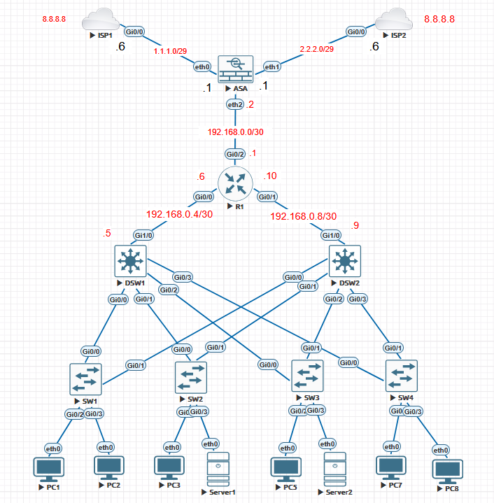

The topology uses two uplinks per access switch, separate routed links from the distribution layer to R1, and an ASA boundary between the campus and two simulated ISP networks.

### Physical and Logical Links

| Local device/interface | Remote device/interface | Link purpose |
| --- | --- | --- |
| SW1 <code>Gi0/0</code> | DSW1 <code>Gi0/0</code> | 802.1Q access uplink |
| SW1 <code>Gi0/1</code> | DSW2 <code>Gi0/0</code> | 802.1Q access uplink |
| SW2 <code>Gi0/0</code> | DSW1 <code>Gi0/1</code> | 802.1Q access uplink |
| SW2 <code>Gi0/1</code> | DSW2 <code>Gi0/1</code> | 802.1Q access uplink |
| SW3 <code>Gi0/0</code> | DSW1 <code>Gi0/2</code> | 802.1Q access uplink |
| SW3 <code>Gi0/1</code> | DSW2 <code>Gi0/2</code> | 802.1Q access uplink |
| SW4 <code>Gi0/0</code> | DSW1 <code>Gi0/3</code> | 802.1Q access uplink |
| SW4 <code>Gi0/1</code> | DSW2 <code>Gi0/3</code> | 802.1Q access uplink |
| DSW1 <code>Gi1/0</code> | R1 <code>Gi0/0</code> | Routed <code>192.168.0.4/30</code> link |
| DSW2 <code>Gi1/0</code> | R1 <code>Gi0/1</code> | Routed <code>192.168.0.8/30</code> link |
| R1 <code>Gi0/2</code> | Firewall <code>Ethernet2</code> | Inside transit <code>192.168.0.0/30</code> |
| Firewall <code>Ethernet0</code> | ISP1 <code>Gi0/0</code> | ISP-1 simulation <code>1.1.1.0/29</code> |
| Firewall <code>Ethernet1</code> | ISP2 <code>Gi0/0</code> | ISP-2 simulation <code>2.2.2.0/29</code> |

### VLAN and Gateway Plan

| VLAN | Subnet | HSRP VIP | DSW1 | DSW2 | Active HSRP node | Attached endpoints |
| --- | --- | --- | --- | --- | --- | --- |
| 10 | <code>192.168.1.0/24</code> | <code>192.168.1.100</code> | <code>.254</code> | <code>.253</code> | DSW1 | PC1, PC5, PC7 |
| 20 | <code>192.168.2.0/24</code> | <code>192.168.2.100</code> | <code>.254</code> | <code>.253</code> | DSW1 | PC2, PC3, PC8 |
| 30 | <code>192.168.3.0/24</code> | <code>192.168.3.100</code> | <code>.254</code> | <code>.253</code> | DSW2 | Server1, Server2 |
| 40 | <code>192.168.4.0/24</code> | <code>192.168.4.100</code> | <code>.254</code> | <code>.253</code> | DSW2 | HR VLAN; no endpoint attached in this baseline |
| 100 | No Layer 3 interface | None | None | None | None | Native VLAN only |

All VPCS endpoints request their addresses through DHCP. DSW1 currently hosts the four DHCP pools, and each pool supplies the relevant HSRP VIP as its default gateway.

### Routed Addressing

| Link | Left address | Right address |
| --- | --- | --- |
| R1-DSW1 | R1 <code>192.168.0.6/30</code> | DSW1 <code>192.168.0.5/30</code> |
| R1-DSW2 | R1 <code>192.168.0.10/30</code> | DSW2 <code>192.168.0.9/30</code> |
| R1-Firewall | R1 <code>192.168.0.1/30</code> | Firewall <code>192.168.0.2/30</code> |
| Firewall-ISP1 | Firewall <code>1.1.1.1/29</code> | ISP1 <code>1.1.1.6/29</code> |
| Firewall-ISP2 | Firewall <code>2.2.2.1/29</code> | ISP2 <code>2.2.2.6/29</code> |

ISP1 and ISP2 each use a local loopback address of <code>8.8.8.8/32</code> as a simulated Internet test destination. The duplicated address is intentional inside this isolated lab; it does not represent connectivity to the public Google DNS service.

> [!WARNING]
> The ISP links use globally routed address space for lab simulation. Keep this topology isolated. For a new public-facing build, prefer RFC 5737 documentation ranges such as <code>198.51.100.0/24</code> and <code>203.0.113.0/24</code>.

## Configuration Walkthrough

The order below follows the forwarding path from endpoint-facing access ports upward to the ASA.

### 1. Access Layer: SW1-SW4

The four access switches place endpoints into VLANs and provide two uplinks, one to each distribution switch. Rapid PVST+ prevents the redundant Layer 2 topology from forming a loop.

Representative access-port configuration:

~~~cisco
interface GigabitEthernet0/2
 switchport mode access
 switchport access vlan 10
 switchport port-security maximum 2
 switchport port-security mac-address sticky
 switchport port-security
 spanning-tree portfast edge
~~~

Representative dual-uplink configuration:

~~~cisco
interface GigabitEthernet0/0
 switchport trunk allowed vlan 10,20,30,40
 switchport trunk native vlan 100
!
interface GigabitEthernet0/1
 switchport trunk allowed vlan 10,20,30,40
 switchport trunk native vlan 100
~~~

The distribution-side interfaces use DTP <code>dynamic desirable</code>. The observed access-side configuration relies on negotiation rather than explicitly setting <code>switchport mode trunk</code>. This is useful for demonstrating DTP, but a later hardening exercise should convert the links to deterministic static trunks and disable negotiation where supported.

The native VLAN is consistently set to VLAN 100 and user traffic is limited to VLANs 10-40. VLAN 100 is not in the allowed list, so no user or management service should depend on untagged traffic across these links.

Full configurations:

- [SW1](./configs/SW1.cfg)
- [SW2](./configs/SW2.cfg)
- [SW3](./configs/SW3.cfg)
- [SW4](./configs/SW4.cfg)
- [Endpoint mapping](./configs/endpoints.txt)

#### Access-Layer Verification

Run:

~~~text
show vlan brief
show interfaces trunk
show spanning-tree root
show spanning-tree vlan 10
show port-security interface GigabitEthernet0/2
show mac address-table dynamic
~~~

SW1 has active data, voice, server, and HR VLANs. Its endpoint-facing ports place PC1 in VLAN 10 and PC2 in VLAN 20:

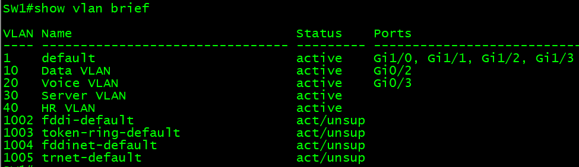

The trunk output confirms that both uplinks negotiated 802.1Q trunks, use native VLAN 100, and carry VLANs 10-40:

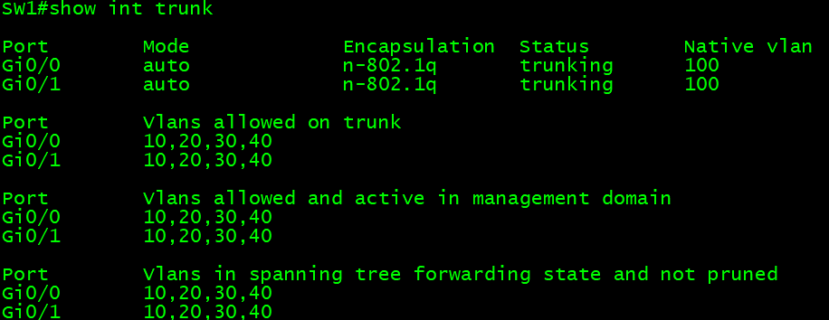

Port Security is active on both SW1 endpoint ports, with a maximum of two secure MAC addresses per port and no recorded violations:

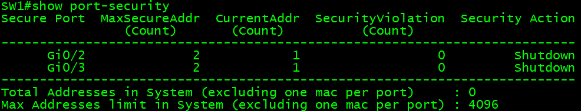

Rapid PVST+ selects SW1 <code>Gi0/0</code> as the root port for VLANs 10 and 20. Both displayed SW1 uplinks are forwarding; loop-prevention decisions for the complete topology are distributed across the other access and distribution ports.

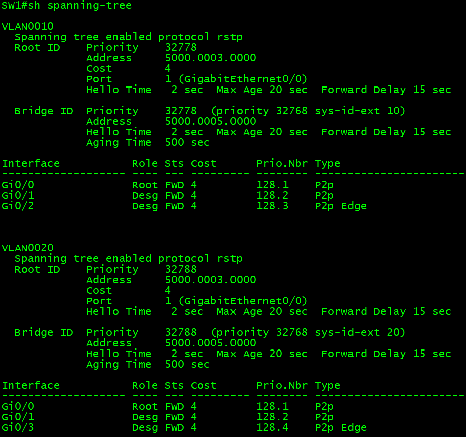

All four access switches now apply the same Port Security baseline to their endpoint-facing ports. Learned sticky MAC addresses are intentionally omitted from the publication configuration files so that the lab remains reusable.

The <code>switchport voice vlan 20</code> command is present on selected VLAN 20 access ports, but the access VLAN is also VLAN 20 and the attached nodes are VPCS devices. This does not demonstrate a separate voice VLAN or a real phone-plus-PC attachment.

### 2. Distribution Layer: DSW1 and DSW2

The distribution switches terminate the campus VLANs with SVIs, route between VLANs, participate in OSPF, and use HSRP to present a stable default gateway to endpoints.

The HSRP priorities intentionally split the active-gateway role:

- DSW1 has priority 110 for VLANs 10 and 20.
- DSW2 has priority 110 for VLANs 30 and 40.
- Both switches use <code>preempt</code>, allowing the preferred device to resume the active role after recovery.

Representative SVI:

~~~cisco
interface Vlan10
 ip address 192.168.1.254 255.255.255.0
 standby 1 ip 192.168.1.100
 standby 1 priority 110
 standby 1 preempt
 ip ospf network broadcast
 ip ospf 1 area 0
~~~

DSW1 provides DHCP for all four VLANs:

~~~cisco
ip dhcp pool VLAN10
 network 192.168.1.0 255.255.255.0
 default-router 192.168.1.100
 dns-server 8.8.8.8
~~~

Each distribution switch uses a routed point-to-point uplink to R1:

~~~cisco
interface GigabitEthernet1/0
 no switchport
 ip ospf network point-to-point
 ip ospf 1 area 0
~~~

Full configurations:

- [DSW1](./configs/DSW1.cfg)
- [DSW2](./configs/DSW2.cfg)

#### Distribution-Layer Verification

Run:

~~~text
show ip interface brief
show standby brief
show ip dhcp pool
show ip dhcp binding
show ip ospf neighbor
show ip route ospf
show spanning-tree root
~~~

DSW1 is active for VLANs 10 and 20 and standby for VLANs 30 and 40. The displayed active addresses for VLANs 30 and 40 are DSW2's SVI addresses:

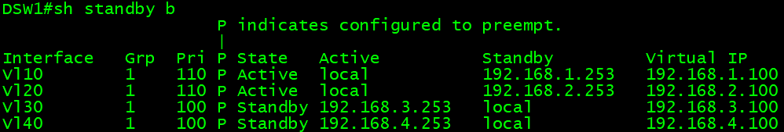

Each DHCP pool reserves three addresses: the HSRP VIP at <code>.100</code> and the two distribution SVI addresses at <code>.253</code> and <code>.254</code>. VLANs 10 and 20 each have three leases, VLAN 30 has two, and the HR VLAN has none because no HR endpoint is attached in this baseline:

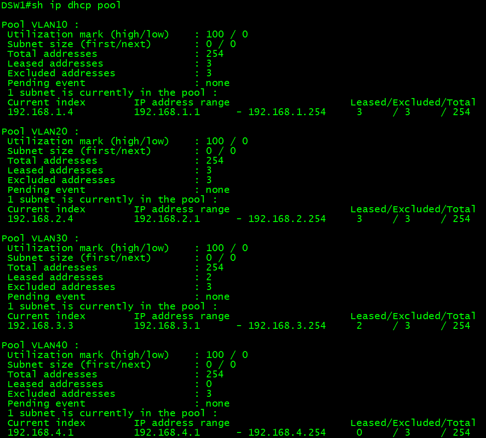

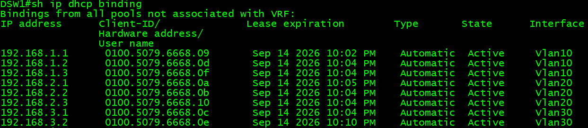

DSW1 forms a full OSPF adjacency with R1 on the routed uplink. Because the two distribution switches also run OSPF on every SVI, DSW1 and DSW2 form a separate adjacency in each of VLANs 10-40:

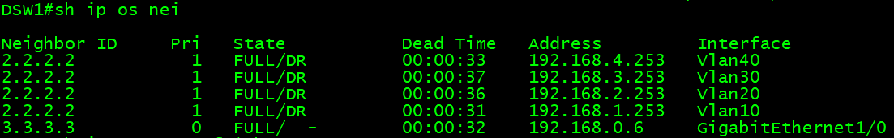

The topology has no dedicated DSW1-DSW2 interconnect. HSRP and OSPF control traffic therefore share the access VLAN paths, and the distribution switches can learn equal-cost routes through the peer SVIs as well as R1. That keeps the lab small and exposes useful routing behaviour, but it also turns client VLANs into transit networks and differs from common resilient campus designs.

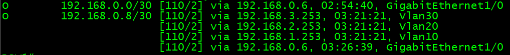

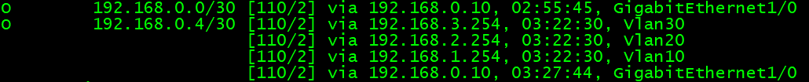

### 3. Campus Edge Router: R1

R1 joins three OSPF-facing links:

- <code>Gi0/0</code> to DSW1 on <code>192.168.0.4/30</code>.
- <code>Gi0/1</code> to DSW2 on <code>192.168.0.8/30</code>.
- <code>Gi0/2</code> to the Firewall on <code>192.168.0.0/30</code>.

~~~cisco
interface GigabitEthernet0/0
 ip address 192.168.0.6 255.255.255.252
 ip ospf network point-to-point
 ip ospf 1 area 0
!
interface GigabitEthernet0/1
 ip address 192.168.0.10 255.255.255.252
 ip ospf network point-to-point
 ip ospf 1 area 0
!
interface GigabitEthernet0/2
 ip address 192.168.0.1 255.255.255.252
 ip ospf 1 area 0
!
router ospf 1
 router-id 3.3.3.3
~~~

R1 should learn campus prefixes from both distribution switches and a default route from the ASA. This makes it the transition between the campus routing domain and the security edge.

Full configuration: [R1](./configs/R1.cfg)

#### R1 Verification

Run:

~~~text
show ip ospf neighbor
show ip ospf interface brief
show ip route ospf
show ip route 0.0.0.0
show ip cef 8.8.8.8
~~~

R1 has full OSPF adjacencies with the ASA and both distribution switches:

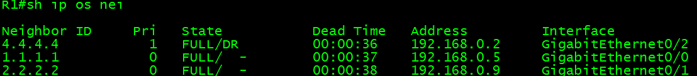

### 4. Security and Internet Edge: Firewall

The ASA uses one high-security inside interface and two security-level 0 ISP-facing interfaces:

| ASA interface | Name | Address | Security level |
| --- | --- | --- | --- |
| <code>Ethernet2</code> | inside | <code>192.168.0.2/30</code> | 100 |
| <code>Ethernet0</code> | ISP-1 | <code>1.1.1.1/29</code> | 0 |
| <code>Ethernet1</code> | ISP-2 | <code>2.2.2.1/29</code> | 0 |

OSPF advertises an unconditional default route toward R1:

~~~cisco
router ospf 1
 router-id 4.4.4.4
 network 192.168.0.0 255.255.255.252 area 0
 default-information originate always
~~~

Two static defaults prefer ISP-1 and retain ISP-2 as a higher-metric alternative:

~~~cisco
route ISP-1 0.0.0.0 0.0.0.0 1.1.1.6 1
route ISP-2 0.0.0.0 0.0.0.0 2.2.2.6 10
~~~

The current NAT rules are source-specific:

- VLAN 10 uses the <code>1.1.1.2-1.1.1.4</code> pool through ISP-1.
- VLAN 20 uses the <code>2.2.2.2-2.2.2.4</code> pool through ISP-2.
- VLANs 30 and 40 have no outbound translation rule.

This allows the lab to compare translation and path selection, but it is not complete dual-ISP failover. A routing failover alone does not create an equivalent NAT rule on the alternate egress interface.

Full configurations:

- [Firewall](./configs/Firewall.cfg)
- [ISP1](./configs/ISP1.cfg)
- [ISP2](./configs/ISP2.cfg)

The publication copy intentionally excludes encrypted password hashes, checksums, call-home data, generated defaults, and software-image files.

#### ASA Verification

Run:

~~~text
show interface ip brief
show ospf neighbor
show route
show route 0.0.0.0
show nat
show xlate
show conn
~~~

The NAT table confirms both source-specific rules. The captured counters show four translations for VLAN 10 through ISP-1; the VLAN 20 rule is configured but has no captured translation hit in this baseline evidence:

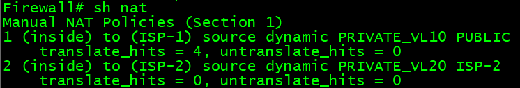

The routing table contains all four campus VLANs through OSPF and installs the lower-metric ISP-1 default route. The higher-metric ISP-2 route remains in the configuration as a floating alternative and therefore does not appear as an active route in this output:

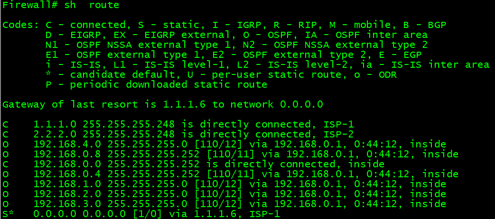

## End-to-End Validation

Validate one dependency at a time so that a successful Internet-style ping is not the only proof:

1. Confirm the endpoint received a DHCP address, mask, and HSRP default gateway.
2. Ping the local HSRP VIP.
3. Ping an endpoint in another VLAN to prove inter-VLAN routing.
4. Confirm OSPF adjacencies and routes at DSW1, DSW2, R1, and the ASA.
5. Test the simulated <code>8.8.8.8</code> destination from a VLAN 10 client.
6. Confirm that the ASA NAT hit counter increases for the VLAN 10 rule.
7. Repeat after an intentional uplink, distribution, or ISP failure only when the relevant tracking and alternate NAT policy have been configured.

VPCS commands:

~~~text
show ip
ping 192.168.X.100
ping <remote-VLAN-host>
trace 8.8.8.8
~~~

PC1 receives <code>192.168.1.1/24</code> from DSW1 and uses the HSRP VIP <code>192.168.1.100</code> as its default gateway:

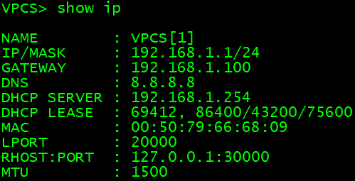

The local-gateway test verifies reachability to the HSRP VIP:

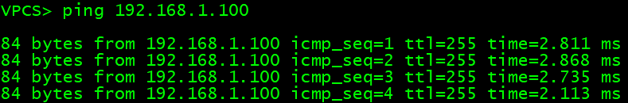

The inter-VLAN test verifies routed reachability from PC1 in VLAN 10 to <code>192.168.3.1</code> in the server VLAN:

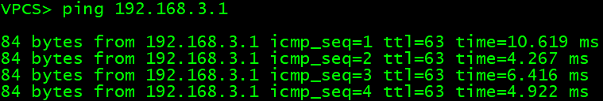

The final ping reaches the simulated <code>8.8.8.8</code> loopback through R1, the ASA, NAT, and ISP1:

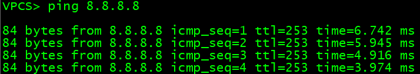

Together, these captures verify DHCP, the first-hop gateway, inter-VLAN routing, the campus-to-edge path, and VLAN 10 outbound NAT. ISP-2 remains configured for a later policy and failover validation exercise.

## Observed Baseline Limitations

These are documented as current state, not hidden or presented as completed enhancements:

1. Device-specific sticky/static MAC entries and unrelated MAC ageing overrides were removed from the publication copy.
2. Selected access ports use the same VLAN for access and voice traffic, and VPCS cannot validate IP-phone behaviour.
3. Trunks depend on DTP rather than explicit static trunk mode.
4. STP root placement is not explicitly aligned with the HSRP active gateways.
5. There is no dedicated distribution interconnect or port-channel.
6. DHCP is hosted only on DSW1, so gateway redundancy does not provide DHCP-service redundancy.
7. HSRP does not track routed uplinks.
8. OSPF runs on the client-facing SVIs, creating multiple DSW1-DSW2 adjacencies and using client VLANs as transit networks.
9. OSPF has no authentication in the baseline.
10. ASA NAT covers VLANs 10 and 20 only, and only the VLAN 10/ISP-1 path has captured traffic evidence.
11. No management VLAN, AAA, hardened SSH policy, NTP, syslog, SNMP, or configuration backup workflow is demonstrated.
12. Access-layer protections such as BPDU Guard, DHCP Snooping, Dynamic ARP Inspection, storm control, and unused-port shutdown are not yet included.

## Suggested Additional Configurations

The baseline supports focused follow-on labs without changing its overall structure:

1. Add DHCP Snooping, trusted uplinks, and Dynamic ARP Inspection.
2. Convert trunks to explicit 802.1Q mode and disable DTP where supported.
3. Align Rapid PVST+ roots with the HSRP active gateways for VLAN groups 10/20 and 30/40.
4. Add BPDU Guard, Root Guard, storm control, and unused-port shutdown.
5. Add a distribution interconnect or redesign the distribution/access boundary as routed access.
6. Add HSRP interface/object tracking and validate failover convergence.
7. Add a dedicated distribution transit link, make client-facing SVIs passive where the design permits, and test OSPF authentication and fault injection.
8. Add ACLs between the data, voice, server, and HR VLANs.
9. Validate the VLAN 20/ISP-2 policy, then add complete ASA policy, PAT/NAT failover, SLA tracking, and tested ISP failure behaviour.
10. Add a management VLAN, AAA, SSH, NTP, syslog, SNMP/telemetry, and configuration backups.
11. Automate configuration deployment and state validation with Python, Ansible, pyATS/Genie, or APIs supported by the chosen platform.

## Disclaimer

This lab is for education and isolated experimentation. Review addressing, security policy, licensing, software support, and platform-specific syntax before adapting any part of it to another environment.
