# DHCP Snooping and Dynamic ARP Inspection on Cisco IOS

This EVE-NG lab demonstrates two related first-hop security controls:

- **DHCP Snooping** blocks DHCP server messages arriving on an untrusted access port and builds a trusted IP-MAC-VLAN-interface binding table.
- **Dynamic ARP Inspection (DAI)** validates ARP messages against that binding table and drops ARP traffic that does not match a known binding.

The lab uses Cisco routers as both DHCP servers. Because the switch inserts DHCP Option 82, the DHCP-server-facing router interfaces must explicitly trust relay information. That setting is separate from the switch-side `ip dhcp snooping trust` command.

> [!IMPORTANT]
> DHCP Snooping and DAI solve different problems. DHCP Snooping prevents a rogue DHCP server from supplying client configuration. DAI validates IP-to-MAC ownership for ARP. Enabling DAI does not, by itself, make an unauthorised DHCP server legitimate.

## Objectives

- Observe a client accepting a DHCP lease from either a legitimate or rogue Cisco IOS DHCP server.
- Confirm that DHCP Option 82 is present in the client request.
- Configure the legitimate DHCP-server port as trusted and leave the rogue-server port untrusted.
- Verify the DHCP Snooping binding table and dropped-packet counters.
- Enable DAI only after valid DHCP bindings exist.
- Confirm that an ARP source without a matching DHCP Snooping binding is dropped.
- Record the platform-specific trust boundary rather than treating every interface as trusted.

## Environment and Scope

The lab was captured in EVE-NG using a Cisco IOSv/IOSvL2-style topology. The exact image release was not recorded, so validate command support against the image used for a new run.

The recorded topology uses the following switch interfaces:

```text
Gi0/0, Gi0/1, Gi0/2, Gi0/3, Gi1/0
```

The external test destination is the router's Loopback0. No additional external router or Linux host is required.

## Topology and Addressing

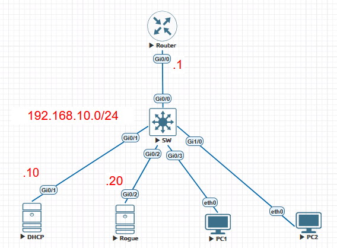

```text
Router G0/0   ─── SW Gi0/0       192.168.10.1/24 gateway
DHCP Gi0/1    ─── SW Gi0/1       legitimate Cisco IOS DHCP server
Rogue Gi0/2   ─── SW Gi0/2       unauthorised Cisco IOS DHCP server
PC1 eth0      ─── SW Gi0/3       DHCP client
PC2 eth0      ─── SW Gi1/0       DHCP client

Router Loopback0: 203.0.113.1/32
Shared access VLAN: 10 (192.168.10.0/24)
```

| Node | Interface | Address or role |
| --- | --- | --- |
| Router | `Gi0/0` | `192.168.10.1/24`, client default gateway |
| Router | `Loopback0` | `203.0.113.1/32`, external test destination |
| DHCP | `Gi0/1` | `192.168.10.10/24`, legitimate DHCP server |
| Rogue | `Gi0/2` | `192.168.10.20/24`, rogue DHCP server and untrusted ARP source |
| PC1 | `Gi0/3` | DHCP client; recorded rogue lease was `192.168.10.200/24` with gateway `192.168.10.254` |
| PC2 | `Gi1/0` | DHCP client; recorded legitimate lease was `192.168.10.22/24` with gateway `192.168.10.1` |

The legitimate pool begins at `192.168.10.21` in the captured run. The exact lease assigned to a client depends on lease state and request order; do not use one screenshot as proof of a fixed allocation policy.

## Baseline Configuration

### Router (R1)

```cisco
interface GigabitEthernet0/0
 description TO-SW
 ip address 192.168.10.1 255.255.255.0
 no shutdown

interface Loopback0
 description EXTERNAL-TEST
 ip address 203.0.113.1 255.255.255.255
```

### DHCP: legitimate DHCP server

```cisco
interface GigabitEthernet0/1
 description LEGITIMATE-DHCP-SERVER
 ip address 192.168.10.10 255.255.255.0
 ip dhcp relay information trusted
 no shutdown

ip dhcp excluded-address 192.168.10.1 192.168.10.20

ip dhcp pool LEGIT-DHCP
 network 192.168.10.0 255.255.255.0
 default-router 192.168.10.1
 dns-server 8.8.8.8
 lease 0 10
```

`ip dhcp relay information trusted` is required here because the Cisco router is acting as the DHCP server and the switch inserts Option 82 into client requests.

### Rogue: unauthorised DHCP server

```cisco
interface GigabitEthernet0/2
 description ROGUE-DHCP-SERVER
 ip address 192.168.10.20 255.255.255.0
 ip dhcp relay information trusted
 no shutdown

ip dhcp excluded-address 192.168.10.1 192.168.10.199

ip dhcp pool ROGUE-DHCP
 network 192.168.10.0 255.255.255.0
 default-router 192.168.10.254
 dns-server 192.168.10.254
 lease 0 1
```

The rogue pool deliberately advertises an unreachable default gateway. This makes the DHCP failure visible without changing the client subnet or mask.

### SW: VLAN and access ports

```cisco
vlan 10
 name USERS

interface GigabitEthernet0/0
 description TO-R1
 switchport mode access
 switchport access vlan 10

interface GigabitEthernet0/1
 description TO-DHCP-LEGITIMATE
 switchport mode access
 switchport access vlan 10

interface GigabitEthernet0/2
 description TO-ROGUE-DHCP
 switchport mode access
 switchport access vlan 10

interface GigabitEthernet0/3
 description TO-PC1
 switchport mode access
 switchport access vlan 10
 spanning-tree portfast

interface GigabitEthernet1/0
 description TO-PC2
 switchport mode access
 switchport access vlan 10
 spanning-tree portfast
```

## Test 1: baseline DHCP behaviour

Do not enable DHCP Snooping or DAI yet. On both VPCS clients, request an address:

```text
ip dhcp
show
ping 192.168.10.1
ping 203.0.113.1
```

Repeat `ip dhcp` on a client when testing lease renewal. The client may accept whichever DHCP Offer arrives first.

### Recorded result

PC2 received a legitimate lease and reached both the gateway and the Loopback destination:

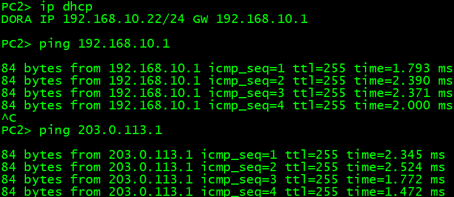

PC1 received the rogue lease `192.168.10.200/24` with default gateway `192.168.10.254`. Its local gateway test succeeded because the client and R1 were in the same subnet, but the external test failed because the advertised next hop was unreachable:

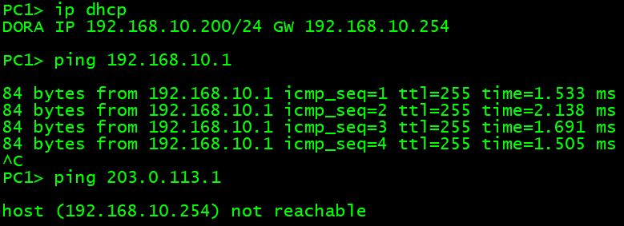

This is the expected Rogue DHCP failure mode: the client can have a plausible address and mask while receiving an unusable default gateway.

## Test 2: confirm Option 82 and configure DHCP Snooping

Enable DHCP Snooping on SW:

```cisco
ip dhcp snooping
ip dhcp snooping vlan 10
ip dhcp snooping information option
```

Trust only the port connected to the legitimate DHCP server:

```cisco
interface GigabitEthernet0/1
 ip dhcp snooping trust
```

Leave Rogue's `Gi0/2` and all client ports untrusted. Optionally rate-limit DHCP messages on client and rogue-facing ports:

```cisco
interface GigabitEthernet0/2
 ip dhcp snooping limit rate 15

interface GigabitEthernet0/3
 ip dhcp snooping limit rate 15

interface GigabitEthernet1/0
 ip dhcp snooping limit rate 15
```

### Verify Option 82

The captured DHCP Discover contains Option 82 with Agent Circuit ID and Agent Remote ID suboptions:

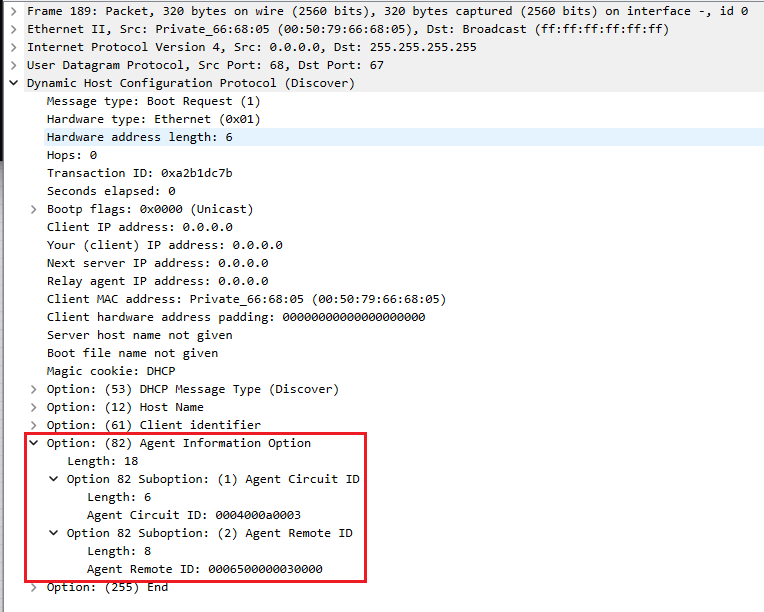

On SW, confirm that Option 82 insertion is enabled and that the legitimate server-facing port is trusted and allows the option:

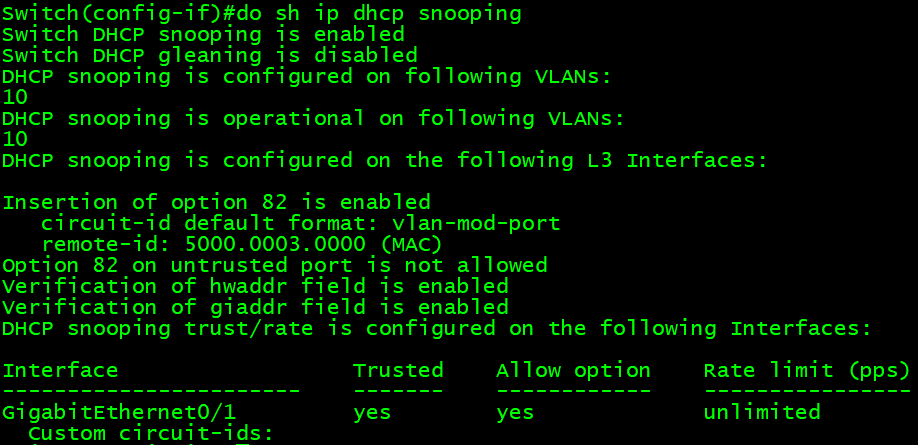

The router-side `ip dhcp relay information trusted` commands on DHCP and Rogue are what allow the Cisco DHCP processes to accept these relay-information fields in this direct-server lab.

### Verify the binding table

Renew the clients:

```text
ip dhcp
show
```

Then inspect the switch:

```cisco
show ip dhcp snooping binding
show ip dhcp snooping statistics
```

The recorded binding identifies PC1's MAC, IP address, VLAN, and access interface:

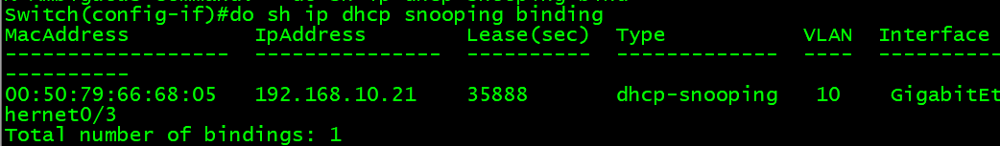

After a further lease check, the same client remained associated with the same IP, VLAN, and access interface while the lease timer changed:

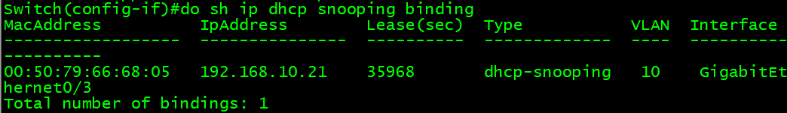

The captured statistics also show forwarded DHCP traffic with no drops during that check:

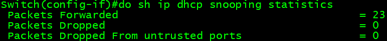

At this point, Rogue's DHCP Offer should no longer be accepted through the untrusted `Gi0/2` port. The client should receive the legitimate gateway `192.168.10.1` and reach `203.0.113.1` consistently.

## Test 3: establish the DAI prerequisite

DAI must be enabled only after valid dynamic bindings exist. Confirm the table again after the client has renewed:

```cisco
show ip dhcp snooping binding
```

The same binding was checked again immediately before enabling DAI. The binding table is the source of truth for a DHCP-assigned host.

If a host uses a static address, use a static IP source binding or an ARP ACL instead of assuming that DHCP Snooping can learn it.

## Test 4: inspect the pre-DAI ARP state

Before enabling DAI, inspect R1's ARP table:

```cisco
show ip arp
```

The captured table includes the gateway, both DHCP-server addresses, and client addresses:

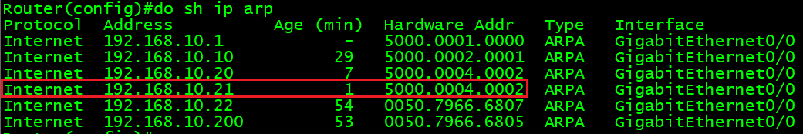

When diagnosing an address conflict, compare the ARP MAC address with the DHCP Snooping binding. A single ARP snapshot is not sufficient proof of ownership; clear or age the entry and repeat the observation if the addresses disagree.

## Test 5: enable and verify DAI

Enable DAI for VLAN 10:

```cisco
ip arp inspection vlan 10
```

Trust only the interfaces that carry legitimate infrastructure ARP:

```cisco
interface GigabitEthernet0/0
 ip arp inspection trust

interface GigabitEthernet0/1
 ip arp inspection trust
```

Keep the rogue-server and client ports untrusted:

```cisco
interface GigabitEthernet0/2
 ip arp inspection limit rate 15

interface GigabitEthernet0/3
 ip arp inspection limit rate 15

interface GigabitEthernet1/0
 ip arp inspection limit rate 15
```

Verify the trust boundary:

```cisco
show ip arp inspection
show ip arp inspection interfaces
show ip arp inspection statistics vlan 10
```

The recorded interface output shows the Router and the legitimate DHCP-server port as trusted, while Rogue and the client ports remain untrusted:

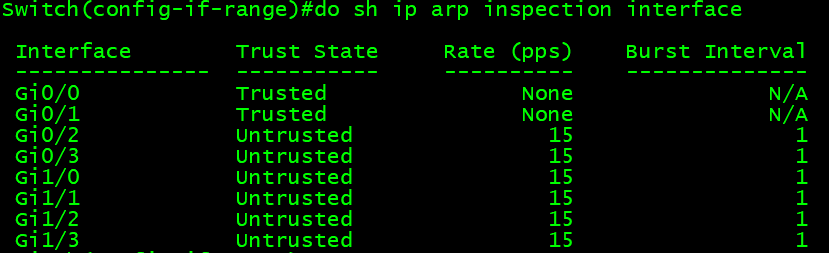

In the captured run, Rogue's attempt to ping the gateway failed after DAI was enabled:

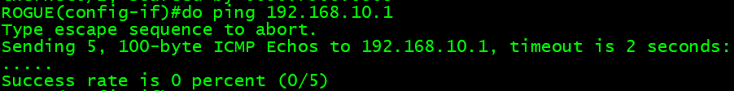

The corresponding DAI counters show active inspection and a dropped packet:

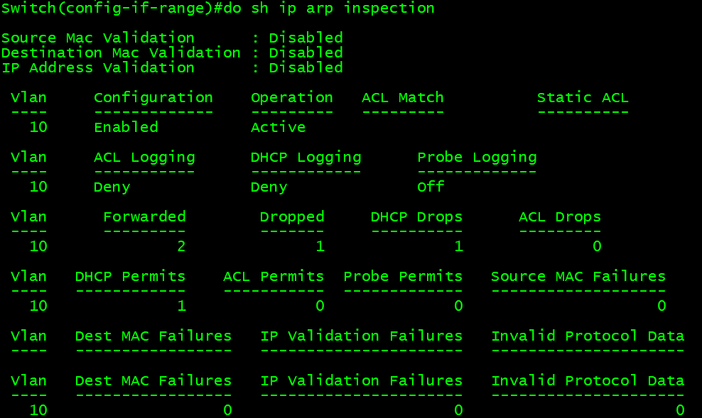

The exact counter category is platform- and release-dependent. Treat the counter increase, the untrusted interface, and the failed Rogue test as a combined observation rather than attributing every counter to one packet without a synchronized capture.

## Verification checklist

```cisco
show vlan brief
show interfaces status
show ip dhcp snooping
show ip dhcp snooping binding
show ip dhcp snooping statistics
show ip arp inspection
show ip arp inspection interfaces
show ip arp inspection statistics vlan 10
show ip arp
```

Client-side checks:

```text
show
show arp
ping 192.168.10.1
ping 203.0.113.1
```

Expected final state:

| Check | Expected result |
| --- | --- |
| Legitimate DHCP | Accepted through trusted `SW Gi0/1` |
| Rogue DHCP | Rejected on untrusted `SW Gi0/2` |
| DHCP binding | Contains the client MAC, IP, VLAN 10, and access interface |
| R1 ARP | Matches the legitimate binding for DHCP clients |
| Rogue ARP | Rejected when it does not match a valid binding |
| PC1/PC2 external Ping | Stable through `203.0.113.1` |

## Troubleshooting notes

### The Cisco DHCP server stops responding after Option 82 is enabled

Check the DHCP-server-facing router interface. In this topology, the legitimate server uses `Gi0/1` and the Rogue server uses `Gi0/2`:

```cisco
show running-config interface GigabitEthernet0/1
show running-config interface GigabitEthernet0/2
```

For each Cisco router acting as a DHCP server in this lab, the interface should include:

```cisco
ip dhcp relay information trusted
```

Do not confuse this with the switch-side command:

```cisco
ip dhcp snooping trust
```

The first trusts relay information on the DHCP server; the second trusts DHCP server messages entering a switch port.

### The binding table is empty

Check the following in order:

1. The client is actually sending DHCP traffic.
2. DHCP Snooping is enabled globally and for VLAN 10.
3. The legitimate DHCP-server port (`SW Gi0/1`) is trusted.
4. Option 82 is accepted on the Cisco DHCP server interface.
5. The client renews its lease after the configuration is applied.

### DAI drops a legitimate client

DAI requires a valid binding for a DHCP-assigned host. Renew the lease and confirm:

```cisco
show ip dhcp snooping binding
```

For static hosts, configure an appropriate static binding or ARP ACL instead of blindly trusting the access port.

### The ARP result does not match an earlier screenshot

ARP entries age and can be rewritten by later traffic. Record the binding, clear or wait for the ARP entry to expire, repeat the same test, and compare the MAC address with the current binding. Do not label a single stale ARP line as a confirmed duplicate-IP fault.

## Cleanup

Return the switch to a normal unprotected lab state only when the experiment is complete:

```cisco
no ip arp inspection vlan 10
no ip dhcp snooping vlan 10
no ip dhcp snooping
```

On Rogue, remove the rogue DHCP pool if the router will be reused:

```cisco
no ip dhcp pool ROGUE-DHCP
```

## Limitations and safety

- Use the topology only in an isolated EVE-NG lab. Never connect the Rogue DHCP router to a production VLAN.
- A Rogue DHCP server and an ARP attacker are separate traffic conditions. This lab uses the same untrusted Rogue port to demonstrate both control boundaries; it does not claim that DAI filters DHCP.
- DAI is an ingress feature. It protects the VLAN and interfaces on the switch where it is enabled; it does not automatically protect a downstream segment hidden behind another bridge or router.
- Cisco command availability and counter names vary by IOS image and release. Capture the running configuration and verification output from the image actually tested.
