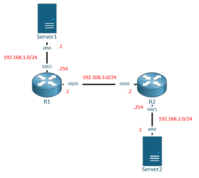
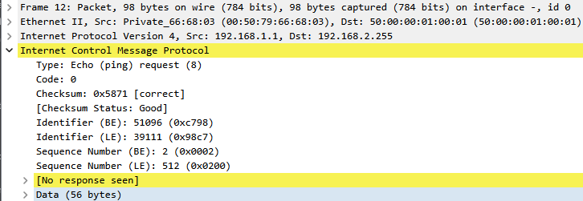
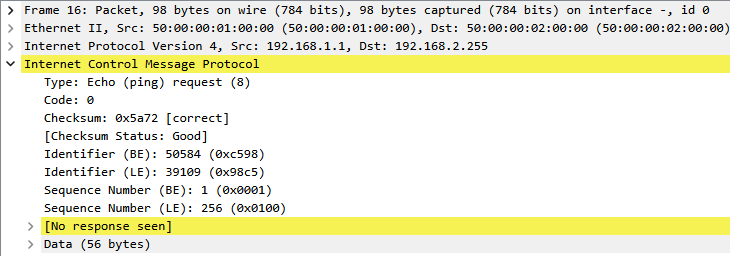
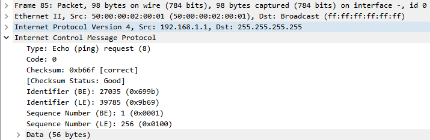

# IPv4 Directed Broadcast on Cisco IOS

An IPv4 directed broadcast lets a host send one packet toward a remote subnet and have the last-hop router deliver it as a broadcast on that subnet. Because this behaviour can turn a destination network into a traffic amplifier, Cisco IOS disables directed-broadcast forwarding by default.

This guide explains the forwarding path, enables the feature only on the destination-facing interface, and verifies the result at each hop with packet captures.

## Broadcast Types

IPv4 commonly uses two forms of broadcast address:

| Type | Example | Scope and forwarding behaviour |
| --- | --- | --- |
| Limited broadcast | `255.255.255.255` | Reaches the local link only. A router does not forward it to another subnet. |
| Network-prefix-directed broadcast | `192.168.2.255` for `192.168.2.0/24` | Identifies every host in a specific subnet. Transit routers can route the packet toward that subnet, but the last-hop router drops it by default instead of transmitting it onto the destination link. |

A directed-broadcast address consists of the destination network prefix followed by an all-ones host portion. It is therefore not always the final dotted-decimal address ending in `.255`; the value depends on the prefix length.

For example, the directed-broadcast address for `192.168.2.0/26` is `192.168.2.63`.

## Forwarding Model

Consider a packet sent from `192.168.1.1` to the directed-broadcast address `192.168.2.255`:

1. Transit routers route the packet toward `192.168.2.0/24` in the same way as ordinary unicast traffic. On each transit Ethernet segment, the Layer 2 destination is the next-hop router's MAC address.
2. The router directly connected to `192.168.2.0/24` recognizes that the destination is the broadcast address of an attached subnet.
3. By default, that last-hop router drops the packet instead of placing it on the destination link.
4. If `ip directed-broadcast` is enabled on the destination-facing interface, Cisco IOS converts, or "explodes," the packet into a physical broadcast on that interface.

During the final conversion, IOS rewrites the IP destination to the broadcast address configured for the outgoing interface and uses the Layer 2 broadcast destination `ff:ff:ff:ff:ff:ff`. The IOS default interface broadcast address is `255.255.255.255`, which explains the Layer 3 all-ones destination observed in this lab. If `ip broadcast-address` is explicitly changed, the final IP destination can differ.

> [!IMPORTANT]
> Configure `ip directed-broadcast` on the interface connected to the **target subnet**, where the packet is converted into a physical broadcast. The command does not need to be enabled on every transit interface.

## Security Considerations

Directed broadcasts have historically been used in reflection and amplification attacks such as the Smurf attack. An attacker spoofs the victim's source address and sends an ICMP Echo Request to a directed-broadcast address. If the last-hop router broadcasts the request and many hosts reply, the responses converge on the victim.

RFC 2644 changed the required router default to block directed broadcasts, and Cisco IOS has disabled the feature by default since IOS Release 12.0. Leave it disabled unless a documented application requires it. If it must be enabled:

- Enable it only on the required destination-facing interfaces.
- Restrict eligible traffic with an ACL.
- Permit only the required source, protocol, and destination where the platform supports those matches.
- Apply source-address validation and monitor the resulting broadcast traffic.

Many current host operating systems also ignore broadcast ICMP Echo Requests. A missing ping reply therefore does **not** prove that the router dropped the directed broadcast; verify the destination-facing interface with a packet capture or an equivalent traffic counter.

## Command Reference

The interface-level syntax is:

```text
ip directed-broadcast [access-list]
```

Without an ACL, any otherwise eligible directed broadcast may be converted on that interface. With an ACL, only packets permitted by the ACL are eligible; packets denied explicitly or by the implicit deny are dropped at the conversion point.

A standard ACL can restrict source addresses. An extended ACL can additionally restrict fields such as protocol and destination. Exact support for numbered or named ACLs varies between IOS, IOS XE, NX-OS, platform families, and software releases, so check the command reference for the target device.

To return to the secure default:

```cisco
interface GigabitEthernet0/1
 no ip directed-broadcast
```

## Lab

### Objectives

- Distinguish a limited broadcast from a directed broadcast.
- Observe normal routed forwarding before the packet reaches the target subnet.
- Confirm that the last-hop router drops the directed broadcast by default.
- Enable conversion on the destination-facing interface and verify the resulting Layer 2 and Layer 3 destinations.
- Restore the default configuration after testing.

### Environment and Assumptions

The original capture set contains two Cisco IOS routers and two lightweight endpoint nodes. The exact IOS image and release were not recorded, so the commands and packet-rewrite behaviour should be revalidated before applying the procedure to a different platform or release.

The lab uses ICMP only to make the forwarding path easy to inspect. It does not depend on an endpoint replying to a broadcast Echo Request.

### Topology



| Node | Interface | Address | Role |
| --- | --- | --- | --- |
| Server1 | `eth0` | `192.168.1.1/24` | Test source |
| R1 | `GigabitEthernet0/1` | `192.168.1.254/24` | Source LAN gateway |
| R1 | `GigabitEthernet0/0` | `192.168.3.1/30` | Transit link |
| R2 | `GigabitEthernet0/0` | `192.168.3.2/30` | Transit link |
| R2 | `GigabitEthernet0/1` | `192.168.2.254/24` | Target LAN gateway and conversion point |
| Server2 | `eth0` | `192.168.2.1/24` | Host on the target subnet |

The directed-broadcast address under test is `192.168.2.255`.

### Base Configuration

#### R1

```cisco
hostname R1
!
interface GigabitEthernet0/0
 ip address 192.168.3.1 255.255.255.252
 no shutdown
!
interface GigabitEthernet0/1
 ip address 192.168.1.254 255.255.255.0
 no shutdown
!
ip route 192.168.2.0 255.255.255.0 192.168.3.2
```

#### R2

```cisco
hostname R2
!
interface GigabitEthernet0/0
 ip address 192.168.3.2 255.255.255.252
 no shutdown
!
interface GigabitEthernet0/1
 ip address 192.168.2.254 255.255.255.0
 no shutdown
!
ip route 192.168.1.0 255.255.255.0 192.168.3.1
```

#### Endpoints

```text
# Server1
set pcname Server1
ip 192.168.1.1/24 192.168.1.254

# Server2
set pcname Server2
ip 192.168.2.1/24 192.168.2.254
```

### 1. Verify the Initial State

Confirm that R2 has directed-broadcast forwarding disabled on the interface connected to the target subnet:

```text
R2# show ip interface GigabitEthernet0/1 | include Directed
  Directed broadcast forwarding is disabled
```

Also verify reachability and routing before testing the broadcast path:

```text
R1# show ip route 192.168.2.255
R1# ping 192.168.3.2
R2# ping 192.168.1.1
```

### 2. Send a Directed Broadcast with the Default Configuration

From Server1, send an ICMP Echo Request to the target subnet's broadcast address:

```text
Server1> ping 192.168.2.255
```

Capture the packet on the following interfaces at the same time:

- R1 `GigabitEthernet0/1`, facing Server1.
- R1 `GigabitEthernet0/0`, facing R2.
- R2 `GigabitEthernet0/1`, facing Server2.

On R1's source-facing interface, the frame is addressed to R1's MAC address while the IP destination remains `192.168.2.255`:



On the R1-to-R2 transit link, the IP destination is still `192.168.2.255`, but the Ethernet frame is sent to R2's next-hop MAC address. This demonstrates that the packet is routed normally before the last hop:



No corresponding frame appears on R2 `GigabitEthernet0/1`. R2 recognizes the destination as the broadcast address of its attached `192.168.2.0/24` subnet and drops it because directed-broadcast forwarding is disabled.

### 3. Enable Directed-Broadcast Conversion

Enable the feature only on R2's target-facing interface:

```cisco
R2# configure terminal
R2(config)# interface GigabitEthernet0/1
R2(config-if)# ip directed-broadcast
R2(config-if)# end
```

Verify the state before retesting:

```text
R2# show ip interface GigabitEthernet0/1 | include Directed
  Directed broadcast forwarding is enabled
```

Send the same test again:

```text
Server1> ping 192.168.2.255
```

This time, the capture on R2 `GigabitEthernet0/1` shows the final conversion:

- Ethernet destination: `ff:ff:ff:ff:ff:ff`.
- IPv4 source: `192.168.1.1`.
- IPv4 destination: `255.255.255.255`, the default IOS interface broadcast address used by this lab.
- ICMP payload: Echo Request.



The packet capture, rather than an ICMP reply, is the decisive evidence that R2 forwarded the broadcast onto the target LAN.

### 4. Optional ACL Restriction

The unrestricted command is useful for demonstrating the mechanism but is not a suitable default for a real network. On an IOS release that accepts the following numbered extended ACL syntax, the policy can be limited to ICMP Echo Requests from the lab source to the intended directed-broadcast address:

```cisco
access-list 100 permit icmp host 192.168.1.1 host 192.168.2.255 echo
!
interface GigabitEthernet0/1
 ip directed-broadcast 100
```

Verify both the interface state and ACL counters after generating permitted and denied test traffic:

```text
R2# show ip interface GigabitEthernet0/1 | include Directed
R2# show access-lists 100
```

> [!NOTE]
> This ACL variant is a hardening example and was not exercised in the supplied capture set. Confirm the supported ACL form and matching behaviour on the actual platform.

### 5. Cleanup and Regression Check

Restore the secure default:

```cisco
R2# configure terminal
R2(config)# interface GigabitEthernet0/1
R2(config-if)# no ip directed-broadcast
R2(config-if)# end
```

Confirm the rollback:

```text
R2# show ip interface GigabitEthernet0/1 | include Directed
  Directed broadcast forwarding is disabled
```

Repeat the ping and destination-facing capture. The packet should still traverse R1, but no matching frame should leave R2 `GigabitEthernet0/1`.

## Results

| Observation point | Feature state | IPv4 destination | Ethernet destination | Result |
| --- | --- | --- | --- | --- |
| R1 source-facing interface | Disabled on R2 | `192.168.2.255` | R1 MAC | Packet enters the routed path. |
| R1 transit interface | Disabled on R2 | `192.168.2.255` | R2 next-hop MAC | Packet is routed normally toward the target subnet. |
| R2 target-facing interface | Disabled | No packet observed | No packet observed | Last-hop conversion is blocked. |
| R2 target-facing interface | Enabled | `255.255.255.255` in this IOS lab | `ff:ff:ff:ff:ff:ff` | Packet is transmitted as a local physical broadcast. |

The experiment demonstrates the key boundary: `ip directed-broadcast` controls the **last-hop conversion onto the target subnet**, not ordinary transit routing toward that subnet.

## Troubleshooting Checklist

If the expected broadcast does not appear on the destination segment:

1. Recalculate the target subnet's directed-broadcast address from its prefix length.
2. Confirm that transit routers have a route covering the target address.
3. Confirm that `ip directed-broadcast` is configured on the target-facing interface, not only on an ingress or transit interface.
4. If an ACL is attached, check its entries, order, implicit deny, and match counters.
5. Capture on both sides of the last-hop router to distinguish a routing failure from a conversion-policy drop.
6. Do not use the absence of an ICMP Echo Reply as the only failure signal; the destination hosts may intentionally ignore broadcast ICMP.

## References

- [Cisco IOS XE 17.x: Configuring IPv4 Broadcast Packet Handling](https://www.cisco.com/c/en/us/td/docs/routers/ios/config/17-x/ip-addressing/b-ip-addressing/m_iap-bph-0.html)
- [Cisco IOS IP Application Services Command Reference: `ip directed-broadcast`](https://www.cisco.com/c/en/us/td/docs/ios-xml/ios/ipapp/command/iap-cr-book/iap-i1.html)
- [RFC 1812: Requirements for IP Version 4 Routers](https://www.rfc-editor.org/rfc/rfc1812.html)
- [RFC 2644: Changing the Default for Directed Broadcasts in Routers](https://www.rfc-editor.org/rfc/rfc2644.html)
