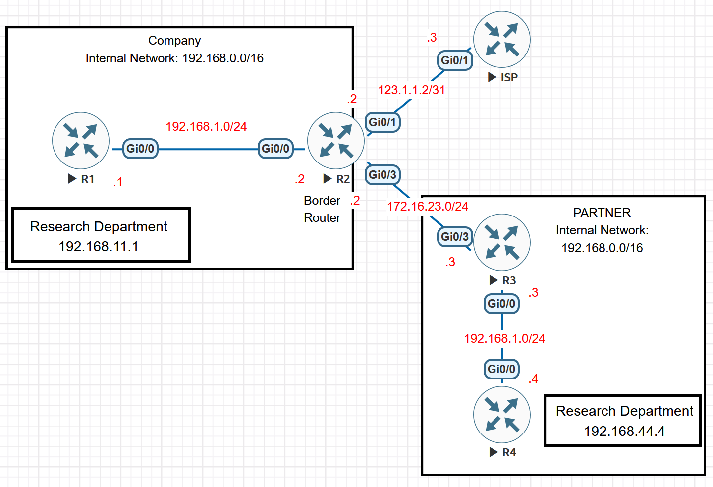

# Legacy NAT Between Overlapping Networks

This EVE-NG troubleshooting lab examines bidirectional static NAT between two organisations that both use `192.168.0.0/16`. The border router must translate both endpoints, but legacy Cisco IOS NAT performs routing and translation in a different order depending on which side receives the packet.

The scenario was adapted from [CostiSer's Quiz #11](https://costiser.ro/2013/03/27/quiz-11/) and its published solution, [NAT - Order of Operation](https://costiser.ro/2013/05/12/nat-order-of-operation/). The original solution adds a host route for the outside-local address. On the IOS image used in this reproduction, static outside-source NAT also created a connected `/32` NAT alias. That platform-specific alias suppressed the manual route, so the working correction required both `no-alias` and the `/32` route.

> [!NOTE]
> The lab has been reproduced in EVE-NG, and the retained CLI evidence documents the routing adjacencies, initial NAT failure, platform-specific alias state, unsuccessful PBR attempt, corrected RIB/FIB state, return-path translation, and Proxy ARP behaviour. The exact IOS image, final ping success-rate line, and packet captures were not retained; these evidence boundaries are stated explicitly below.

## Objectives

- Reproduce bidirectional NAT between overlapping address spaces.
- Explain the four NAT address identities used by Cisco IOS.
- Demonstrate the different routing and NAT order for inside- and outside-originated traffic.
- Reproduce the failed return path caused by the outside-local address overlapping an inside connected network.
- Compare the original static-route correction with the behaviour of the tested IOS image.
- Show why a NAT-created local alias can suppress a manual route and prevent interface PBR from solving the problem.
- Verify why R1 can still resolve `192.168.1.4` through Proxy ARP after `no-alias` is configured.
- Demonstrate that R1 loses reachability when Proxy ARP is disabled, even though R2 retains the correct static RIB/FIB path.

## Environment and Scope

- Platform: EVE-NG
- Nodes: five Cisco IOS routers
- R1: Company research router
- R2: Company border router and NAT device
- ISP: simulated Internet router
- R3: Partner border router
- R4: Partner research router
- NAT model: legacy `ip nat inside` and `ip nat outside`, not NAT Virtual Interface (NVI)
- Company routing: OSPF process 1, area 0, between R1 and R2
- Partner routing: EIGRP autonomous system 1 between R3 and R4

The two research systems are represented by loopback interfaces. Platform-generated boilerplate and unused shutdown interfaces are omitted from the configuration excerpts.

## Topology



| Device | Interface | Address | Role |
| --- | --- | --- | --- |
| R1 | `Gi0/0` | `192.168.1.1/24` | Company internal link |
| R1 | `Loopback0` | `192.168.11.1/32` | Company research system |
| R2 | `Gi0/0` | `192.168.1.2/24` | NAT inside |
| R2 | `Gi0/1` | `123.1.1.2/31` | Internet-facing NAT outside |
| ISP | `Gi0/1` | `123.1.1.3/31` | Simulated Internet link |
| R2 | `Gi0/3` | `172.16.23.2/24` | Partner-facing NAT outside |
| R3 | `Gi0/3` | `172.16.23.3/24` | Link to R2 |
| R3 | `Gi0/0` | `192.168.1.3/24` | Partner internal link |
| R4 | `Gi0/0` | `192.168.1.4/24` | Partner internal link |
| R4 | `Loopback0` | `192.168.44.4/32` | Partner research system |

The two `192.168.1.0/24` segments are separate Layer 2 networks. Reusing the prefix is deliberate and is the central constraint of the exercise.

## Translation Requirements

The Company research address must appear on the Partner side as:

```text
Inside local:   192.168.11.1
Inside global:  172.16.23.1
```

The Partner research address must appear inside the Company network as:

```text
Outside global: 192.168.44.4
Outside local:  192.168.1.4
```

The required static mappings on R2 are therefore:

```cisco
ip nat inside source static 192.168.11.1 172.16.23.1
ip nat outside source static 192.168.44.4 192.168.1.4
```

The second command is bidirectional. For a packet travelling from inside to outside, it translates destination `192.168.1.4` to the real Partner address `192.168.44.4`.

## Initial Configuration

This baseline deliberately preserves the faulty NAT state so that the routing problem can be observed before it is corrected.

### R1: Company research router

```cisco
hostname R1
!
no ip domain lookup
ip cef
!
interface Loopback0
 description COMPANY-RESEARCH
 ip address 192.168.11.1 255.255.255.255
!
interface GigabitEthernet0/0
 description TO-R2-Gi0/0
 ip address 192.168.1.1 255.255.255.0
 ip ospf network point-to-point
 no shutdown
!
router ospf 1
 network 192.168.1.0 0.0.0.255 area 0
 network 192.168.11.1 0.0.0.0 area 0
```

### R2: Company border and NAT router

```cisco
hostname R2
!
no ip domain lookup
ip cef
!
interface GigabitEthernet0/0
 description TO-R1-Gi0/0
 ip address 192.168.1.2 255.255.255.0
 ip ospf network point-to-point
 ip nat inside
 no shutdown
!
interface GigabitEthernet0/1
 description TO-ISP-Gi0/1
 ip address 123.1.1.2 255.255.255.254
 ip nat outside
 no shutdown
!
interface GigabitEthernet0/3
 description TO-R3-Gi0/3
 ip address 172.16.23.2 255.255.255.0
 ip nat outside
 no shutdown
!
router ospf 1
 network 192.168.1.0 0.0.0.255 area 0
 default-information originate
!
access-list 1 permit 192.168.0.0 0.0.255.255
!
ip nat inside source list 1 interface GigabitEthernet0/1 overload
ip nat inside source static 192.168.11.1 172.16.23.1
ip nat outside source static 192.168.44.4 192.168.1.4
!
ip route 192.168.44.4 255.255.255.255 172.16.23.3
ip route 0.0.0.0 0.0.0.0 123.1.1.3
```

R2 learns `192.168.11.1/32` from R1 through OSPF and conditionally originates its installed static default into area 0. R2 already uses inside-source PAT toward the ISP. Both `Gi0/1` and `Gi0/3` are outside interfaces because the exercise must retain legacy NAT rather than replace it with NVI.

### ISP

```cisco
hostname ISP
!
no ip domain lookup
ip cef
!
interface GigabitEthernet0/1
 description TO-R2-Gi0/1
 ip address 123.1.1.3 255.255.255.254
 no shutdown
```

### R3: Partner border router

```cisco
hostname R3
!
no ip domain lookup
ip cef
!
interface GigabitEthernet0/3
 description TO-R2-Gi0/3
 ip address 172.16.23.3 255.255.255.0
 no shutdown
!
interface GigabitEthernet0/0
 description TO-R4-Gi0/0
 ip address 192.168.1.3 255.255.255.0
 no shutdown
!
router eigrp 1
 network 172.16.23.0 0.0.0.255
 network 192.168.1.0 0.0.0.255
!
ip route 0.0.0.0 0.0.0.0 172.16.23.2
```

### R4: Partner research router

```cisco
hostname R4
!
no ip domain lookup
ip cef
!
interface Loopback0
 description PARTNER-RESEARCH
 ip address 192.168.44.4 255.255.255.255
!
interface GigabitEthernet0/0
 description TO-R3-Gi0/0
 ip address 192.168.1.4 255.255.255.0
 no shutdown
!
router eigrp 1
 network 192.168.1.0 0.0.0.255
 network 192.168.44.4 0.0.0.0
```

## Stage 1: Verify the Underlay

Verify the OSPF and EIGRP adjacencies before troubleshooting NAT:

```cisco
R1#show ip ospf neighbor

Neighbor ID     Pri   State           Dead Time   Address         Interface
192.168.1.2       0   FULL/  -        00:00:35    192.168.1.2     GigabitEthernet0/0

R1#sh ip route ospf | b ateway
Gateway of last resort is 192.168.1.2 to network 0.0.0.0

O*E2  0.0.0.0/0 [110/1] via 192.168.1.2, 00:00:14, GigabitEthernet0/0

R2#sh ip ospf neighbor

Neighbor ID     Pri   State           Dead Time   Address         Interface
192.168.11.1      0   FULL/  -        00:00:39    192.168.1.1     GigabitEthernet0/0

R2#sh ip route 192.168.11.1
Routing entry for 192.168.11.1/32
  Known via "ospf 1", distance 110, metric 2, type intra area
  Last update from 192.168.1.1 on GigabitEthernet0/0, 00:13:59 ago
  Routing Descriptor Blocks:
  * 192.168.1.1, from 192.168.11.1, 00:13:59 ago, via GigabitEthernet0/0
      Route metric is 2, traffic share count is 1

R3#sh ip eigrp neighbor
EIGRP-IPv4 Neighbors for AS(1)
H   Address                 Interface              Hold Uptime   SRTT   RTO  Q  Seq
                                                   (sec)         (ms)       Cnt Num
0   192.168.1.4             Gi0/0                    13 00:14:26  404  2424  0  3

R3#sh ip route 192.168.44.4
Routing entry for 192.168.44.4/32
  Known via "eigrp 1", distance 90, metric 130816, type internal
  Redistributing via eigrp 1
  Last update from 192.168.1.4 on GigabitEthernet0/0, 00:14:26 ago
  Routing Descriptor Blocks:
  * 192.168.1.4, from 192.168.1.4, 00:14:26 ago, via GigabitEthernet0/0
      Route metric is 130816, traffic share count is 1
      Total delay is 5010 microseconds, minimum bandwidth is 1000000 Kbit
      Reliability 255/255, minimum MTU 1500 bytes
      Loading 1/255, Hops 1

R4#show ip eigrp neighbors
EIGRP-IPv4 Neighbors for AS(1)
H   Address                 Interface              Hold Uptime   SRTT   RTO  Q  Seq
                                                   (sec)         (ms)       Cnt Num
0   192.168.1.3             Gi0/0                    13 00:18:45  203  1218  0  3

R4#sh ip route 172.16.23.0
Routing entry for 172.16.23.0/24
  Known via "eigrp 1", distance 90, metric 3072, type internal
  Redistributing via eigrp 1
  Last update from 192.168.1.3 on GigabitEthernet0/0, 00:00:24 ago
  Routing Descriptor Blocks:
  * 192.168.1.3, from 192.168.1.3, 00:00:24 ago, via GigabitEthernet0/0
      Route metric is 3072, traffic share count is 1
      Total delay is 20 microseconds, minimum bandwidth is 1000000 Kbit
      Reliability 255/255, minimum MTU 1500 bytes
      Loading 1/255, Hops 1
```

The expected routing state is:

- R1 and R2 form one OSPF adjacency on `192.168.1.0/24` in area 0.
- R2 learns `192.168.11.1/32` through OSPF.
- R1 learns an OSPF external default originated by R2 while R2's static default is installed.
- R3 and R4 form one EIGRP AS 1 adjacency on their separate `192.168.1.0/24` segment.
- R3 learns `192.168.44.4/32` through EIGRP.
- R4 learns `172.16.23.0/24` through EIGRP.

The retained underlay reachability samples are:

```cisco
R2#ping 192.168.44.4 source 172.16.23.2
Type escape sequence to abort.
Sending 5, 100-byte ICMP Echos to 192.168.44.4, timeout is 2 seconds:
Packet sent with a source address of 172.16.23.2
!!!!!
Success rate is 100 percent (5/5), round-trip min/avg/max = 2/2/2 ms

R3#ping 192.168.1.4
Type escape sequence to abort.
Sending 5, 100-byte ICMP Echos to 192.168.1.4, timeout is 2 seconds:
!!!!!
Success rate is 100 percent (5/5), round-trip min/avg/max = 1/1/2 ms
```

The underlay must work independently of the translated addresses. A failed test at this stage is a routing or interface problem, not evidence of a NAT order-of-operations problem.

## Stage 2: Reproduce the NAT Failure

Clear old dynamic state, enable NAT debugging for the controlled test, and ping the translated Company address from R4:

```cisco
R2# clear ip nat translation *
R2# debug ip nat detailed

R4#ping 172.16.23.1 source Loopback0
Type escape sequence to abort.
Sending 5, 100-byte ICMP Echos to 172.16.23.1, timeout is 2 seconds:
Packet sent with a source address of 192.168.44.4
.....
Success rate is 0 percent (0/5)

R2#
*Oct  6 03:16:24.018: NAT: Existing entry found in the global tree,updating it to point to the latest node passed
*Oct  6 03:16:24.018: NAT*: o: icmp (192.168.44.4, 0) -> (172.16.23.1, 0) [0]
*Oct  6 03:16:24.018: NAT*: s=192.168.44.4->192.168.1.4, d=172.16.23.1 [0]
*Oct  6 03:16:24.018: NAT*: s=192.168.1.4, d=172.16.23.1->192.168.11.1 [0]
......

R2#show ip nat translations
Pro Inside global      Inside local       Outside local      Outside global
--- ---                ---                192.168.1.4        192.168.44.4
icmp 172.16.23.1:0     192.168.11.1:0     192.168.1.4:0      192.168.44.4:0
--- 172.16.23.1        192.168.11.1       ---                ---

R2# undebug all
```

The expected translation identities are:

| NAT field | Address | Meaning |
| --- | --- | --- |
| Inside local | `192.168.11.1` | Real Company research address |
| Inside global | `172.16.23.1` | Company address visible to the Partner |
| Outside local | `192.168.1.4` | Partner address visible inside the Company |
| Outside global | `192.168.44.4` | Real Partner research address |

The presence of a translation does not prove that the return packet was routed to the correct outside interface.

## NAT and Routing Order

Legacy NAT processing depends on the receiving interface:

```text
Outside -> Inside: NAT first, then routing
Inside  -> Outside: routing first, then NAT
```

### Partner-to-Company request

R4 sends:

```text
Source: 192.168.44.4
Destination: 172.16.23.1
```

The packet enters R2 on outside interface `Gi0/3`. R2 translates both endpoints before the routing lookup:

```text
Source:      192.168.44.4 -> 192.168.1.4
Destination: 172.16.23.1  -> 192.168.11.1
```

R2 can then route the translated destination `192.168.11.1` toward R1.

### Company-to-Partner return packet

The reply enters R2 on inside interface `Gi0/0`:

```text
Source: 192.168.11.1
Destination: 192.168.1.4
```

R2 performs the routing lookup before outside-source NAT changes destination `192.168.1.4` into `192.168.44.4`. The route for the outside-local address must therefore point toward R3 before translation occurs.

## Stage 3: Test the Original Static-Route Solution

The published Quiz #11 solution adds a more-specific route for the outside-local address:

```cisco
R2(config)# ip route 192.168.1.4 255.255.255.255 172.16.23.3
```

On the tested IOS image, the route did not become active. The observed output was:

```text
R2(config)#ip route 192.168.1.4 255.255.255.255 172.16.23.3
R2(config)#do sh ip route 192.168.1.4
Routing entry for 192.168.1.4/32
  Known via "connected", distance 0, metric 0 (connected)
  Routing Descriptor Blocks:
  * directly connected, via GigabitEthernet0/0
      Route metric is 0, traffic share count is 1
```

The static route remained in the configuration but was suppressed by a connected `/32` with administrative distance 0. This differs from the older IOS behaviour shown in the original article, where the conflicting entry was the connected `192.168.1.0/24` route rather than a NAT-created connected host route.

Inspect all three forwarding views on R2:

```cisco
R2#show running-config | include ^ip nat|^ip route 192.168.1.4
ip nat inside source list 1 interface GigabitEthernet0/1 overload
ip nat inside source static 192.168.11.1 172.16.23.1
ip nat outside source static 192.168.44.4 192.168.1.4
ip route 192.168.1.4 255.255.255.255 172.16.23.3

R2#show ip aliases
Address Type             IP Address      Port
Interface                123.1.1.2
Dynamic                  172.16.23.1
Interface                172.16.23.2
Interface                192.168.1.2
Dynamic                  192.168.1.4

R2#show ip cef 192.168.1.4 detail
192.168.1.4/32, epoch 0, flags [receive, source eligible]
  receive
```

On this platform, the behaviour is consistent with the outside-source static mapping creating a NAT alias for outside-local address `192.168.1.4`. The connected `/32` and any CEF local or receive presentation are platform-specific implementation details and should be verified rather than assumed on another IOS release.

## Stage 4: Test PBR as an Alternative

The following policy on R2 attempts to redirect the inside return traffic to R3:

```cisco
ip access-list extended ACL_PARTNER_ALIAS
 permit ip host 192.168.11.1 host 192.168.1.4
!
route-map PBR_PARTNER permit 10
 match ip address ACL_PARTNER_ALIAS
 set ip next-hop 172.16.23.3
!
interface GigabitEthernet0/0
 ip policy route-map PBR_PARTNER
```

Verify policy attachment, match counters, and forwarding state:

```cisco
R2#show ip policy
Interface      Route map
Gi0/0          PBR_PARTNER

R2#show route-map PBR_PARTNER
route-map PBR_PARTNER, permit, sequence 10
  Match clauses:
    ip address (access-lists): ACL_PARTNER_ALIAS
  Set clauses:
    ip next-hop 172.16.23.3
  Policy routing matches: 0 packets, 0 bytes

R2#show access-lists ACL_PARTNER_ALIAS
Extended IP access list ACL_PARTNER_ALIAS
    10 permit ip host 192.168.11.1 host 192.168.1.4

R2#show ip route 192.168.1.4
Routing entry for 192.168.1.4/32
  Known via "connected", distance 0, metric 0 (connected)
  Routing Descriptor Blocks:
  * directly connected, via GigabitEthernet0/0
      Route metric is 0, traffic share count is 1

R2#show ip cef 192.168.1.4 detail
192.168.1.4/32, epoch 0, flags [receive, source eligible]
  receive
```

Repeat the controlled ping from R4:

```cisco
R4# ping 172.16.23.1 source Loopback0
```

The repeated ping still failed in the lab, although its success-rate line was not retained. The preserved counters show that PBR matched zero packets, while RIB and CEF still classified `192.168.1.4/32` as connected and `receive`.

PBR did not correct the tested state. The NAT alias caused `192.168.1.4/32` to be treated as a local or connected destination rather than ordinary transit traffic. Cisco PBR documentation excludes traffic destined for a router-local address from normal interface PBR processing. PBR can choose a different path for forwarded traffic, but it does not remove the address ownership introduced by the NAT alias.

If `set ip default next-hop` is used instead of `set ip next-hop`, it has an additional limitation: a default next hop is considered only when normal routing has no explicit route. The connected `/32` is already an explicit route.

Remove the unsuccessful PBR test before applying the final correction:

```cisco
interface GigabitEthernet0/0
 no ip policy route-map PBR_PARTNER
!
no route-map PBR_PARTNER
no ip access-list extended ACL_PARTNER_ALIAS
```

## Stage 5: Apply the Tested Correction

Keep the already configured `/32` static route and replace only the outside-source mapping so that NAT no longer creates the conflicting alias:

```cisco
R2(config)# no ip nat outside source static 192.168.44.4 192.168.1.4
R2(config)# ip nat outside source static 192.168.44.4 192.168.1.4 no-alias
```

`no-alias` does not remove the static translation. It prevents NAT from recreating the additional alias for outside-local address `192.168.1.4`. Once the connected `/32` alias disappears, the existing static route through `172.16.23.3` becomes the active forwarding entry.

Verify the corrected control-plane state:

```cisco
R2#show running-config | include ^ip nat|^ip route 192.168.1.4
ip nat inside source list 1 interface GigabitEthernet0/1 overload
ip nat inside source static 192.168.11.1 172.16.23.1
ip nat outside source static 192.168.44.4 192.168.1.4 no-alias
ip route 192.168.1.4 255.255.255.255 172.16.23.3

R2#show ip aliases
Address Type             IP Address      Port
Interface                123.1.1.2
Dynamic                  172.16.23.1
Interface                172.16.23.2
Interface                192.168.1.2

R2#show ip route 192.168.1.4
Routing entry for 192.168.1.4/32
  Known via "static", distance 1, metric 0
  Routing Descriptor Blocks:
  * 172.16.23.3
      Route metric is 0, traffic share count is 1

R2#show ip cef 192.168.1.4 detail
192.168.1.4/32, epoch 0
  recursive via 172.16.23.3
    attached to GigabitEthernet0/3

R2#show ip nat translations
Pro Inside global      Inside local       Outside local      Outside global
--- ---                ---                192.168.1.4        192.168.44.4
--- 172.16.23.1        192.168.11.1       ---                ---
```

The important distinction is:

| Mechanism | Purpose |
| --- | --- |
| Static NAT mapping | Defines `192.168.44.4` ↔ `192.168.1.4` translation |
| NAT alias | Lets NAT claim or answer for the translated address on a connected segment |
| `/32` static route | Sends the outside-local address toward R3 before inside-to-outside translation |

## Stage 6: Verify the Corrected Translation Path

Clear old dynamic translations and repeat the original R4-initiated test:

```cisco
R2# clear ip nat translation *
R2# debug ip nat detailed

R4# ping 172.16.23.1 source Loopback0

R2#
*Oct  6 03:25:49.852: NAT: Existing entry found in the global tree,updating it to point to the latest node passed
*Oct  6 03:25:49.852: NAT*: o: icmp (192.168.44.4, 2) -> (172.16.23.1, 2) [10]
*Oct  6 03:25:49.852: NAT*: s=192.168.44.4->192.168.1.4, d=172.16.23.1 [10]
*Oct  6 03:25:49.852: NAT*: s=192.168.1.4, d=172.16.23.1->192.168.11.1 [10]
*Oct  6 03:25:49.853: NAT*: i: icmp (192.168.11.1, 2) -> (192.168.1.4, 2) [10]
*Oct  6 03:25:49.853: NAT*: s=192.168.11.1->172.16.23.1, d=192.168.1.4 [10]
*Oct  6 03:25:49.853: NAT*: s=172.16.23.1, d=192.168.1.4->192.168.44.4 [10]
......

R2#show ip nat translations
Pro Inside global      Inside local       Outside local      Outside global
--- ---                ---                192.168.1.4        192.168.44.4
icmp 172.16.23.1:3     192.168.11.1:3     192.168.1.4:3      192.168.44.4:3
--- 172.16.23.1        192.168.11.1       ---                ---

R2#show ip nat statistics
Total active translations: 3 (2 static, 1 dynamic; 1 extended)
Peak translations: 3, occurred 00:10:50 ago
Outside interfaces:
  GigabitEthernet0/1, GigabitEthernet0/3
Inside interfaces:
  GigabitEthernet0/0
Hits: 30  Misses: 0
CEF Translated packets: 30, CEF Punted packets: 5
Expired translations: 2
Dynamic mappings:
-- Inside Source
[Id: 1] access-list 1 interface GigabitEthernet0/1 refcount 0

Total doors: 0
Appl doors: 0
Normal doors: 0
Queued Packets: 0

R2# undebug all
```

The debug records both request and reply processing through R2, proving that the return packet now follows the static `/32` route and receives both translations. The retained snippet does not include R4's final ping success-rate line, so it is not presented as independent endpoint evidence.

The corrected forward and return paths use these address views:

| Stage | Source | Destination |
| --- | --- | --- |
| R4 sends | `192.168.44.4` | `172.16.23.1` |
| R2 sends to R1 | `192.168.1.4` | `192.168.11.1` |
| R1 replies | `192.168.11.1` | `192.168.1.4` |
| R2 sends to R4 | `172.16.23.1` | `192.168.44.4` |

## Why R1 Requires No Change

After `no-alias` is configured, R1 can still receive an ARP reply for `192.168.1.4`. That reply does not prove that the NAT alias still exists.

R1 considers `192.168.1.4` on-link and broadcasts an ARP request. R2 now has a `/32` route to that address through a different interface:

```text
192.168.1.4/32 -> 172.16.23.3 via Gi0/3
```

With Proxy ARP enabled on `Gi0/0`, R2 can answer using its own `Gi0/0` MAC and then route the packet toward R3. NAT alias and Proxy ARP can therefore produce a similar ARP reply while creating very different RIB/FIB state.

Verify the distinction:

```cisco
R2#show ip aliases
Address Type             IP Address      Port
Interface                123.1.1.2
Dynamic                  172.16.23.1
Interface                172.16.23.2
Interface                192.168.1.2

R2#show ip interface GigabitEthernet0/0 | include Proxy ARP
  Proxy ARP is enabled
  Local Proxy ARP is disabled

R2#show ip route 192.168.1.4
Routing entry for 192.168.1.4/32
  Known via "static", distance 1, metric 0
  Routing Descriptor Blocks:
  * 172.16.23.3
      Route metric is 0, traffic share count is 1

R1# clear arp-cache
R1# ping 192.168.1.4 source Loopback0
R1# show ip arp 192.168.1.4
Protocol  Address          Age (min)  Hardware Addr   Type   Interface
Internet  192.168.1.4             0   5000.0002.0000  ARPA   GigabitEthernet0/0
```

| State | Why R2 answers ARP | R2 treatment of `192.168.1.4` |
| --- | --- | --- |
| Original NAT rule | NAT alias claims the translated address | Connected/local `/32` on the tested IOS |
| `no-alias` plus `/32` route | Proxy ARP answers for a destination routed through another interface | Transit route through `172.16.23.3` |
| `no-alias` plus `/32` route, but Proxy ARP disabled | R2 does not answer R1's ARP request | Transit route still exists, but R1 cannot deliver the frame to R2 |

### Negative Test: Disable Proxy ARP on R2

This negative test isolates the remaining Layer 2 dependency. With `no-alias` configured, R2 still has the correct `/32` transit route, but R1 treats `192.168.1.4` as an on-link destination because it belongs to R1's connected `192.168.1.0/24` network. R1 therefore needs an ARP reply before it can send the Ethernet frame.

Temporarily disable Proxy ARP on R2's R1-facing interface:

```cisco
R2(config)# interface GigabitEthernet0/0
R2(config-if)# no ip proxy-arp

R2(config-if)#do show ip interface GigabitEthernet0/0 | include Proxy ARP
  Proxy ARP is disabled
  Local Proxy ARP is disabled
```

Confirm that removing Proxy ARP did not change the NAT alias, RIB, or FIB state:

```cisco
R2#show ip aliases
Address Type             IP Address      Port
Interface                123.1.1.2
Dynamic                  172.16.23.1
Interface                172.16.23.2
Interface                192.168.1.2

R2#show ip route 192.168.1.4
Routing entry for 192.168.1.4/32
  Known via "static", distance 1, metric 0
  Routing Descriptor Blocks:
  * 172.16.23.3
      Route metric is 0, traffic share count is 1

R2#show ip cef 192.168.1.4 detail
192.168.1.4/32, epoch 0
  recursive via 172.16.23.3
    attached to GigabitEthernet0/3
```

Clear R1's cached ARP entry before repeating the test. Otherwise, an entry learned while Proxy ARP was enabled could hide the dependency until it expires.

```cisco
R1#clear arp-cache

R1#show ip arp 192.168.1.4

R1#ping 192.168.1.4 source Loopback0
Type escape sequence to abort.
Sending 5, 100-byte ICMP Echos to 192.168.1.4, timeout is 2 seconds:
Packet sent with a source address of 192.168.11.1
.....
Success rate is 0 percent (0/5)

R1#show ip arp 192.168.1.4
Protocol  Address          Age (min)  Hardware Addr   Type   Interface
Internet  192.168.1.4             0   Incomplete      ARPA
```

The expected failure point is ARP resolution, not the `/32` route on R2. With Proxy ARP disabled, R2 no longer replies on `Gi0/0` for `192.168.1.4`. R1 cannot resolve a destination MAC address, so the test packet never reaches R2 for routing or NAT processing.

Restore Proxy ARP and repeat the same test:

```cisco
R2(config)# interface GigabitEthernet0/0
R2(config-if)# ip proxy-arp
R2(config-if)# end
R2#show ip interface GigabitEthernet0/0 | include Proxy ARP
  Proxy ARP is enabled
  Local Proxy ARP is disabled

R1# clear arp-cache
R1#ping 192.168.1.4 source Loopback0
Type escape sequence to abort.
Sending 5, 100-byte ICMP Echos to 192.168.1.4, timeout is 2 seconds:
Packet sent with a source address of 192.168.11.1
.!!!!
Success rate is 80 percent (4/5), round-trip min/avg/max = 2/2/3 ms

R1#show ip arp 192.168.1.4
Protocol  Address          Age (min)  Hardware Addr   Type   Interface
Internet  192.168.1.4             0   5000.0002.0000  ARPA   GigabitEthernet0/0
```

This comparison demonstrates that `no-alias` and Proxy ARP perform different functions. `no-alias` allows the static `/32` route to become the active forwarding entry on R2, while Proxy ARP allows R1 to hand an apparently on-link packet to R2. If Proxy ARP must remain disabled, R1 needs a routing design that treats `192.168.1.4` as reachable through R2 rather than directly connected.

## Root Cause

Two related conditions caused the failure on the tested platform:

1. Legacy inside-to-outside processing performs the route decision before outside-source NAT translates destination `192.168.1.4` to `192.168.44.4`.
2. The outside-source static mapping created a connected `/32` NAT alias for `192.168.1.4`, suppressing the manual static route and making the address appear local rather than transit.

The correction addresses both conditions:

```text
no-alias
    -> removes the NAT-created local alias

192.168.1.4/32 via 172.16.23.3
    -> establishes the required pre-translation forwarding path
```

PBR alone addressed neither the NAT-created address ownership nor the connected `/32` that represented it.

## Final R2 Configuration

```cisco
hostname R2
!
no ip domain lookup
ip cef
!
interface GigabitEthernet0/0
 description TO-R1-Gi0/0
 ip address 192.168.1.2 255.255.255.0
 ip ospf network point-to-point
 ip nat inside
 no shutdown
!
interface GigabitEthernet0/1
 description TO-ISP-Gi0/1
 ip address 123.1.1.2 255.255.255.254
 ip nat outside
 no shutdown
!
interface GigabitEthernet0/3
 description TO-R3-Gi0/3
 ip address 172.16.23.2 255.255.255.0
 ip nat outside
 no shutdown
!
router ospf 1
 network 192.168.1.0 0.0.0.255 area 0
 default-information originate
!
access-list 1 permit 192.168.0.0 0.0.255.255
!
ip nat inside source list 1 interface GigabitEthernet0/1 overload
ip nat inside source static 192.168.11.1 172.16.23.1
ip nat outside source static 192.168.44.4 192.168.1.4 no-alias
!
ip route 192.168.44.4 255.255.255.255 172.16.23.3
ip route 192.168.1.4 255.255.255.255 172.16.23.3
ip route 0.0.0.0 0.0.0.0 123.1.1.3
```

## Verification Coverage and Remaining Evidence

The retained CLI evidence covers:

1. OSPF area 0 and EIGRP AS 1 adjacencies and learned routes.
2. Selected underlay reachability tests.
3. The failed translated ping in the initial state.
4. NAT debug and the translation table from the failed flow.
5. The NAT alias, connected `/32`, and CEF `receive` entry.
6. The unsuccessful PBR attachment, zero match counter, and unchanged local forwarding state.
7. The absent alias and active static RIB/CEF path after `no-alias`.
8. Request and reply translations through R2 after the correction.
9. Proxy ARP status and R1's ARP entry for `192.168.1.4`.
10. The negative Proxy ARP test: unchanged R2 alias/RIB/FIB state, failed R1 ARP resolution and ping, and restored reachability after Proxy ARP was re-enabled.

The following artifacts were not retained and remain optional repeat-run improvements:

- Exact image filename and a concise `show version` record.
- The final R4 ping success-rate line after the correction.
- The failed ping output from the PBR experiment.
- Packet captures on the R1-R2 and R2-R3 links.

## Rollback

To restore the deliberately faulty NAT state for another test:

```cisco
R2(config)# no ip nat outside source static 192.168.44.4 192.168.1.4 no-alias
R2(config)# no ip route 192.168.1.4 255.255.255.255 172.16.23.3
R2(config)# ip nat outside source static 192.168.44.4 192.168.1.4
```

Clear dynamic translations before repeating a controlled comparison:

```cisco
R2# clear ip nat translation *
```

## Operational Limitations

- The connected `/32` alias presentation was observed on the tested IOS image; other releases may present or implement the alias differently.
- The original article's static-route-only correction remains valid for platforms that do not install the conflicting connected `/32`.
- Proxy ARP is required for R1 to reach the overlapping outside-local address without an explicit host route. Disabling Proxy ARP changes that dependency.
- Debugging NAT can generate substantial console output. Enable it only for a controlled test and disable it with `undebug all` immediately afterward.
- The topology is designed to expose NAT processing behaviour. It is not a production recommendation for integrating organisations with overlapping address plans.
- Production designs should consider VRFs, dedicated translation boundaries, policy controls, observability, and an addressing-overlap remediation plan.

## Key Lessons

- A valid NAT translation does not prove that the packet was routed through the correct interface.
- Legacy NAT order is direction-dependent: outside-to-inside performs NAT before routing, while inside-to-outside performs routing before NAT.
- Outside local is the representation of an outside host used inside the NAT domain; it must be routable before inside-to-outside destination translation occurs.
- A NAT alias is separate from the translation itself. `no-alias` preserves the mapping while preventing alias creation.
- A connected or local `/32` can suppress a manual static route and change a destination from transit traffic into router-local traffic.
- Interface PBR is not a substitute for removing a local address classification.
- NAT alias and Proxy ARP can both cause R2 to answer ARP, but their forwarding consequences are different.
- In this addressing design, R1 still depends on R2's Proxy ARP reply; disabling Proxy ARP prevents Layer 2 delivery before routing or NAT can occur.
- RIB, FIB, NAT state, ARP behaviour, and packet captures should be examined together when platform behaviour differs from an older reference.

## Related Lab

- [NAT Destination-Port Redirection from Inside to Outside](./NAT%20Port%20Redirection.md) reproduces CostiSer's Quiz #3 and the separate port-forwarding article. It changes an external destination port while retaining inside-source PAT; it is not the same topology or failure as this overlapping-network lab.

## References

- [CostiSer: Quiz #11 - NAT both Source and Destination](https://costiser.ro/2013/03/27/quiz-11/)
- [CostiSer: NAT - Order of Operation](https://costiser.ro/2013/05/12/nat-order-of-operation/)
- [Cisco IOS XE IP Addressing Services Command Reference: `ip nat outside source`](https://www.cisco.com/c/en/us/td/docs/switches/lan/catalyst9300/software/release/17-12/command_reference/b_1712_9300_cr/ip_addressing_services_commands.html)
- [Cisco: Verify and Troubleshoot Basic NAT Connectivity](https://www.cisco.com/c/en/us/support/docs/ip/network-address-translation-nat/221481-8605-13.pdf)
- [Cisco IOS XE IP Routing Configuration Guide: Policy-Based Routing](https://www.cisco.com/c/en/us/td/docs/routers/ios-xe/ip-routing/b-ip-routing/m_iri-ip-prot-indep-0.html)
- [Cisco: Understand Proxy ARP](https://www.cisco.com/c/en/us/support/docs/ip/dynamic-address-allocation-resolution/13718-5.html)
