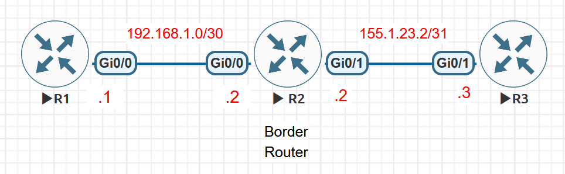
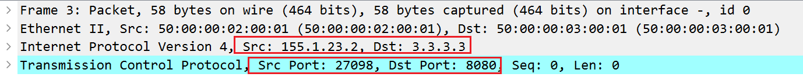

# NAT Destination-Port Redirection from Inside to Outside

This EVE-NG lab demonstrates a less intuitive Cisco IOS NAT use case: an internal application is fixed to TCP destination port `12345`, while the external service listens on TCP port `8080` and the ISP blocks TCP `12345`. The border router must therefore translate the destination port as traffic leaves the inside network.

The scenario was adapted from [CostiSer's Quiz #3](https://costiser.ro/2013/01/19/quiz-3/) and reproduced on Cisco IOS 15.8. The retained evidence includes failure-state CLI output, corrected NAT tables and statistics, and an outside-link packet capture. It does not include the client's final `Open` message, a full TCP handshake, or a post-fix ACL counter comparison; those remain repeat-run checks.

## Objectives

- Reproduce an upstream ACL blocking TCP destination port `12345`.
- Preserve the client application's fixed destination `3.3.3.3:12345`.
- Keep the existing inside-source PAT configuration on the border router.
- Redirect the destination port from `12345` to `8080` on traffic leaving R2.
- Explain how inside-source PAT and outside-source static PAT can affect the same flow.
- Verify the forward translation and record the bidirectional NAT state.

## Environment and Scope

- Platform: EVE-NG
- Network operating system: Cisco IOS 15.8
- Nodes: three Cisco IOS routers
- R1: internal client
- R2: border router and NAT device
- R3: ISP filter and simulated partner server
- Test service: the IOS HTTP server on TCP `8080`

The HTTP service is used only to provide a TCP listener. The lab tests connection establishment and NAT behaviour, not the HTTP application itself.

Platform-generated boilerplate and unused shutdown interfaces are omitted from the configuration excerpts so that the forwarding and NAT logic remain visible.

## Topology



| Device | Interface | Address | Role |
| --- | --- | --- | --- |
| R1 | `Gi0/0` | `192.168.1.1/30` | Internal client |
| R2 | `Gi0/0` | `192.168.1.2/30` | NAT inside |
| R2 | `Gi0/1` | `155.1.23.2/31` | NAT outside |
| R3 | `Gi0/1` | `155.1.23.3/31` | ISP-facing link |
| R3 | `Loopback0` | `3.3.3.3/32` | Simulated partner server |

R3 combines two roles for this focused lab. Its inbound ACL represents the ISP policy, while `Loopback0` and the HTTP server represent the partner service.

## Traffic Requirement

The internal application cannot be reconfigured and always opens a TCP connection to:

```text
3.3.3.3:12345
```

The real service is available at:

```text
3.3.3.3:8080
```

R2 must preserve the address while changing only the destination port:

```text
Inside view:   3.3.3.3:12345
Outside view:  3.3.3.3:8080
```

## Baseline Configuration

### R1: internal client

```cisco
hostname R1
!
no ip domain lookup
ip cef
!
interface GigabitEthernet0/0
 ip address 192.168.1.1 255.255.255.252
 no shutdown
!
ip route 0.0.0.0 0.0.0.0 192.168.1.2
```

### R2: border router before the correction

```cisco
hostname R2
!
no ip domain lookup
ip cef
!
interface GigabitEthernet0/0
 ip address 192.168.1.2 255.255.255.252
 ip nat inside
 ip virtual-reassembly in
 no shutdown
!
interface GigabitEthernet0/1
 ip address 155.1.23.2 255.255.255.254
 ip nat outside
 ip virtual-reassembly in
 no shutdown
!
ip access-list extended ACL_INTERNAL
 permit ip 192.168.1.0 0.0.0.255 any
!
ip nat inside source list ACL_INTERNAL interface GigabitEthernet0/1 overload
ip route 0.0.0.0 0.0.0.0 155.1.23.3
```

The existing NAT statement performs source PAT. It hides internal addresses behind R2's outside-interface address, but it does not change the external destination port.

### R3: ISP policy and partner service

```cisco
hostname R3
!
no ip domain lookup
ip cef
!
interface Loopback0
 ip address 3.3.3.3 255.255.255.255
!
interface GigabitEthernet0/1
 ip address 155.1.23.3 255.255.255.254
 ip access-group ACL_ISP in
 no shutdown
!
ip http server
ip http port 8080
no ip http secure-server
!
ip access-list extended ACL_ISP
 deny tcp any host 3.3.3.3 eq 12345
 permit ip any any
```

The ACL drops an unmodified connection to TCP `12345`. The HTTP server gives R3 a listening socket on TCP `8080`, allowing the corrected TCP handshake to complete.

## Stage 1: Reproduce the Failure

Confirm that R1 can reach the server address and then attempt the application connection:

```cisco
R1#ping 3.3.3.3
Type escape sequence to abort.
Sending 5, 100-byte ICMP Echos to 3.3.3.3, timeout is 2 seconds:
!!!!!
Success rate is 100 percent (5/5), round-trip min/avg/max = 2/2/3 ms

R1#telnet 3.3.3.3 12345
Trying 3.3.3.3, 12345 ...
% Destination unreachable; gateway or host down
```

Inspect the border router and ISP policy:

```cisco
R2#show ip nat translations
Pro Inside global      Inside local       Outside local      Outside global
icmp 155.1.23.2:1      192.168.1.1:1      3.3.3.3:1          3.3.3.3:1
tcp 155.1.23.2:41759   192.168.1.1:41759  3.3.3.3:12345      3.3.3.3:12345

R3#show access-lists ACL_ISP
Extended IP access list ACL_ISP
    10 deny tcp any host 3.3.3.3 eq 12345 (6 matches)
    20 permit ip any any (57 matches)
```

Acceptance criteria for the failure state:

- ICMP reachability succeeds because the ACL permits other IP traffic.
- The TCP connection to port `12345` fails.
- R3 reports six ACL matches for TCP destination port `12345` after the failed attempts.
- R2 performs inside-source PAT, but the destination remains `3.3.3.3:12345`.

## Stage 2: Apply the Correction

Add the following command on R2 without removing the existing overload rule:

```cisco
R2(config)# ip nat outside source static tcp 3.3.3.3 8080 3.3.3.3 12345 extendable
```

The command follows this order:

```text
ip nat outside source static tcp
  <outside-global-address> <outside-global-port>
  <outside-local-address>  <outside-local-port>
```

For this lab:

| NAT term | Value | Meaning |
| --- | --- | --- |
| Outside global | `3.3.3.3:8080` | The real external server and listening port |
| Outside local | `3.3.3.3:12345` | How the external service appears to the inside client |

Static NAT is bidirectional. When traffic travels from inside to outside, R2 matches the destination against the outside-local tuple and translates it to the outside-global tuple. The apparently source-oriented command therefore changes the destination port in this direction.

## How the Two NAT Rules Work Together

R2 now has two independent mappings:

```cisco
ip nat inside source list ACL_INTERNAL interface GigabitEthernet0/1 overload
ip nat outside source static tcp 3.3.3.3 8080 3.3.3.3 12345 extendable
```

They are not mutually exclusive and are not processed as a top-to-bottom ACL. Each rule translates a different endpoint of the same TCP flow:

| Rule | Forward-path field translated | Result |
| --- | --- | --- |
| Inside-source overload | Source address and, if necessary, source port | `192.168.1.1` becomes `155.1.23.2` |
| Outside-source static PAT | Destination port | `3.3.3.3:12345` becomes `3.3.3.3:8080` |

An illustrative connection is transformed as follows:

| Stage | Source | Destination |
| --- | --- | --- |
| R1 sends | `192.168.1.1:44060` | `3.3.3.3:12345` |
| R2 sends toward R3 | `155.1.23.2:44060` | `3.3.3.3:8080` |
| R3 replies | `3.3.3.3:8080` | `155.1.23.2:44060` |
| R2 delivers to R1 | `3.3.3.3:12345` | `192.168.1.1:44060` |

The source port is illustrative. PAT may preserve it or select another available port.

The corresponding NAT state has four useful views:

| Translation field | Example | Interpretation |
| --- | --- | --- |
| Inside local | `192.168.1.1:44060` | Actual internal client |
| Inside global | `155.1.23.2:44060` | Client identity visible outside |
| Outside local | `3.3.3.3:12345` | Server identity visible inside |
| Outside global | `3.3.3.3:8080` | Actual external service |

## Stage 3: Verify the Corrected Flow

Clear old lab translations if necessary, then repeat the connection:

```cisco
R2# clear ip nat translation *
R1# telnet 3.3.3.3 12345
```

Verify the static mapping and active flow:

```cisco
R2#show ip nat translations
Pro Inside global      Inside local       Outside local      Outside global
tcp ---                ---                3.3.3.3:12345      3.3.3.3:8080
tcp 155.1.23.2:27098   192.168.1.1:27098  3.3.3.3:12345      3.3.3.3:8080

R2#show ip nat translations verbose
Pro Inside global      Inside local       Outside local      Outside global
tcp ---                ---                3.3.3.3:12345      3.3.3.3:8080
    create 00:00:51, use 00:00:16 timeout:0,
    flags:
static, extended, outside, extendable, use_count: 1, entry-id: 18, lc_entries: 0
tcp 155.1.23.2:27098   192.168.1.1:27098  3.3.3.3:12345      3.3.3.3:8080
    create 00:00:16, use 00:00:16 timeout:86400000, left 23:59:43, Map-Id(In): 1,
    flags:
extended, outside, use_count: 0, entry-id: 19, lc_entries: 0

R2#show ip nat statistics
Total active translations: 2 (1 static, 1 dynamic; 2 extended)
Peak translations: 6, occurred 01:25:18 ago
Outside interfaces:
  GigabitEthernet0/1
Inside interfaces:
  GigabitEthernet0/0
Hits: 120  Misses: 0
CEF Translated packets: 114, CEF Punted packets: 6
Expired translations: 5
Dynamic mappings:
-- Inside Source
[Id: 1] access-list ACL_INTERNAL interface GigabitEthernet0/1 refcount 1

Total doors: 0
Appl doors: 0
Normal doors: 0
Queued Packets: 0
```

Recorded evidence for the corrected state:

- R2 installs the static outside mapping from outside local `3.3.3.3:12345` to outside global `3.3.3.3:8080`.
- The active translation combines that destination-port rewrite with inside-source PAT from `192.168.1.1:27098` to `155.1.23.2:27098`.
- The outside-link capture shows the forwarded packet as `155.1.23.2:27098 -> 3.3.3.3:8080`.



The capture was taken on the R2-R3 outside link and directly confirms the source PAT and destination-port translation on the forward path. The retained artifacts do not show the final R1 `Open` message, the complete TCP handshake, or a post-fix ACL counter comparison; capture those items in a repeat run if independent end-to-end proof is required.

## Final R2 Configuration

```cisco
hostname R2
!
no ip domain lookup
ip cef
!
interface GigabitEthernet0/0
 ip address 192.168.1.2 255.255.255.252
 ip nat inside
 ip virtual-reassembly in
 no shutdown
!
interface GigabitEthernet0/1
 ip address 155.1.23.2 255.255.255.254
 ip nat outside
 ip virtual-reassembly in
 no shutdown
!
ip access-list extended ACL_INTERNAL
 permit ip 192.168.1.0 0.0.0.255 any
!
ip nat inside source list ACL_INTERNAL interface GigabitEthernet0/1 overload
ip nat outside source static tcp 3.3.3.3 8080 3.3.3.3 12345 extendable
!
ip route 0.0.0.0 0.0.0.0 155.1.23.3
```

## Troubleshooting Checklist

1. Confirm R1 uses `192.168.1.2` as its default route.
2. Confirm R2 uses `Gi0/0` as `ip nat inside` and `Gi0/1` as `ip nat outside`.
3. Confirm R2 can route to `3.3.3.3` through `155.1.23.3`.
4. Confirm the R3 HTTP server is enabled on TCP `8080`.
5. Confirm `ACL_ISP` is applied inbound on R3 `Gi0/1`.
6. Confirm the static mapping lists global port `8080` before local port `12345`.
7. Clear stale translations before repeating a controlled test.
8. Compare the ACL counters and NAT table before and after exactly one connection attempt.

## Rollback

Remove only the destination-port mapping:

```cisco
R2(config)# no ip nat outside source static tcp 3.3.3.3 8080 3.3.3.3 12345 extendable
```

The existing inside-source overload rule remains in place, so ordinary outbound PAT continues to function. To clean up the simulated service after the experiment:

```cisco
R3(config)# no ip http server
R3(config)# no ip http port
```

## Operational Limitations

- R3 combines the ISP and partner-server roles; a production path would separate provider policy from the application endpoint.
- The ACL permits all traffic except the one test port and is not a production security policy.
- `ACL_INTERNAL` retains the supplied `/24` match, while the reproduced point-to-point link is `/30`. A tightly scoped version of this exact three-router lab could instead match `192.168.1.0 0.0.0.3`.
- The IOS HTTP server is enabled only to provide a TCP `8080` listener. It should not be exposed or retained unnecessarily.
- Telnet is used as a simple TCP connectivity test, not as a recommended management protocol.
- The `extendable` keyword is retained from the validated configuration. It is useful when overlapping static translations may exist, although this single mapping does not rely on multiple overlapping entries.
- The lab proves the NAT mechanism for this topology; platform syntax and processing details should be revalidated on other IOS or IOS XE releases.

## Key Lessons

- `inside` and `outside` identify NAT address domains; they do not simply mean the direction in which the current packet is travelling.
- Inside-source PAT and outside-source static PAT can translate different endpoints of the same flow.
- A static NAT mapping is bidirectional, so an outside-source mapping can change the destination of inside-to-outside traffic.
- NAT verification requires all four address views: inside local, inside global, outside local, and outside global.
- ACL counters, NAT state, and the real listening socket together provide stronger evidence than a successful ping.

## References

- [CostiSer: Quiz #3 - NAT port redirection from inside to outside](https://costiser.ro/2013/01/19/quiz-3/)
- [CostiSer: NAT - Port Forwarding in Both Directions](https://costiser.ro/2013/01/26/nat-port-forwarding-in-both-directions/)
- [Cisco IOS XE IP Addressing Configuration Guide: NAT for IP Address Conservation](https://www.cisco.com/c/en/us/td/docs/routers/ios/config/17-x/ip-addressing/b-ip-addressing/m_iadnat-addr-consv-xe.html)
