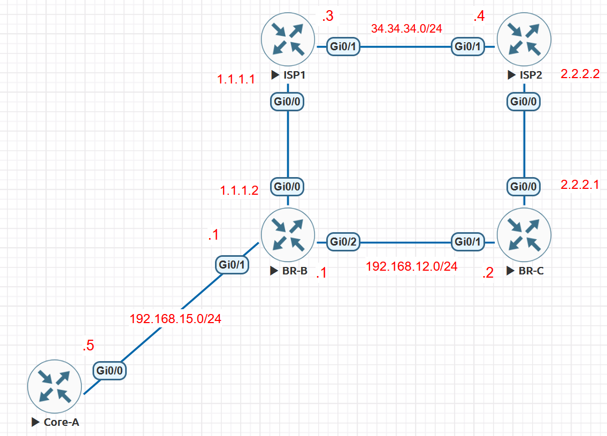

# OSPF Default Route Blackholing and Failover

This EVE-NG lab reproduces a dual-Internet failure in which OSPF continues to advertise a default route through an edge router that has already lost its upstream default. The internal routing table still looks valid, but traffic is delivered to a router that cannot forward it.

The fault is caused by using `default-information originate always` on both border routers. The `always` keyword deliberately separates OSPF default-route origination from the presence of a usable default route in the local routing table. Removing that keyword makes each border router advertise `0.0.0.0/0` only while it has a default route to support the advertisement.

This lab was reconstructed from [CostiSer's Quiz #24](https://costiser.ro/2014/05/10/quiz-24/) and successfully reproduced and resolved in EVE-NG.

## Objectives

- Build two Internet exits that inject equal-cost OSPF external default routes.
- Verify why CORE-A initially chooses the exit through BR-B.
- Fail the BR-B-to-ISP-1 circuit and reproduce the traffic black hole.
- Distinguish a valid OSPF Type-5 LSA from usable upstream reachability.
- Correct the default-origination policy without changing OSPF path cost.
- Verify withdrawal, failover through BR-C, recovery, and rollback.

## Environment and Scope

The topology uses five Cisco IOS routers in EVE-NG. The original quiz used FastEthernet and Serial interfaces; equivalent Ethernet interfaces may be substituted when the selected virtual image does not provide them.

NAT overload is included to provide a return path for the private inside addresses. NAT is not the cause of the OSPF failure.

## Topology



CORE-A has no direct link to BR-C. Even after a successful failover, its first hop can therefore remain BR-B; BR-B becomes a transit router toward BR-C rather than the Internet exit.

Internal links run in OSPF area 0. BR-B and BR-C are OSPF autonomous system boundary routers (ASBRs) because they inject the default route. Each receives `0.0.0.0/0` through eBGP from its ISP.

## Baseline Configuration

The following configuration is intentionally limited to the features required by this experiment. Add `clock rate` only on a Serial interface that is actually the DCE side in the selected image.

### CORE-A

```cisco
hostname CORE-A
!
interface GigabitEthernet0/0
 ip address 192.168.15.5 255.255.255.0
 no shutdown
!
router ospf 1
 network 192.168.0.0 0.0.255.255 area 0
```

### BR-B

```cisco
hostname BR-B
!
interface GigabitEthernet0/2
 ip address 192.168.12.1 255.255.255.0
 ip nat inside
 no shutdown
!
interface GigabitEthernet0/1
 ip address 192.168.15.1 255.255.255.0
 ip nat inside
 no shutdown
!
interface GigabitEthernet0/0
 ip address 1.1.1.2 255.255.255.252
 ip nat outside
 no shutdown
!
router ospf 1
 network 192.168.0.0 0.0.255.255 area 0
 default-information originate always
!
router bgp 65001
 neighbor 1.1.1.1 remote-as 100
!
ip access-list standard NAT_INSIDE
 permit 192.168.0.0 0.0.255.255
!
ip nat inside source list NAT_INSIDE interface GigabitEthernet0/0 overload
```

### BR-C

```cisco
hostname BR-C
!
interface GigabitEthernet0/1
 ip address 192.168.12.2 255.255.255.0
 ip nat inside
 no shutdown
!
interface GigabitEthernet0/0
 ip address 2.2.2.1 255.255.255.252
 ip nat outside
 no shutdown
!
router ospf 1
 network 192.168.0.0 0.0.255.255 area 0
 default-information originate always
!
router bgp 65001
 neighbor 2.2.2.2 remote-as 200
!
ip access-list standard NAT_INSIDE
 permit 192.168.0.0 0.0.255.255
!
ip nat inside source list NAT_INSIDE interface GigabitEthernet0/0 overload
```

### ISP-1

```cisco
hostname ISP-1
!
interface GigabitEthernet0/0
 ip address 1.1.1.1 255.255.255.252
 no shutdown
!
interface GigabitEthernet0/1
 ip address 34.34.34.3 255.255.255.0
 no shutdown
!
router bgp 100
 neighbor 1.1.1.2 remote-as 65001
 neighbor 1.1.1.2 default-originate
 neighbor 34.34.34.4 remote-as 200
!
ip route 2.2.2.0 255.255.255.252 34.34.34.4
```

### ISP-2

```cisco
hostname ISP-2
!
interface GigabitEthernet0/0
 ip address 2.2.2.2 255.255.255.252
 no shutdown
!
interface GigabitEthernet0/1
 ip address 34.34.34.4 255.255.255.0
 no shutdown
!
router bgp 200
 neighbor 2.2.2.1 remote-as 65001
 neighbor 2.2.2.1 default-originate
 neighbor 34.34.34.3 remote-as 100
!
ip route 1.1.1.0 255.255.255.252 34.34.34.3
```

## Stage 1: Verify the Healthy Baseline

Confirm the control plane before testing application reachability.

On BR-B:

```cisco
BR-B#sh ip bgp summary | begin Neighbor
Neighbor        V           AS MsgRcvd MsgSent   TblVer  InQ OutQ Up/Down  State/PfxRcd
1.1.1.1         4          100       5       4        2    0    0 00:00:20        1

BR-B#show ip bgp | b Network
     Network          Next Hop            Metric LocPrf Weight Path
 *>   0.0.0.0          1.1.1.1                                0 100 i

BR-B#show ip route 0.0.0.0
Routing entry for 0.0.0.0/0, supernet
  Known via "bgp 65001", distance 20, metric 0, candidate default path
  Tag 100, type external
  Last update from 1.1.1.1 00:01:11 ago
  Routing Descriptor Blocks:
  * 1.1.1.1, from 1.1.1.1, 00:01:11 ago
      Route metric is 0, traffic share count is 1
      AS Hops 1
      Route tag 100
      MPLS label: none

BR-B#show ip ospf neighbor
Neighbor ID     Pri   State           Dead Time   Address         Interface
192.168.12.2      1   FULL/BDR        00:00:39    192.168.12.2    GigabitEthernet0/2
192.168.15.5      1   FULL/DR         00:00:33    192.168.15.5    GigabitEthernet0/1
```

On BR-C:

```
BR-C#sh ip bgp summary | begin Neighbor
Neighbor        V           AS MsgRcvd MsgSent   TblVer  InQ OutQ Up/Down  State/PfxRcd
2.2.2.2         4          200     140     140        2    0    0 02:04:58        1

BR-C#show ip bgp | b Network
     Network          Next Hop            Metric LocPrf Weight Path
 *>   0.0.0.0          2.2.2.2                                0 200 i

BR-C#show ip route 0.0.0.0
Routing entry for 0.0.0.0/0, supernet
  Known via "bgp 65001", distance 20, metric 0, candidate default path
  Tag 200, type external
  Last update from 2.2.2.2 02:04:25 ago
  Routing Descriptor Blocks:
  * 2.2.2.2, from 2.2.2.2, 02:04:25 ago
      Route metric is 0, traffic share count is 1
      AS Hops 1
      Route tag 200
      MPLS label: none

BR-C#show ip ospf neighbor
Neighbor ID     Pri   State           Dead Time   Address         Interface
192.168.15.1      1   FULL/DR         00:00:32    192.168.12.1    GigabitEthernet0/1
```

Both border routers should have an eBGP-learned default route and a Full OSPF adjacency on `192.168.12.0/24`.

On CORE-A:

```cisco
CORE-A#show ip ospf database external 0.0.0.0

            OSPF Router with ID (192.168.15.5) (Process ID 1)

                Type-5 AS External Link States

  LS age: 1524
  Options: (No TOS-capability, DC, Upward)
  LS Type: AS External Link
  Link State ID: 0.0.0.0 (External Network Number )
  Advertising Router: 192.168.12.2
  LS Seq Number: 80000004
  Checksum: 0xC86F
  Length: 36
  Network Mask: /0
        Metric Type: 2 (Larger than any link state path)
        MTID: 0
        Metric: 1
        Forward Address: 0.0.0.0
        External Route Tag: 1

  LS age: 253
  Options: (No TOS-capability, DC, Upward)
  LS Type: AS External Link
  Link State ID: 0.0.0.0 (External Network Number )
  Advertising Router: 192.168.15.1
  LS Seq Number: 80000001
  Checksum: 0xBF79
  Length: 36
  Network Mask: /0
        Metric Type: 2 (Larger than any link state path)
        MTID: 0
        Metric: 1
        Forward Address: 0.0.0.0
        External Route Tag: 1

CORE-A#show ip route 0.0.0.0
Routing entry for 0.0.0.0/0, supernet
  Known via "ospf 1", distance 110, metric 1, candidate default path
  Tag 1, type extern 2, forward metric 1
  Last update from 192.168.15.1 on GigabitEthernet0/0, 00:04:54 ago
  Routing Descriptor Blocks:
  * 192.168.15.1, from 192.168.15.1, 00:04:54 ago, via GigabitEthernet0/0
      Route metric is 1, traffic share count is 1
      Route tag 1

CORE-A#traceroute 34.34.34.4
Type escape sequence to abort.
Tracing the route to 34.34.34.4
VRF info: (vrf in name/id, vrf out name/id)
  1 192.168.15.1 2 msec 2 msec 2 msec
  2 1.1.1.1 4 msec 3 msec 2 msec
  3 34.34.34.4 3 msec *  4 msec
```

Observed baseline state:

- The OSPF database contains two Type-5 LSAs for `0.0.0.0/0`, one from each ASBR.
- Both defaults are External Type 2 (`O*E2`) and are advertised with the same external metric unless a metric was configured explicitly.
- CORE-A chooses the LSA whose advertising ASBR has the lower internal OSPF distance. In this topology that path is through BR-B.
- The traceroute reaches `34.34.34.4` through BR-B and ISP-1.

The exact displayed external metric can vary with IOS release and configuration. The important condition is that the two ASBRs advertise the same external metric. RFC 2328 specifies that equal-cost Type-2 routes are then distinguished by the internal distance to their advertising routers.

## Stage 2: Inject the Failure

Shut the ISP-1-facing circuit on one end. The example below uses BR-B:

```cisco
BR-B# configure terminal
BR-B(config)# interface GigabitEthernet0/0
BR-B(config-if)# shutdown
```

Confirm that the interface and eBGP session fail and that BR-B loses its BGP default:

```cisco
BR-B#show ip ospf database external 0.0.0.0

            OSPF Router with ID (192.168.15.1) (Process ID 1)

                Type-5 AS External Link States

  LS age: 1769
  Options: (No TOS-capability, DC, Upward)
  LS Type: AS External Link
  Link State ID: 0.0.0.0 (External Network Number )
  Advertising Router: 192.168.12.2
  LS Seq Number: 80000004
  Checksum: 0xC86F
  Length: 36
  Network Mask: /0
        Metric Type: 2 (Larger than any link state path)
        MTID: 0
        Metric: 1
        Forward Address: 0.0.0.0
        External Route Tag: 1

  LS age: 498
  Options: (No TOS-capability, DC, Upward)
  LS Type: AS External Link
  Link State ID: 0.0.0.0 (External Network Number )
  Advertising Router: 192.168.15.1
  LS Seq Number: 80000001
  Checksum: 0xBF79
  Length: 36
  Network Mask: /0
        Metric Type: 2 (Larger than any link state path)
        MTID: 0
        Metric: 1
        Forward Address: 0.0.0.0
        External Route Tag: 1

BR-B#sh ip bgp 0.0.0.0
BGP routing table entry for 0.0.0.0/0, version 3
Paths: (0 available, no best path)
  Not advertised to any peer

BR-B#show ip route 0.0.0.0
% Network not in table
```

Next, check CORE-A again:

```cisco
CORE-A#show ip ospf data external 0.0.0.0

            OSPF Router with ID (192.168.15.5) (Process ID 1)

                Type-5 AS External Link States

  LS age: 1704
  Options: (No TOS-capability, DC, Upward)
  LS Type: AS External Link
  Link State ID: 0.0.0.0 (External Network Number )
  Advertising Router: 192.168.12.2
  LS Seq Number: 80000004
  Checksum: 0xC86F
  Length: 36
  Network Mask: /0
        Metric Type: 2 (Larger than any link state path)
        MTID: 0
        Metric: 1
        Forward Address: 0.0.0.0
        External Route Tag: 1

  LS age: 433
  Options: (No TOS-capability, DC, Upward)
  LS Type: AS External Link
  Link State ID: 0.0.0.0 (External Network Number )
  Advertising Router: 192.168.15.1
  LS Seq Number: 80000001
  Checksum: 0xBF79
  Length: 36
  Network Mask: /0
        Metric Type: 2 (Larger than any link state path)
        MTID: 0
        Metric: 1
        Forward Address: 0.0.0.0
        External Route Tag: 1

CORE-A#show ip route 0.0.0.0
Routing entry for 0.0.0.0/0, supernet
  Known via "ospf 1", distance 110, metric 1, candidate default path
  Tag 1, type extern 2, forward metric 1
  Last update from 192.168.15.1 on GigabitEthernet0/0, 00:07:19 ago
  Routing Descriptor Blocks:
  * 192.168.15.1, from 192.168.15.1, 00:07:19 ago, via GigabitEthernet0/0
      Route metric is 1, traffic share count is 1
      Route tag 1

CORE-A#traceroute 34.34.34.4
Type escape sequence to abort.
Tracing the route to 34.34.34.4
VRF info: (vrf in name/id, vrf out name/id)
  1 192.168.15.1 2 msec 2 msec 2 msec
  2 192.168.15.1 !H  *  !H
```

Observed faulty state:

- BR-B no longer has a usable upstream default route.
- BR-B still originates its Type-5 default LSA because of `default-information originate always`.
- BR-B can see BR-C's Type-5 default LSA in the link-state database, but it does not install that route while BR-B is configured to originate its own default with `always`.
- CORE-A still sees both default LSAs and continues selecting the lower-cost path toward BR-B.
- Traffic reaches BR-B, but BR-B cannot forward it toward an Internet exit. A traceroute can stop at BR-B with an unreachable indication.

## Root Cause

The OSPF database is internally consistent; the advertised information is simply no longer tied to BR-B's forwarding capability.

```text
ISP-1 failure
    -> BR-B loses its eBGP default route
    -> "always" keeps BR-B's OSPF default LSA active
    -> BR-B does not install BR-C's OSPF default while originating its own with "always"
    -> CORE-A still prefers the nearer equal-metric ASBR
    -> traffic is sent to BR-B
    -> BR-B has no usable default route
    -> traffic is blackholed
```

`default-information originate always` does exactly what its name implies: it advertises the OSPF default even when no default route exists in the router's routing table. In the tested IOS behaviour documented by the original solution, an OSPF router originating a default with `always` also declines to install another router's Type-5 default. OSPF can therefore contain BR-C's valid LSA while BR-B still has no default route in its routing table.

This distinction explains why checking only `show ip ospf database` is misleading. The link-state database records received advertisements; it does not prove that a particular LSA passed route calculation and entered the routing table. In a repeat run, inspect the detailed LSA for the `Routing Bit Set` indicator and confirm the result independently with `show ip route 0.0.0.0`.

Changing the OSPF cost, external metric, or metric type can influence which ASBR is preferred, but it does not correct a stale advertisement. A router with the most attractive metric can still blackhole traffic if its upstream route has failed.

## Stage 3: Correct the Origination Policy

On BR-B, replace unconditional origination with conditional origination:

```cisco
configure terminal
 router ospf 1
  no default-information originate always
  default-information originate
end
```

Without `always`, Cisco IOS originates the OSPF default only when the router has a default route in its routing table.

For a symmetric final policy, apply the same change to BR-C. The captured evidence below validates the BR-B/ISP-1 failure direction; a reverse BR-C/ISP-2 failure test was not captured in this run.

Removing `always` has two effects during the ISP-1 failure: BR-B withdraws its unsupported self-originated default, and BR-C's Type-5 LSA becomes eligible for route calculation on BR-B. BR-B can then install the OSPF default through `192.168.12.2`.

## Alternative Design: Exchange Defaults with iBGP

The original solution also presents iBGP between BR-B and BR-C as an alternative. Because both border routers use AS 65001, each can advertise its eBGP-learned default to the other:

```cisco
! BR-B
router bgp 65001
 neighbor 192.168.12.2 remote-as 65001
 neighbor 192.168.12.2 next-hop-self

! BR-C
router bgp 65001
 neighbor 192.168.12.1 remote-as 65001
 neighbor 192.168.12.1 next-hop-self
```

If ISP-1 fails, BR-B can then install the default learned through iBGP from BR-C and forward traffic toward the second exit. This removes the immediate black hole even if OSPF continues to originate the default with `always`.

For this focused experiment, conditional OSPF origination is the clearer correction because it removes the stale advertisement and directly couples the OSPF signal to a default route in the local routing table. An iBGP edge design can be appropriate in a real network, but it requires deliberate next-hop policy, filtering, session resiliency, and failure testing rather than being added only to hide an unconditional OSPF advertisement.

## Stage 4: Verify Failover

Keep the BR-B-to-ISP-1 circuit shut and verify the corrected state.

On CORE-A:

```cisco
CORE-A#show ip ospf database external 0.0.0.0

            OSPF Router with ID (192.168.15.5) (Process ID 1)

                Type-5 AS External Link States

  LS age: 1928
  Options: (No TOS-capability, DC, Upward)
  LS Type: AS External Link
  Link State ID: 0.0.0.0 (External Network Number )
  Advertising Router: 192.168.12.2
  LS Seq Number: 80000004
  Checksum: 0xC86F
  Length: 36
  Network Mask: /0
        Metric Type: 2 (Larger than any link state path)
        MTID: 0
        Metric: 1
        Forward Address: 0.0.0.0
        External Route Tag: 1

CORE-A#show ip route 0.0.0.0
Routing entry for 0.0.0.0/0, supernet
  Known via "ospf 1", distance 110, metric 1, candidate default path
  Tag 1, type extern 2, forward metric 2
  Last update from 192.168.15.1 on GigabitEthernet0/0, 00:01:31 ago
  Routing Descriptor Blocks:
  * 192.168.15.1, from 192.168.12.2, 00:01:31 ago, via GigabitEthernet0/0
      Route metric is 1, traffic share count is 1
      Route tag 1

CORE-A#traceroute 34.34.34.4
Type escape sequence to abort.
Tracing the route to 34.34.34.4
VRF info: (vrf in name/id, vrf out name/id)
  1 192.168.15.1 1 msec 2 msec 2 msec
  2 192.168.12.2 2 msec 3 msec 3 msec
  3 2.2.2.2 5 msec *  4 msec
```

On BR-B:

```cisco
BR-B#show ip ospf database external 0.0.0.0

            OSPF Router with ID (192.168.15.1) (Process ID 1)

                Type-5 AS External Link States

  LS age: 72
  Options: (No TOS-capability, DC, Upward)
  LS Type: AS External Link
  Link State ID: 0.0.0.0 (External Network Number )
  Advertising Router: 192.168.12.2
  LS Seq Number: 80000005
  Checksum: 0xC670
  Length: 36
  Network Mask: /0
        Metric Type: 2 (Larger than any link state path)
        MTID: 0
        Metric: 1
        Forward Address: 0.0.0.0
        External Route Tag: 1

BR-B#show ip route 0.0.0.0
Routing entry for 0.0.0.0/0, supernet
  Known via "ospf 1", distance 110, metric 1, candidate default path
  Tag 1, type extern 2, forward metric 1
  Last update from 192.168.12.2 on GigabitEthernet0/2, 00:00:27 ago
  Routing Descriptor Blocks:
  * 192.168.12.2, from 192.168.12.2, 00:00:27 ago, via GigabitEthernet0/2
      Route metric is 1, traffic share count is 1
      Route tag 1

BR-B#show ip route 192.168.12.2
Routing entry for 192.168.12.0/24
  Known via "connected", distance 0, metric 0 (connected, via interface)
  Routing Descriptor Blocks:
  * directly connected, via GigabitEthernet0/2
      Route metric is 0, traffic share count is 1
```

Observed corrected state:

- BR-B withdraws its self-originated Type-5 default LSA after its BGP default disappears.
- BR-C continues advertising the default because its eBGP default through ISP-2 remains installed.
- BR-B can now install BR-C's OSPF external default and forward traffic to `192.168.12.2`.
- CORE-A follows the default originated by BR-C.
- The data path becomes CORE-A -> BR-B -> BR-C -> ISP-2.

CORE-A's immediate next hop can still be `192.168.15.1` on BR-B because BR-B is the only adjacent internal router. That does not mean the failed exit is still selected. Use the advertising-router field in the Type-5 LSA, BR-B's routing table, and the full traceroute to prove the failover.

## Stage 5: Verify Recovery

Restore the ISP-1-facing interface:

```cisco
BR-B# configure terminal
BR-B(config)# interface GigabitEthernet0/0
BR-B(config-if)# no shutdown
```

Verify the entire control-plane and forwarding chain:

```cisco
BR-B#sh ip bgp 0.0.0.0
BGP routing table entry for 0.0.0.0/0, version 4
Paths: (1 available, best #1, table default)
  Not advertised to any peer
  Refresh Epoch 1
  100
    1.1.1.1 from 1.1.1.1 (34.34.34.3)
      Origin IGP, localpref 100, valid, external, best
      rx pathid: 0, tx pathid: 0x0

BR-B#show ip route 0.0.0.0
Routing entry for 0.0.0.0/0, supernet
  Known via "bgp 65001", distance 20, metric 0, candidate default path
  Tag 100, type external
  Last update from 1.1.1.1 00:00:09 ago
  Routing Descriptor Blocks:
  * 1.1.1.1, from 1.1.1.1, 00:00:09 ago
      Route metric is 0, traffic share count is 1
      AS Hops 1
      Route tag 100
      MPLS label: none

CORE-A#show ip ospf database external 0.0.0.0

            OSPF Router with ID (192.168.15.5) (Process ID 1)

                Type-5 AS External Link States

  LS age: 190
  Options: (No TOS-capability, DC, Upward)
  LS Type: AS External Link
  Link State ID: 0.0.0.0 (External Network Number )
  Advertising Router: 192.168.12.2
  LS Seq Number: 80000005
  Checksum: 0xC670
  Length: 36
  Network Mask: /0
        Metric Type: 2 (Larger than any link state path)
        MTID: 0
        Metric: 1
        Forward Address: 0.0.0.0
        External Route Tag: 1

  LS age: 38
  Options: (No TOS-capability, DC, Upward)
  LS Type: AS External Link
  Link State ID: 0.0.0.0 (External Network Number )
  Advertising Router: 192.168.15.1
  LS Seq Number: 80000001
  Checksum: 0xBF79
  Length: 36
  Network Mask: /0
        Metric Type: 2 (Larger than any link state path)
        MTID: 0
        Metric: 1
        Forward Address: 0.0.0.0
        External Route Tag: 1

CORE-A#traceroute 34.34.34.4
Type escape sequence to abort.
Tracing the route to 34.34.34.4
VRF info: (vrf in name/id, vrf out name/id)
  1 192.168.15.1 1 msec 2 msec 2 msec
  2 1.1.1.1 3 msec 2 msec 2 msec
  3 34.34.34.4 4 msec *  3 msec
```

BR-B should relearn the BGP default and originate its Type-5 default again. With equal external metrics, CORE-A should return to the lower internal-cost ASBR path through BR-B.

## State Matrix

| Test state | BR-B upstream default | BR-B Type-5 default | Selected advertising ASBR | End-to-end result |
| --- | --- | --- | --- | --- |
| Baseline with `always` | Present | Present | BR-B | Reachable |
| ISP-1 down with `always` | Absent | Still present | BR-B | Blackholed |
| ISP-1 down after the fix | Absent | Withdrawn | BR-C | Reachable through BR-B as transit |
| ISP-1 restored after the fix | Present | Present again | BR-B | Reachable |

## Verification Coverage and Remaining Checks

The recorded CLI covers the complete forwarding chain for the tested ISP-1 failure direction:

1. Healthy baseline: both Type-5 default LSAs, both eBGP-learned defaults, and a successful traceroute through ISP-1.
2. Faulty state: BR-B's missing BGP default, its persistent self-originated LSA, the unchanged CORE-A route, and the failed traceroute.
3. Corrected failure state: only BR-C's Type-5 default, BR-B's OSPF default via BR-C, and a successful traceroute through ISP-2.
4. Recovery: BR-B's restored BGP default, both Type-5 LSAs, and the restored traceroute through ISP-1.

A future repeat run could strengthen the record with the failed interface and BGP-neighbour state at the moment of failure, CORE-A's detailed default-route output after recovery, NAT translations on each exit, and a reverse BR-C/ISP-2 failure test.

The complete verification command set is:

```cisco
show ip interface brief
show ip bgp summary
show ip bgp 0.0.0.0
show ip ospf neighbor
show ip ospf database external 0.0.0.0
show ip route 0.0.0.0
show ip route 192.168.12.2
show ip nat translations
traceroute 34.34.34.4
```

Do not use a successful ping alone as proof of control-plane convergence. The database, routing table, and forwarding path together show why traffic failed and why the correction worked.

## Operational Limitations

- Conditional OSPF origination only follows the presence of a default route in the local routing table. If the directly connected eBGP session remains up while reachability fails farther inside the provider, the default may remain installed and advertised.
- Detecting a remote failure can require BFD, IP SLA/object tracking, conditional BGP advertisement, or another mechanism appropriate to the platform and service design.
- A tracked default route must test a meaningful destination. Tracking only the local ISP next hop does not prove end-to-end Internet reachability.
- Faster detection and faster convergence are separate concerns. BFD can detect an adjacent failure quickly; OSPF and BGP still need to withdraw and install the resulting routes.
- NAT state is exit-specific. Existing sessions may reset when traffic changes borders even when routing failover succeeds.
- The topology is a troubleshooting exercise, not a complete production edge design. It omits firewall policy, provider diversity, route filtering, maximum-prefix controls, authentication, monitoring, and change-management safeguards.

## Rollback

The recommended final state for this topology is conditional default origination. To restore the deliberately faulty behaviour for another test:

```cisco
configure terminal
 router ospf 1
  no default-information originate
  default-information originate always
end
```

Use that rollback only in an isolated lab. Restoring `always` also restores the risk that an edge router advertises a default route without a usable external path.

## Key Lessons

- A present route in the OSPF database is evidence of an advertisement, not proof of external reachability.
- `always` is a policy decision, not a harmless convenience keyword.
- Equal-metric E2 defaults are resolved using internal distance to the forwarding address or advertising ASBR.
- Path-preference tuning cannot repair an advertisement that should have been withdrawn.
- Verify failover at three layers: upstream route, OSPF LSA, and actual forwarding path.
- In a non-full-mesh topology, the first hop can remain unchanged even though the selected exit and later hops have changed.

## References

- [CostiSer: Quiz #24 - OSPF Default-Information Originate Always](https://costiser.ro/2014/05/10/quiz-24/)
- [CostiSer: OSPF Default-Information Originate - Side Effects of the `always` Keyword](https://costiser.ro/2014/12/03/ospf-default-information-originate-side-effects-of-always-keyword/)
- [Cisco IOS IP Routing: OSPF Command Reference - `default-information originate`](https://www.cisco.com/c/en/us/td/docs/ios-xml/ios/iproute_ospf/command/iro-cr-book/ospf-a1.html)
- [RFC 2328: OSPF Version 2](https://www.rfc-editor.org/rfc/rfc2328.html)
- [Cisco: OSPF Type-5 Route Calculation Configuration Example](https://www.cisco.com/c/en/us/support/docs/ip/open-shortest-path-first-ospf/118799-configure-ospf-00.html)
