# IGMPv1, IGMPv2, and IGMPv3 on Cisco IOSv

This EVE-NG lab examines IPv4 multicast receiver membership with IGMPv1, IGMPv2, and IGMPv3. Cisco IOSv nodes act as both multicast sources and receivers, so the lab does not depend on Linux hosts, VPCS, or an external traffic generator.

The captured run verifies querier election, the independence of the IGMP Querier and PIM Designated Router (DR), IGMPv1 and IGMPv2 message behaviour, static group membership, router-side IGMP filtering, IGMPv3 source filtering, Source-Specific Multicast (SSM), and basic IGMP Snooping state.

> [!NOTE]
> The exact IOSv and IOSvL2 software releases were not retained with the capture set. The configurations and outputs below reflect the recorded EVE-NG run, but command availability and timer presentation can differ between IOS, IOS XE, virtual images, and physical Catalyst platforms.

## Scope and Evidence Boundaries

- `Source1`, `Source2`, `H1`, and `H2` are IOSv routers used as endpoint simulators.
- `R1`, `R2`, and `R3` provide multicast routing. The endpoint nodes do not run PIM.
- The receiver nodes use `ip igmp join-group`; the source nodes use IOS multicast `ping` to generate traffic.
- The packet captures prove the message types and addresses visible in the screenshots. The IPv4 header was not expanded in every capture, so fields not visible in a screenshot are not presented as captured evidence.
- A host report-suppression test was planned, but no decisive Query/Report capture was retained. This document therefore does not claim that report suppression was observed in the run.
- The SSM test proves source-selective reception through IGMP state and source ping results. No `show ip mroute` or `show ip rpf` output was retained, so the document does not claim a captured comparison of `(*,G)` and `(S,G)` forwarding entries.
- The IGMP Snooping table was retained, but simultaneous H1-facing and H2-facing packet captures were not. The recorded evidence proves group-to-port learning, not a complete per-port forwarding comparison.
- Selective IGMPv3 EXCLUDE, IGMP Proxy/UDLR, throttling, and explicit tracking are outside the scope of this recorded run.

## Objectives

- Build working unicast and PIM reachability between source and receiver networks.
- Confirm that PIM enables IGMP on the receiver-facing routed interfaces.
- Verify the IGMPv2 querier election on a shared LAN.
- Demonstrate that the IGMP Querier and PIM DR can be different routers.
- Capture IGMPv2 Membership Report, Leave, and Group-Specific Query messages.
- Compare IGMPv1 and IGMPv2 leave behaviour.
- Verify a permanent `ip igmp static-group` membership.
- Permit and deny dynamic group membership with `ip igmp access-group`.
- Verify IGMPv3 INCLUDE state for one source in the SSM range.
- Verify an IGMPv3 EXCLUDE-empty membership that accepts both active sources.
- Confirm that IGMP Snooping learns the receiver-facing switch port.

## Topology

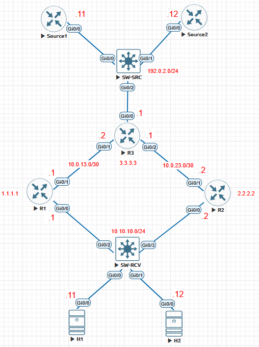

The receiver LAN is a shared multi-access network. R1 and R2 initially run both PIM and IGMP on this LAN so their IGMP and PIM elections can be compared. After the election test, PIM is removed from R2's receiver-facing interface and R1 becomes the only last-hop multicast router for the remaining tests.

### Addressing and Interface Map

| Node | Interface | Address | Connection or role |
| --- | --- | --- | --- |
| Source1 (`SRC1`) | `Gi0/0` | `192.0.2.11/24` | SW-SRC `Gi0/0`; multicast source 1 |
| Source2 (`SRC2`) | `Gi0/0` | `192.0.2.12/24` | SW-SRC `Gi0/1`; multicast source 2 |
| R3 | `Gi0/0` | `192.0.2.1/24` | SW-SRC `Gi0/2`; source-LAN gateway |
| R3 | `Gi0/1` | `10.0.13.2/30` | R1 `Gi0/1` |
| R3 | `Gi0/2` | `10.0.23.1/30` | R2 `Gi0/1` |
| R3 | `Loopback0` | `3.3.3.3/32` | Static PIM-SM RP |
| R1 | `Gi0/0` | `10.10.10.1/24` | SW-RCV `Gi0/2`; receiver LAN |
| R1 | `Gi0/1` | `10.0.13.1/30` | R3 `Gi0/1` |
| R1 | `Loopback0` | `1.1.1.1/32` | OSPF router ID |
| R2 | `Gi0/0` | `10.10.10.2/24` | SW-RCV `Gi0/3`; receiver LAN |
| R2 | `Gi0/1` | `10.0.23.2/30` | R3 `Gi0/2` |
| R2 | `Loopback0` | `2.2.2.2/32` | OSPF router ID |
| H1 | `Gi0/0` | `10.10.10.11/24` | SW-RCV `Gi0/0`; receiver 1 |
| H2 | `Gi0/0` | `10.10.10.12/24` | SW-RCV `Gi0/1`; receiver 2 |

## Base Configuration

### R1

```cisco
hostname R1
ip multicast-routing

interface Loopback0
 ip address 1.1.1.1 255.255.255.255
 ip pim sparse-mode

interface GigabitEthernet0/0
 description RECEIVER-LAN
 ip address 10.10.10.1 255.255.255.0
 ip pim sparse-mode
 ip igmp version 2
 ip igmp query-interval 10
 ip igmp query-max-response-time 3
 no shutdown

interface GigabitEthernet0/1
 description TO-R3
 ip address 10.0.13.1 255.255.255.252
 ip pim sparse-mode
 no shutdown

router ospf 1
 router-id 1.1.1.1
 network 1.1.1.1 0.0.0.0 area 0
 network 10.0.13.0 0.0.0.3 area 0
 network 10.10.10.0 0.0.0.255 area 0

ip pim rp-address 3.3.3.3
```

### R2

R2 receives a higher PIM DR priority, while R1 retains the lower receiver-LAN IPv4 address. This intentionally separates the PIM DR and IGMP Querier roles.

```cisco
hostname R2
ip multicast-routing

interface Loopback0
 ip address 2.2.2.2 255.255.255.255
 ip pim sparse-mode

interface GigabitEthernet0/0
 description RECEIVER-LAN
 ip address 10.10.10.2 255.255.255.0
 ip pim sparse-mode
 ip pim dr-priority 10
 ip igmp version 2
 ip igmp query-interval 10
 ip igmp query-max-response-time 3
 no shutdown

interface GigabitEthernet0/1
 description TO-R3
 ip address 10.0.23.2 255.255.255.252
 ip pim sparse-mode
 no shutdown

router ospf 1
 router-id 2.2.2.2
 network 2.2.2.2 0.0.0.0 area 0
 network 10.0.23.0 0.0.0.3 area 0
 network 10.10.10.0 0.0.0.255 area 0

ip pim rp-address 3.3.3.3
```

### R3

```cisco
hostname R3
ip multicast-routing

interface Loopback0
 ip address 3.3.3.3 255.255.255.255
 ip pim sparse-mode

interface GigabitEthernet0/0
 description SOURCE-LAN
 ip address 192.0.2.1 255.255.255.0
 ip pim sparse-mode
 no shutdown

interface GigabitEthernet0/1
 description TO-R1
 ip address 10.0.13.2 255.255.255.252
 ip pim sparse-mode
 no shutdown

interface GigabitEthernet0/2
 description TO-R2
 ip address 10.0.23.1 255.255.255.252
 ip pim sparse-mode
 no shutdown

router ospf 1
 router-id 3.3.3.3
 network 3.3.3.3 0.0.0.0 area 0
 network 192.0.2.0 0.0.0.255 area 0
 network 10.0.13.0 0.0.0.3 area 0
 network 10.0.23.0 0.0.0.3 area 0

ip pim rp-address 3.3.3.3
```

### Source1 and Source2

Source1:

```cisco
hostname SRC1

interface GigabitEthernet0/0
 description SOURCE-LAN
 ip address 192.0.2.11 255.255.255.0
 no shutdown

ip route 0.0.0.0 0.0.0.0 192.0.2.1
```

Source2:

```cisco
hostname SRC2

interface GigabitEthernet0/0
 description SOURCE-LAN
 ip address 192.0.2.12 255.255.255.0
 no shutdown

ip route 0.0.0.0 0.0.0.0 192.0.2.1
```

The source nodes do not run PIM or act as multicast transit routers.

### H1 and H2

H1:

```cisco
hostname H1
ip multicast-routing

interface GigabitEthernet0/0
 description RECEIVER-LAN
 ip address 10.10.10.11 255.255.255.0
 no shutdown

ip route 0.0.0.0 0.0.0.0 10.10.10.1
```

H2:

```cisco
hostname H2
ip multicast-routing

interface GigabitEthernet0/0
 description RECEIVER-LAN
 ip address 10.10.10.12 255.255.255.0
 no shutdown

ip route 0.0.0.0 0.0.0.0 10.10.10.1
```

`ip multicast-routing` provides the IOSv local-membership function used by `ip igmp join-group`. PIM is deliberately omitted from H1 and H2, so they are endpoint simulators rather than transit routers.

### SW-RCV

The switch ports below match the recorded topology.

```cisco
hostname SW-RCV

vlan 10
 name RECEIVERS

interface GigabitEthernet0/0
 description TO-H1
 switchport mode access
 switchport access vlan 10
 spanning-tree portfast

interface GigabitEthernet0/1
 description TO-H2
 switchport mode access
 switchport access vlan 10
 spanning-tree portfast

interface GigabitEthernet0/2
 description TO-R1
 switchport mode access
 switchport access vlan 10

interface GigabitEthernet0/3
 description TO-R2
 switchport mode access
 switchport access vlan 10
```

## Baseline Routing and PIM Verification

Verify the control plane before testing IGMP:

```cisco
R1# show ip ospf neighbor
R1# show ip pim neighbor
R1# show ip route 192.0.2.0
R3# show ip route 10.10.10.0
H1# ping 192.0.2.11
```

R1 formed OSPF adjacencies with R2 on the receiver LAN and R3 on the routed uplink:

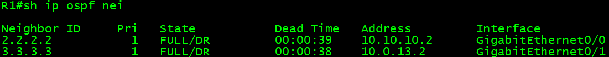

R1 also saw R2 and R3 as PIM neighbours. The output records R2's DR priority of 10 on the shared receiver LAN:

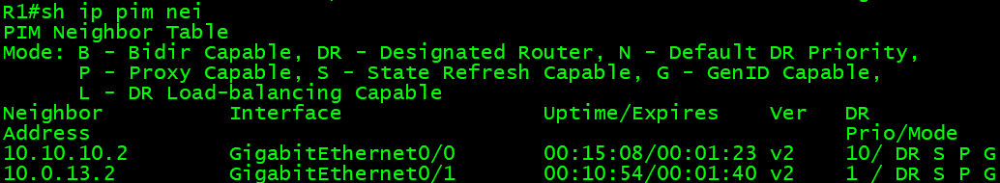

R1 learned `192.0.2.0/24` through R3:

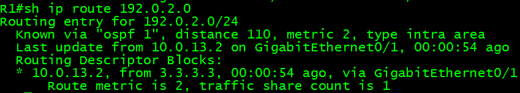

R3 learned equal-cost routes to `10.10.10.0/24` through R1 and R2:

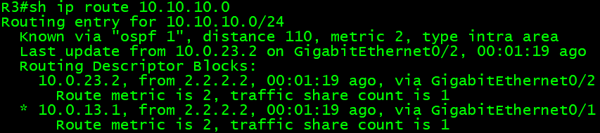

Finally, H1 successfully reached Source1 at `192.0.2.11`, proving end-to-end unicast reachability before multicast testing:

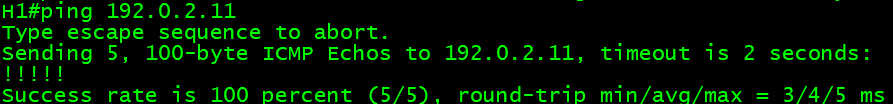

## IGMPv2 Querier Election and PIM DR

### Confirm IGMP Operation

PIM was enabled on both receiver-facing router interfaces. Check their IGMP state with:

```cisco
R1# show ip igmp interface GigabitEthernet0/0
R2# show ip igmp interface GigabitEthernet0/0
```

The recorded R1 output confirms:

- IGMP is enabled on `Gi0/0`.
- The host and router versions are IGMPv2.
- The configured Query Interval is 10 seconds.
- The Maximum Query Response Time is 3 seconds.
- R1 (`10.10.10.1`) is the IGMP Querier.
- R2 (`10.10.10.2`) is the multicast DR.

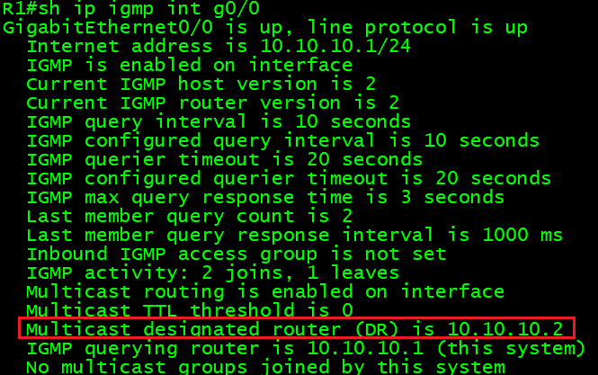

### Capture a General Query

Use the following Wireshark display filter on the receiver LAN:

```text
igmp.type == 0x11
```

The capture shows a Membership Query from `10.10.10.1` to the all-hosts address `224.0.0.1`. Its group address is `0.0.0.0`, identifying it as a General Query, and its advertised maximum response time is 3 seconds.

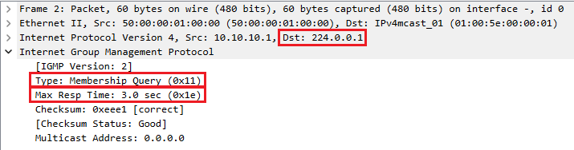

IGMP is carried directly by IPv4 as IP protocol 2 and uses a link-local TTL of 1. Those IPv4 fields should be expanded in Wireshark when capturing a future run; they are not visible in the retained screenshot above.

### Compare the Two Elections

```cisco
R1# show ip pim interface GigabitEthernet0/0 detail
R1# show ip igmp interface GigabitEthernet0/0
```

R2 won the PIM DR election because of its configured DR priority of 10:

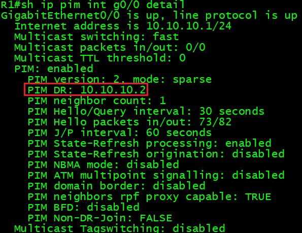

R1 remained the IGMP Querier because `10.10.10.1` is lower than `10.10.10.2`:

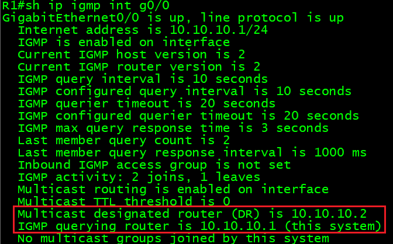

| Role | Recorded device | Selection reason |
| --- | --- | --- |
| IGMP Querier | R1 | Lowest IPv4 address on the LAN |
| PIM DR | R2 | Highest configured PIM DR priority |

The result demonstrates that IGMP Querier and PIM DR are separate elections and do not have to select the same router.

## Use R1 as the Only Last-Hop Router

The dual-router LAN was required for the election test. To remove PIM Assert and duplicate-tree variables from later tests, PIM was disabled only on R2's receiver-facing interface:

```cisco
R2(config)# interface GigabitEthernet0/0
R2(config-if)# no ip pim sparse-mode
```

R1 logged the PIM neighbour loss and changed the DR from `10.10.10.2` to itself. IGMP remained active on R1, which was now both the DR and Querier:

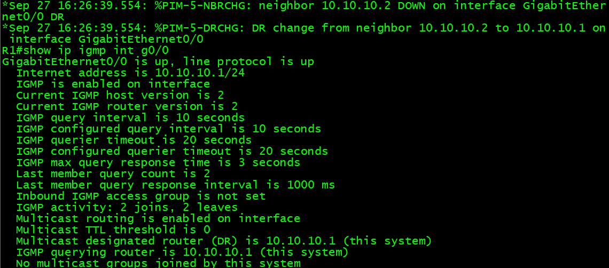

## IGMPv2 Membership and ASM Traffic

IGMP Snooping was temporarily disabled so the shared LAN behaved as a simple Layer 2 segment during the membership tests:

```cisco
SW-RCV(config)# no ip igmp snooping vlan 10
```

### Join H1

Start the receiver-LAN capture before entering the join command:

```cisco
H1(config)# interface GigabitEthernet0/0
H1(config-if)# ip igmp version 2
H1(config-if)# ip igmp join-group 239.1.1.1
```

Wireshark filter:

```text
igmp.type == 0x16
```

H1 sent an IGMPv2 Membership Report from `10.10.10.11` to the requested group `239.1.1.1`:

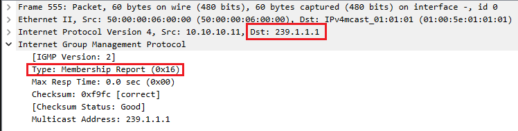

R1 learned the membership dynamically on `Gi0/0`. The state used EXCLUDE mode with an empty source list, which represents an any-source membership, and recorded H1 as the last reporter:

```cisco
R1# show ip igmp groups 239.1.1.1 detail
```

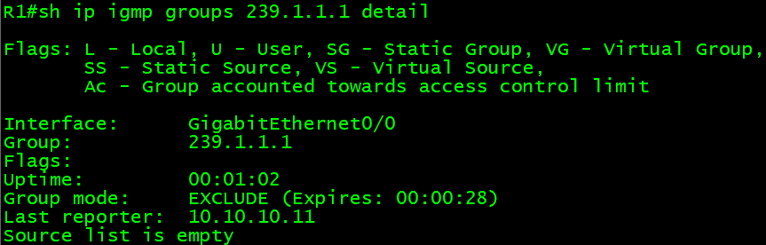

### Add H2 and Generate ASM Traffic

```cisco
H2(config)# interface GigabitEthernet0/0
H2(config-if)# ip igmp version 2
H2(config-if)# ip igmp join-group 239.1.1.1
```

Source1 then sent multicast ICMP Echo Requests:

```cisco
SRC1# ping 239.1.1.1 repeat 20 timeout 1 source GigabitEthernet0/0
```

The ping output contains replies from both `10.10.10.11` and `10.10.10.12`, proving that the single multicast request stream reached both registered receivers:

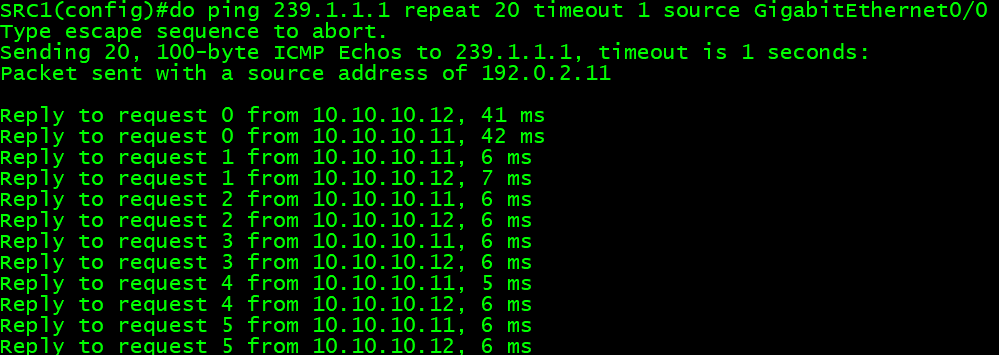

> [!NOTE]
> A decisive host report-suppression capture was not retained. Initial unsolicited Reports are not sufficient evidence of suppression, so this run makes no claim about which host suppressed a response to a later General Query.

## IGMPv2 Leave and Group-Specific Query

H2 was removed first so H1 was the only remaining member:

```cisco
H2(config)# interface GigabitEthernet0/0
H2(config-if)# no ip igmp join-group 239.1.1.1

R1# show ip igmp groups 239.1.1.1 detail
```

The capture was started before removing H1:

```cisco
H1(config)# interface GigabitEthernet0/0
H1(config-if)# no ip igmp join-group 239.1.1.1
```

Useful filter:

```text
igmp.type == 0x17 || igmp.type == 0x11
```

H1 sent an IGMPv2 Leave from `10.10.10.11` to the all-routers address `224.0.0.2`, naming `239.1.1.1` in the group field:

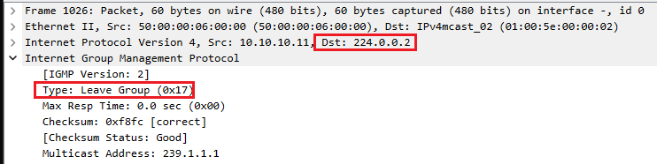

R1 immediately followed with a Group-Specific Query whose destination and group field were both `239.1.1.1`. The advertised maximum response time was reduced to 1 second for the last-member check:

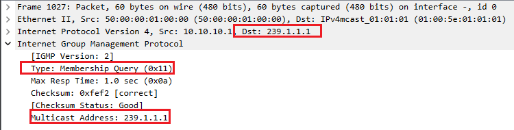

This contrasts with a General Query, which is sent to `224.0.0.1` and carries `0.0.0.0` in the group field.

## IGMPv1 Behaviour

### Configure Version 1

```cisco
R1(config)# interface GigabitEthernet0/0
R1(config-if)# ip igmp version 1
R1(config-if)# ip igmp query-interval 10

H1(config)# interface GigabitEthernet0/0
H1(config-if)# ip igmp version 1
H1(config-if)# ip igmp join-group 239.1.1.2
```

Wireshark filter:

```text
igmp.type == 0x12 || igmp.type == 0x11
```

R1 sent an IGMPv1 General Query to `224.0.0.1`. The IGMPv1 query has no usable Maximum Response Time field:

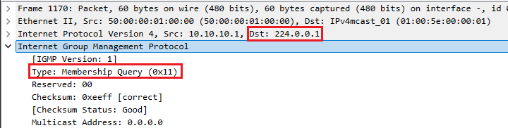

H1 responded with an IGMPv1 Membership Report (`0x12`) addressed to `239.1.1.2`:

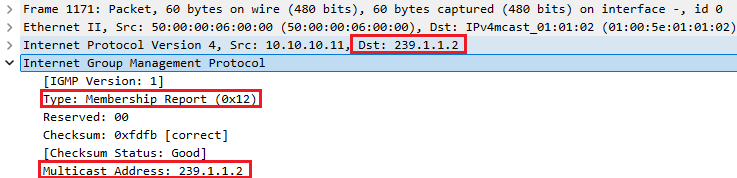

R1 showed IGMP host and router version 1, the 10-second Query Interval, and an active membership for `239.1.1.2` with H1 as the last reporter:

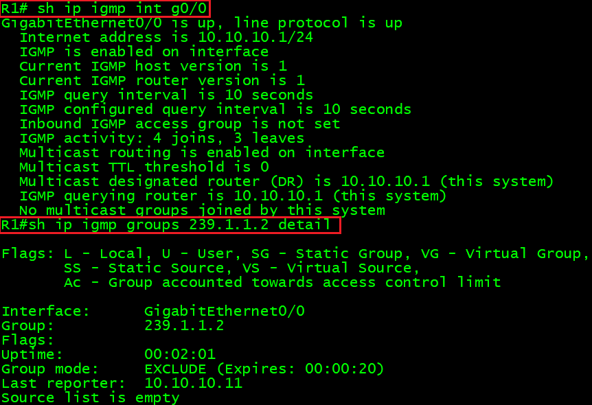

### Remove the Version 1 Membership

```cisco
H1(config)# interface GigabitEthernet0/0
H1(config-if)# no ip igmp join-group 239.1.1.2
```

IGMPv1 has no Leave message. The retained packet list shows the Membership Report followed by periodic Queries, with no IGMPv2 Leave (`0x17`) between them:

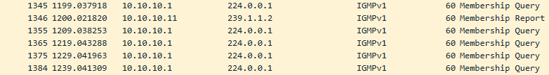

The last-hop router must therefore retain the membership until its timer expires without receiving another Report. The exact expiration period is derived from the active query and robustness timers; it should not be described as universally fixed at 180 seconds.

Restore IGMPv2 before continuing:

```cisco
R1(config)# interface GigabitEthernet0/0
R1(config-if)# ip igmp version 2

H1(config)# interface GigabitEthernet0/0
H1(config-if)# ip igmp version 2
```

## Permanent Static Group Membership

Configure a permanent receiver-facing group on R1:

```cisco
R1(config)# interface GigabitEthernet0/0
R1(config-if)# ip igmp static-group 239.1.1.20
```

Verify the state:

```cisco
R1# show ip igmp groups 239.1.1.20 detail
R1# show ip mroute 239.1.1.20
```

The retained `show ip igmp groups` output marks the group with the `SG` flag, uses `0.0.0.0` as the last reporter, and does not depend on a dynamic host Report:

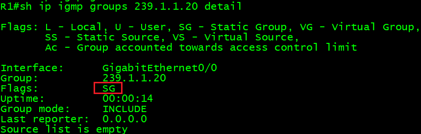

The screenshot proves the permanent IGMP membership. A receiver-LAN packet capture for the corresponding traffic-forwarding test was not retained, so this document does not claim captured proof of the outgoing data stream.

Remove the static state after the test:

```cisco
R1(config)# interface GigabitEthernet0/0
R1(config-if)# no ip igmp static-group 239.1.1.20
```

## Router-Side IGMP Group Filtering

The filter permits `239.1.1.1` and denies other dynamically reported groups:

```cisco
R1(config)# ip access-list standard IGMP-GROUP-FILTER
R1(config-std-nacl)# permit 239.1.1.1
R1(config-std-nacl)# deny any

R1(config)# interface GigabitEthernet0/0
R1(config-if)# ip igmp access-group IGMP-GROUP-FILTER
```

### Allowed Group

```cisco
H1(config)# interface GigabitEthernet0/0
H1(config-if)# ip igmp join-group 239.1.1.1

R1# show ip igmp groups 239.1.1.1 detail
```

R1 installed the permitted dynamic membership and recorded H1 as the last reporter:

```text
R1# show ip igmp groups 239.1.1.1 detail

Interface:      GigabitEthernet0/0
Group:          239.1.1.1
Uptime:         00:00:18
Group mode:     EXCLUDE (Expires: 00:00:24)
Last reporter:  10.10.10.11
Source list is empty
```

### Denied Group

```cisco
H1(config)# interface GigabitEthernet0/0
H1(config-if)# no ip igmp join-group 239.1.1.1
H1(config-if)# ip igmp join-group 239.1.1.99

R1# show ip igmp groups 239.1.1.99
R1# show ip access-lists IGMP-GROUP-FILTER
```

The denied group was absent from R1's connected group table, while the ACL counters recorded both permitted and denied matches:

```text
R1# show ip igmp groups 239.1.1.99
IGMP Connected Group Membership
Group Address    Interface                Uptime    Expires   Last Reporter   Group Accounted

R1# show ip access-list
Standard IP access list IGMP-GROUP-FILTER
    10 permit 239.1.1.1 (8 matches)
    20 deny   any (3 matches)
```

The filter controls memberships learned from IGMP Reports. It does not override a manually configured `ip igmp static-group`.

Clean up:

```cisco
H1(config)# interface GigabitEthernet0/0
H1(config-if)# no ip igmp join-group 239.1.1.99

R1(config)# interface GigabitEthernet0/0
R1(config-if)# no ip igmp access-group IGMP-GROUP-FILTER

R1(config)# no ip access-list standard IGMP-GROUP-FILTER
```

## IGMPv3 INCLUDE and Source-Specific Multicast

Enable the default SSM range on all multicast routers:

```cisco
R1(config)# ip pim ssm default
R2(config)# ip pim ssm default
R3(config)# ip pim ssm default
```

Set IGMPv3 on R1 and H1:

```cisco
R1(config)# interface GigabitEthernet0/0
R1(config-if)# ip igmp version 3

H1(config)# interface GigabitEthernet0/0
H1(config-if)# ip igmp version 3
```

### Request Only Source1

```cisco
H1(config)# interface GigabitEthernet0/0
H1(config-if)# ip igmp join-group 232.1.1.1 source 192.0.2.11
```

Wireshark filter:

```text
igmp.type == 0x22
```

H1 sent an IGMPv3 Membership Report to `224.0.0.22`. The group record identified `232.1.1.1` in INCLUDE mode:

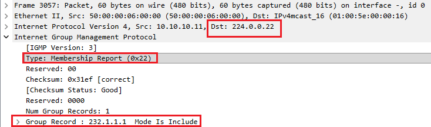

R1 recorded the group as SSM, retained INCLUDE mode, and associated the requested source `192.0.2.11` with H1's report:

```text
R1# show ip igmp groups 232.1.1.1 detail

Interface:      GigabitEthernet0/0
Group:          232.1.1.1
Flags:          SSM
Uptime:         00:01:29
Group mode:     INCLUDE
Last reporter:  10.10.10.11

Source Address   Uptime    v3 Exp    CSR Exp   Fwd  Flags
192.0.2.11       00:01:29  00:00:23  stopped   Yes  R
```

### Test Both Sources

Source1, which H1 explicitly requested, received replies from H1:

```text
SRC1# ping 232.1.1.1 repeat 20 timeout 1 source GigabitEthernet0/0

Sending 20, 100-byte ICMP Echos to 232.1.1.1, timeout is 1 seconds:
Packet sent with a source address of 192.0.2.11

Reply to request 0 from 10.10.10.11, 7 ms
Reply to request 1 from 10.10.10.11, 5 ms
Reply to request 2 from 10.10.10.11, 6 ms
Reply to request 3 from 10.10.10.11, 6 ms
```

Source2, which was not in the INCLUDE list, received no replies:

```text
SRC2# ping 232.1.1.1 repeat 20 timeout 1 source GigabitEthernet0/0

Sending 20, 100-byte ICMP Echos to 232.1.1.1, timeout is 1 seconds:
Packet sent with a source address of 192.0.2.12
.......
```

Together, the IGMP state and ping results prove that H1 requested and received only Source1 for `232.1.1.1`.

> [!NOTE]
> SSM normally builds source-specific `(S,G)` forwarding state and does not use an RP for the SSM group. That protocol property is consistent with this configuration, but the retained evidence set does not include `show ip mroute` or RP/RPF output for this phase.

Clean up:

```cisco
H1(config)# interface GigabitEthernet0/0
H1(config-if)# no ip igmp join-group 232.1.1.1 source 192.0.2.11
```

## IGMPv3 EXCLUDE-Empty Membership

A plain IGMPv3 join represents an any-source membership. H2 joined `239.1.1.30` without naming a source:

```cisco
H2(config)# interface GigabitEthernet0/0
H2(config-if)# ip igmp version 3
H2(config-if)# ip igmp join-group 239.1.1.30
```

H2 sent an IGMPv3 Membership Report to `224.0.0.22`. Its group record placed `239.1.1.30` in EXCLUDE mode:

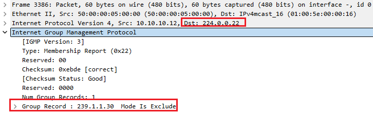

With an empty excluded-source list, H2 accepted traffic from either source. Source1 received replies from H2:

```text
SRC1# ping 239.1.1.30 repeat 10 timeout 1 source GigabitEthernet0/0

Packet sent with a source address of 192.0.2.11

Reply to request 0 from 10.10.10.12, 28 ms
Reply to request 1 from 10.10.10.12, 5 ms
Reply to request 2 from 10.10.10.12, 7 ms
Reply to request 3 from 10.10.10.12, 6 ms
Reply to request 4 from 10.10.10.12, 7 ms
```

Source2 also received replies from H2:

```text
SRC2# ping 239.1.1.30 repeat 10 timeout 1 source GigabitEthernet0/0

Packet sent with a source address of 192.0.2.12

Reply to request 0 from 10.10.10.12, 14 ms
Reply to request 1 from 10.10.10.12, 7 ms
Reply to request 2 from 10.10.10.12, 6 ms
Reply to request 3 from 10.10.10.12, 6 ms
Reply to request 4 from 10.10.10.12, 5 ms
```

The standard IOSv `ip igmp join-group` command can produce an any-source EXCLUDE-empty request and a source-specific INCLUDE request. It is not a general host API for constructing an arbitrary selective-EXCLUDE list such as "receive from all sources except `192.0.2.12`." That case was not tested.

Clean up:

```cisco
H2(config)# interface GigabitEthernet0/0
H2(config-if)# no ip igmp join-group 239.1.1.30
```

## IGMP Snooping

Restore IGMPv2 on the receiver-facing interfaces:

```cisco
R1(config)# interface GigabitEthernet0/0
R1(config-if)# ip igmp version 2

H1(config)# interface GigabitEthernet0/0
H1(config-if)# ip igmp version 2

H2(config)# interface GigabitEthernet0/0
H2(config-if)# ip igmp version 2
```

Enable IGMP Snooping for VLAN 10:

```cisco
SW-RCV(config)# ip igmp snooping vlan 10
```

The recorded switch output confirms that snooping and report suppression were enabled. It also records that this IOSvL2 image did not support IGMPv3 Snooping:

```text
SW-RCV# show ip igmp snooping vlan 10
Global IGMP Snooping configuration:
-------------------------------------------
IGMP snooping                : Enabled
IGMPv3 snooping              : Not supported
Report suppression           : Enabled
TCN solicit query            : Disabled
TCN flood query count        : 2
Robustness variable          : 2
Last member query count      : 2
Last member query interval   : 1000

Vlan 10:
--------
IGMP snooping                       : Enabled
IGMPv2 immediate leave              : Disabled
Multicast router learning mode      : pim-dvmrp
CGMP interoperability mode          : IGMP_ONLY
Robustness variable                 : 2
Last member query count             : 2
Last member query interval          : 1000
```

Only H1 then joined `239.1.1.1`:

```cisco
H1(config)# interface GigabitEthernet0/0
H1(config-if)# ip igmp join-group 239.1.1.1
```

The switch associated the group with `Gi0/0`, which the recorded topology identifies as H1's access port:

```text
SW-RCV# show ip igmp snooping groups vlan 10

Vlan      Group                    Version     Port List
---------------------------------------------------------
10        239.1.1.1                v2          Gi0/0
```

Source1's multicast ping received replies only from H1:

```text
SRC1# ping 239.1.1.1 repeat 20 timeout 1 source GigabitEthernet0/0

Sending 20, 100-byte ICMP Echos to 239.1.1.1, timeout is 1 seconds:
Packet sent with a source address of 192.0.2.11

Reply to request 0 from 10.10.10.11, 38 ms
Reply to request 1 from 10.10.10.11, 5 ms
Reply to request 2 from 10.10.10.11, 6 ms
Reply to request 3 from 10.10.10.11, 6 ms
```

This proves that H1 was the registered receiver and that the switch learned H1's port for the group. A future rerun should add simultaneous captures on SW-RCV `Gi0/0` and `Gi0/1` to prove directly that the multicast data stream is absent from H2's port.

Clean up:

```cisco
H1(config)# interface GigabitEthernet0/0
H1(config-if)# no ip igmp join-group 239.1.1.1
```

## Restore the Baseline

Remove any remaining test memberships and return R1 to IGMPv2:

```cisco
H1(config)# interface GigabitEthernet0/0
H1(config-if)# no ip igmp join-group 239.1.1.1
H1(config-if)# no ip igmp join-group 232.1.1.1 source 192.0.2.11

H2(config)# interface GigabitEthernet0/0
H2(config-if)# no ip igmp join-group 239.1.1.1
H2(config-if)# no ip igmp join-group 239.1.1.30

R1(config)# interface GigabitEthernet0/0
R1(config-if)# no ip igmp static-group 239.1.1.20
R1(config-if)# ip igmp version 2
```

If the original two-router receiver LAN is required again, restore PIM on R2:

```cisco
R2(config)# interface GigabitEthernet0/0
R2(config-if)# ip pim sparse-mode
R2(config-if)# ip pim dr-priority 10
```

Verify the final state:

```cisco
R1# show ip igmp groups
R1# show ip mroute
SW-RCV# show ip igmp snooping groups vlan 10
```

## Conclusions

The recorded run demonstrates the receiver-edge role of IGMP and several important version differences:

- IGMPv2 selected R1 as Querier by the lowest IPv4 address, independently of the PIM DR election won by R2's higher DR priority.
- An IGMPv2 Leave was sent to `224.0.0.2` and triggered a Group-Specific Query to the departing group.
- IGMPv1 produced Queries and Membership Reports but no Leave message, requiring timer-based membership removal.
- A static group appeared with the `SG` flag and did not depend on a host reporter.
- `ip igmp access-group` admitted the permitted group while rejecting the denied group, as confirmed by the empty membership lookup and ACL counters.
- IGMPv3 INCLUDE state selected Source1 for the SSM group, while an EXCLUDE-empty membership accepted the ASM group from both active sources.
- IGMP Snooping learned `239.1.1.1` on H1's actual access port, `Gi0/0`.

The evidence boundaries are equally important: report suppression, detailed SSM multicast-route state, and a two-port Snooping capture should be added in a future run before making stronger claims about those behaviours.
