# TCP MSS, IP MTU, and Ethernet MTU Lab

## Overview

This EVE-NG lab demonstrates three related but distinct limits in an IPv4 network:

- **Ethernet MTU** limits the Layer 3 packet that an Ethernet interface can carry.
- **IP MTU** limits the size of an IP packet that a router sends through an interface without fragmentation.
- **TCP Maximum Segment Size (MSS)** limits the TCP payload in one segment. For ordinary IPv4/TCP traffic without IP or TCP options, `MSS = IP MTU - 20-byte IPv4 header - 20-byte TCP header`.

The lab uses controlled ICMP and TCP traffic to observe Path MTU Discovery (PMTUD), IPv4 fragmentation, a PMTUD black hole, and successful TCP MSS adjustment.

## Objectives

By completing this lab, you should be able to:

1. Distinguish interface MTU from protocol-specific IP MTU on Cisco IOS.
2. Calculate the largest ICMP payload for a given IPv4 MTU.
3. Observe ICMP Destination Unreachable, Code 4 (`Fragmentation Needed`) during PMTUD.
4. Identify IPv4 fragments by their Identification, More Fragments flag, and Fragment Offset.
5. Inspect the MSS option in TCP SYN packets.
6. Explain why a TCP handshake can succeed while larger application data is repeatedly dropped.
7. Recognize the operational risk of an MTU mismatch, including its possible effect on BGP UPDATE delivery.

## Topology

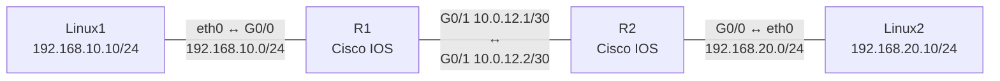

| Node | Interface | IPv4 address | Purpose |
| --- | --- | --- | --- |
| Linux1 | `eth0` | `192.168.10.10/24` | ICMP and `iperf3` client |
| R1 | `G0/0` | `192.168.10.1/24` | Linux1 default gateway |
| R1 | `G0/1` | `10.0.12.1/30` | Transit link and MTU bottleneck |
| R2 | `G0/1` | `10.0.12.2/30` | Transit link |
| R2 | `G0/0` | `192.168.20.1/24` | Linux2 default gateway |
| Linux2 | `eth0` | `192.168.20.10/24` | ICMP and `iperf3` server |

Interface names may differ between EVE-NG images. The examples use Cisco `GigabitEthernet0/0` and `GigabitEthernet0/1`.

## Software and Capture Points

- Two Cisco IOSv, CSR1000v, or equivalent router nodes
- Two Linux nodes with `iproute2`, `iputils-ping`, `iperf3`, `tcpdump`, and `iptables`
- Wireshark through EVE-NG packet capture

Capture both the **Linux1–R1** link and the **R1–R2** link when possible. Capturing on both sides of R1 makes it easier to distinguish a packet generated by Linux1 from the packet that R1 actually forwards.

## Base Configuration

### R1

```cisco
hostname R1
!
interface GigabitEthernet0/0
 ip address 192.168.10.1 255.255.255.0
 no shutdown
!
interface GigabitEthernet0/1
 ip address 10.0.12.1 255.255.255.252
 mtu 1500
 no shutdown
!
ip route 192.168.20.0 255.255.255.0 10.0.12.2
```

### R2

```cisco
hostname R2
!
interface GigabitEthernet0/1
 ip address 10.0.12.2 255.255.255.252
 mtu 1500
 no shutdown
!
interface GigabitEthernet0/0
 ip address 192.168.20.1 255.255.255.0
 no shutdown
!
ip route 192.168.10.0 255.255.255.0 10.0.12.1
```

### Linux1

```bash
sudo ip address add 192.168.10.10/24 dev eth0
sudo ip link set dev eth0 up mtu 1500
sudo ip route replace default via 192.168.10.1
```

### Linux2

```bash
sudo ip address add 192.168.20.10/24 dev eth0
sudo ip link set dev eth0 up mtu 1500
sudo ip route replace default via 192.168.20.1
```

Verify basic connectivity before changing any MTU:

```bash
ping -c 4 192.168.20.10
```

---

## Experiment 1: IP MTU, PMTUD, and IPv4 Fragmentation

### 1.1 Verify the 1500-byte baseline

On Linux1, send a 1472-byte ICMP payload with the Don't Fragment (DF) bit set:

```bash
ping -M do -s 1472 -c 4 192.168.20.10
```

The resulting IPv4 packet is exactly 1500 bytes:

```text
1472-byte data + 8-byte ICMP header + 20-byte IPv4 header = 1500 bytes
```

All four echo requests succeeded with no packet loss.

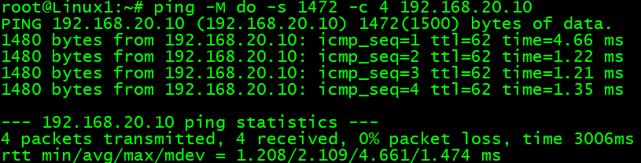

*Figure 1. A 1472-byte ICMP payload produces a 1500-byte IPv4 packet and succeeds across the baseline path.*

Wireshark confirms an IPv4 Total Length of 1500 and a set DF bit.

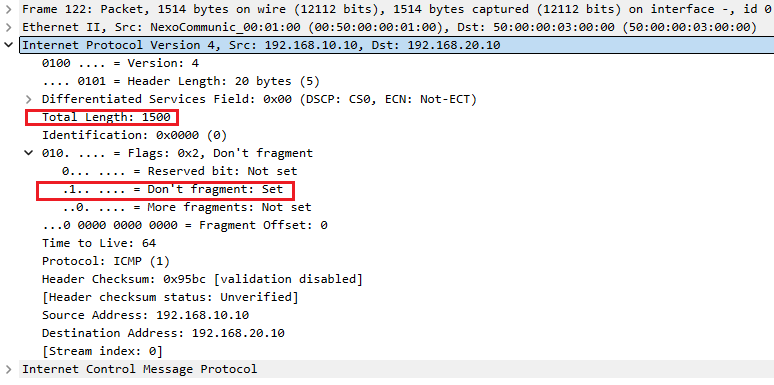

*Figure 2. The baseline packet is 1500 bytes at Layer 3 and cannot be fragmented.*

### 1.2 Create a 1400-byte IP MTU bottleneck

Configure a protocol-specific IP MTU on R1's transit interface:

```cisco
R1(config)# interface GigabitEthernet0/1
R1(config-if)# ip mtu 1400
```

The following commands intentionally report two different values:

```cisco
show ip interface GigabitEthernet0/1
show interface GigabitEthernet0/1
```

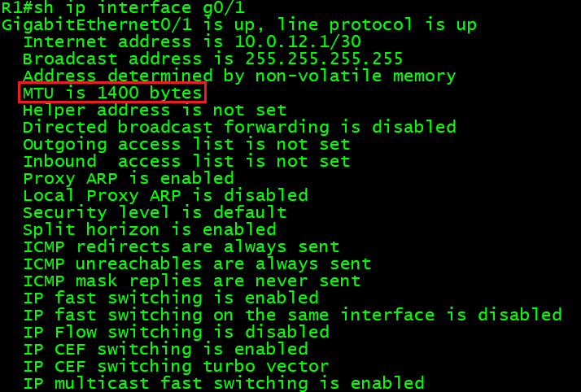

*Figure 3. `show ip interface` reports the protocol-specific IPv4 MTU of 1400 bytes.*

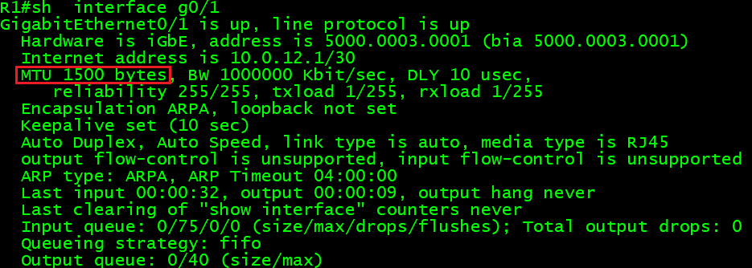

*Figure 4. `show interface` continues to report the underlying interface MTU of 1500 bytes.*

These outputs are not contradictory. The interface can carry a 1500-byte Layer 3 payload at the data-link layer, while IPv4 has been configured to send no more than 1400 bytes through it. The `ip mtu` command changes the IPv4 limit; it does not change the underlying interface MTU shown by `show interface`.

### 1.3 Send an oversized packet with DF set

Repeat the original test:

```bash
ping -M do -s 1472 -c 4 192.168.20.10
```

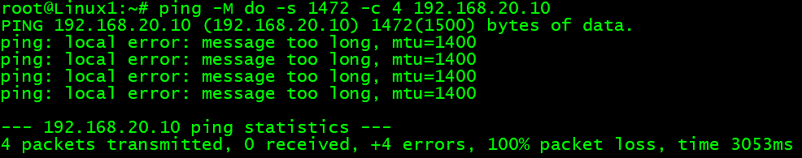

*Figure 5. Linux has learned a path MTU of 1400 and rejects subsequent oversized DF packets locally.*

The first oversized packet causes R1 to return ICMP Destination Unreachable, Code 4. The ICMP message reports a next-hop MTU of 1400. After Linux records that PMTU information, later attempts can fail locally with `message too long, mtu=1400`, so not every attempt must place another oversized packet on the wire.

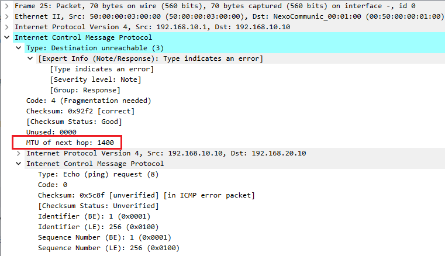

*Figure 6. R1 reports the limiting next-hop MTU, allowing Linux1 to update its path-MTU information.*

### 1.4 Use the correct payload size

For a 1400-byte IPv4 MTU, the largest ICMP echo payload is 1372 bytes:

```text
1372-byte data + 8-byte ICMP header + 20-byte IPv4 header = 1400 bytes
```

```bash
ping -M do -s 1372 -c 4 192.168.20.10
```

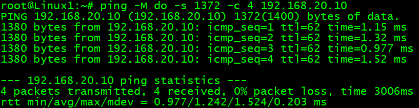

*Figure 7. A 1400-byte DF packet fits the configured IP MTU and succeeds without fragmentation.*

### 1.5 Allow IPv4 fragmentation

Send the original 1500-byte packet without prohibiting fragmentation:

```bash
ping -M dont -s 1472 -c 4 192.168.20.10
```

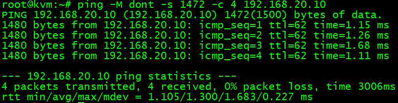

*Figure 8. The echo requests succeed because R1 can fragment the oversized IPv4 packets.*

The first fragment has the More Fragments flag set. Its IPv4 Total Length is 1396 bytes rather than 1400 because every non-final fragment's payload must be a multiple of eight bytes. A 1376-byte fragment payload plus a 20-byte IPv4 header produces 1396 bytes.

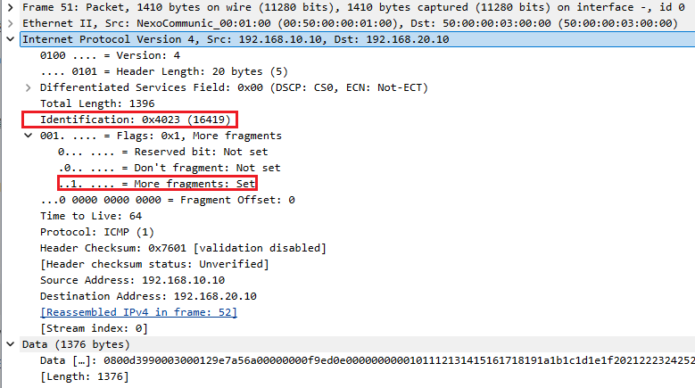

*Figure 9. The first fragment carries 1376 bytes of IP payload and sets the More Fragments flag.*

The second fragment has the same Identification value (`0x4023`), starts at byte offset 1376, and clears the More Fragments flag. Wireshark therefore associates the two packets and reassembles the original IPv4 payload.

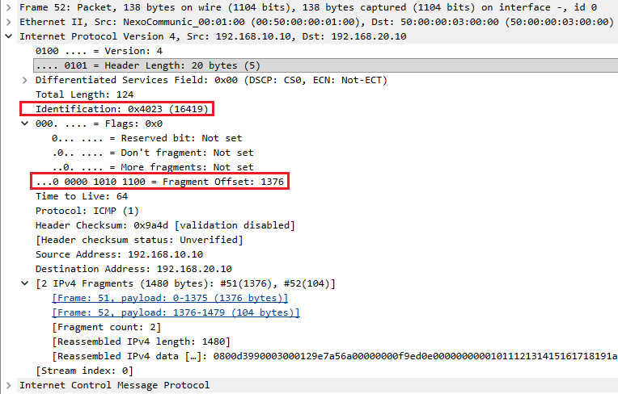

*Figure 10. Matching Identification values and complementary fragment fields identify the two packets as parts of the same original datagram.*

### Experiment 1 result

This experiment verified all of the following:

- A 1472-byte ICMP payload fills a normal 1500-byte IPv4 MTU.
- `ip mtu 1400` can coexist with an underlying interface MTU of 1500.
- An oversized DF packet triggers ICMP `Fragmentation Needed` and PMTU learning.
- A 1372-byte ICMP payload fits a 1400-byte IPv4 MTU.
- Clearing DF allows R1 to fragment the original packet into two IPv4 fragments.

---

## Experiment 2: TCP MSS and a PMTUD Black Hole

Keep the following bottleneck in place:

```cisco
interface GigabitEthernet0/1
 ip mtu 1400
```

Start an `iperf3` server on Linux2:

```bash
iperf3 -s
```

Run a client on Linux1:

```bash
iperf3 -c 192.168.20.10 -n 10M
```

### 2.1 Observe the original TCP MSS

Before MSS adjustment, the SYN sent by Linux1 advertises an MSS of 1460:

```text
1500-byte host MTU - 20-byte IPv4 header - 20-byte TCP header = 1460-byte MSS
```

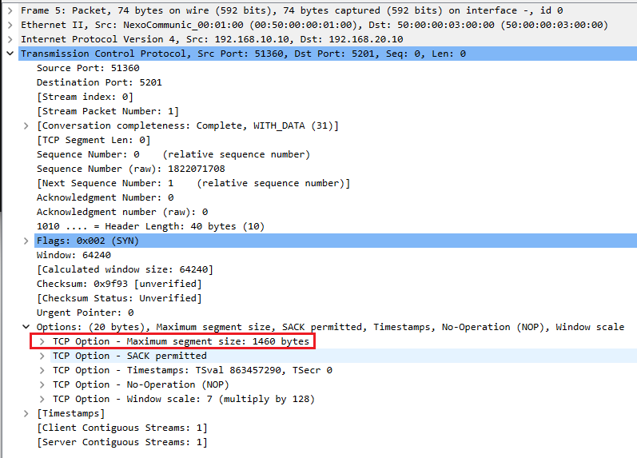

*Figure 11. The endpoint derives MSS from its local 1500-byte interface MTU; it does not know the downstream 1400-byte bottleneck during the handshake.*

The handshake packets are small enough to cross the path. When Linux1 later sends a 1500-byte DF packet, R1 cannot forward it through the 1400-byte IP MTU and returns ICMP `Fragmentation Needed`.

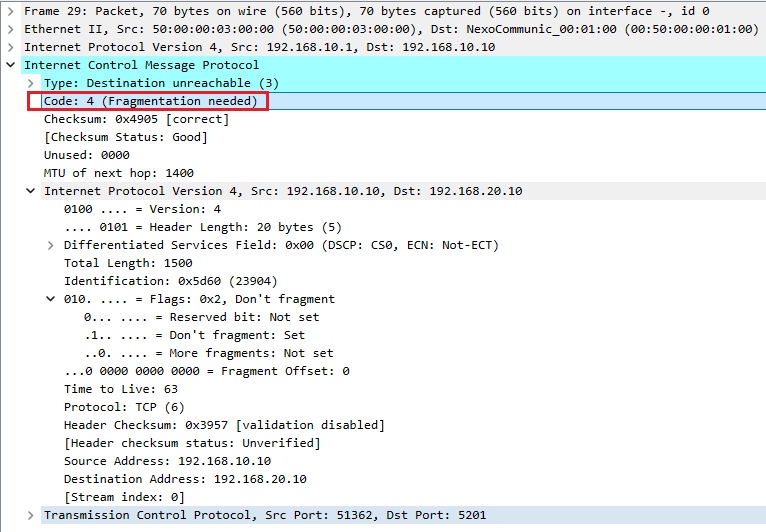

*Figure 12. The embedded packet has an IPv4 Total Length of 1500 and DF set.*

After Linux1 processes the ICMP message, PMTUD records a path MTU of 1400. The TCP connection then sends packets that fit the discovered limit.

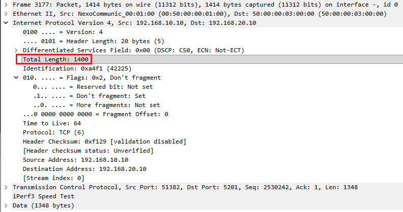

*Figure 13. After PMTUD convergence, the IPv4 Total Length is 1400 and the TCP payload is 1348 bytes.*

The 1348-byte TCP payload is calculated from the actual headers in this packet:

```text
1400-byte IP packet - 20-byte IPv4 header - 32-byte TCP header = 1348 bytes
```

The TCP header is 32 bytes because it contains the normal 20-byte header plus 12 bytes of TCP options and padding. Although the SYN advertised MSS 1460, active TCP options consume space inside the IP packet, so the observed data payload can be smaller than the advertised MSS.

> **Capture note:** A source-side capture also displayed an IPv4 Total Length of 6792 bytes. That value is consistent with a Linux GSO/TSO offload artifact: Wireshark can observe a large software packet before the kernel or virtual NIC divides it into wire-sized segments. It is therefore not used as evidence that a 6792-byte frame crossed the network. Capture the R1–R2 link or disable `tso`, `gso`, and `gro` when exact on-wire packet sizes are required.

### 2.2 Simulate a PMTUD black hole

To demonstrate the dependence on ICMP, discard `Fragmentation Needed` messages on Linux1 and clear cached route information before starting a new TCP connection:

```bash
sudo iptables -I INPUT -p icmp --icmp-type fragmentation-needed -j DROP
sudo ip route flush cache
iperf3 -c 192.168.20.10 -n 10M
```

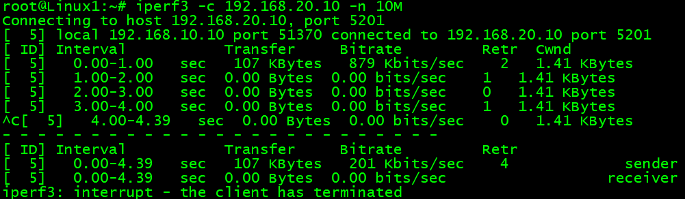

*Figure 14. The TCP connection is established, but useful data transfer nearly stops.*

The capture shows repeated 1514-byte Ethernet frames containing TCP retransmissions with a 1448-byte TCP payload. ICMP `Fragmentation Needed` is visible on the captured link, but the local firewall rule prevents Linux1's TCP stack from using it.

The 1448-byte value follows directly from the captured packet headers:

```text
1514-byte captured Ethernet frame
- 14-byte Ethernet header
= 1500-byte IPv4 packet

1500-byte IPv4 packet
- 20-byte IPv4 header
- 32-byte TCP header
= 1448-byte TCP payload
```

The capture does not include the 4-byte Ethernet FCS. The SYN advertised MSS 1460 based on the minimum 20-byte IPv4 and 20-byte TCP headers; the 12 bytes of TCP options and padding reduce the actual data carried in this full-sized packet from 1460 to 1448 bytes.

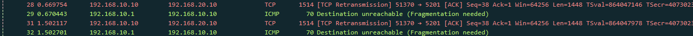

*Figure 15. The sender repeats the same oversized data because usable PMTU feedback does not reach its TCP processing.*

This is a **PMTUD black hole**: the TCP three-way handshake works because SYN, SYN-ACK, and ACK packets are small, but larger DF data packets are dropped. The sender then retransmits data that still does not fit the path.

### Why BGP can be Established but fail to deliver routes

BGP uses TCP. A BGP session can reach `Established` because its TCP handshake, BGP OPEN, KEEPALIVE, and small control messages fit through the path. A larger BGP UPDATE containing multiple prefixes and path attributes may require a larger TCP segment. If that segment exceeds the path MTU, has DF set, and the returning ICMP message is filtered, the UPDATE can be repeatedly lost while smaller traffic continues to pass.

The symptom can therefore be an established neighbor with missing or delayed routes, followed eventually by retransmission or hold-timer problems. MTU is only one possible cause: address-family activation, inbound/outbound policy, prefix filtering, next-hop reachability, maximum-prefix limits, and RIB installation failures must also be checked.

If the BGP speakers are the Cisco routers themselves, interface `ip tcp adjust-mss` is not the primary fix because that command adjusts transit SYN packets. Correct the path/tunnel MTU, permit the required ICMP messages, and verify router-originated TCP PMTUD. Platform-supported global TCP MSS controls may also be relevant.

### 2.3 Configure TCP MSS adjustment

For a 1400-byte IPv4 path, the intended MSS is 1360:

```text
1400-byte IP MTU - 20-byte IPv4 header - 20-byte TCP header = 1360-byte MSS
```

Apply the adjustment to traffic entering from each client LAN:

```cisco
R1(config)# interface GigabitEthernet0/0
R1(config-if)# ip tcp adjust-mss 1360
```

```cisco
R2(config)# interface GigabitEthernet0/0
R2(config-if)# ip tcp adjust-mss 1360
```

Start a completely new capture and a new `iperf3` connection. MSS is exchanged only in SYN packets, so this command cannot repair an already established TCP session.

```bash
iperf3 -c 192.168.20.10 -n 10M
```

The new capture verifies that the adjustment was applied successfully. The SYN-ACK from Linux2 advertises MSS 1360 after crossing the adjusting router:

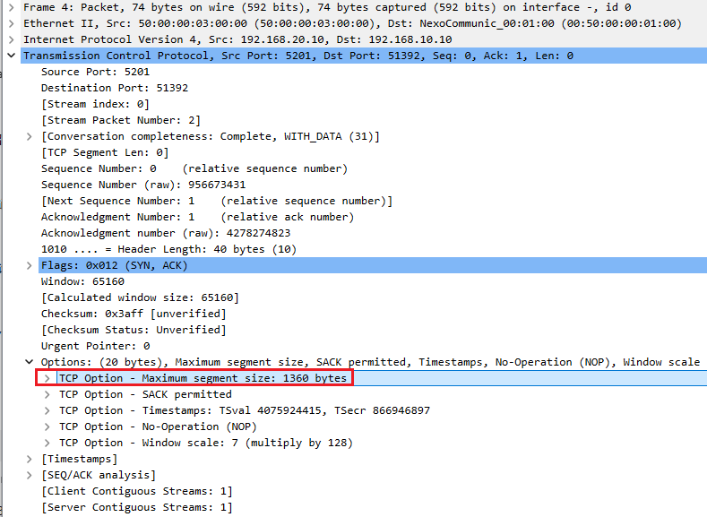

*Figure 16a. The returning SYN-ACK carries an MSS value of 1360, confirming that MSS clamping affected the new connection.*

The subsequent packet sequence contains 1414-byte captured Ethernet frames and 1348-byte TCP payloads. The sequence numbers advance by 1348 each time, and the displayed packets are not marked as retransmissions.

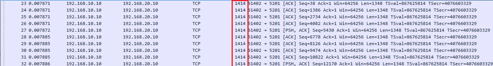

*Figure 16b. Each captured frame is 1414 bytes: a 14-byte Ethernet header followed by a 1400-byte IPv4 packet.*

The packet size is consistent with both the configured IP MTU and negotiated MSS:

```text
1414-byte captured frame - 14-byte Ethernet header = 1400-byte IP packet
1400-byte IP packet - 20-byte IPv4 header - 32-byte TCP header = 1348-byte TCP payload
1360-byte MSS - 12 bytes of TCP options and padding = 1348-byte TCP payload
```

This verifies the core MSS-adjustment objective: the new handshake carries MSS 1360, and the resulting TCP data packets fit the 1400-byte path without relying on oversized 1500-byte packets. A completed `iperf3` summary can be added separately if throughput and total retransmission statistics also need to be documented.

Remove the temporary Linux firewall rule after the test:

```bash
sudo iptables -D INPUT -p icmp --icmp-type fragmentation-needed -j DROP
```

### Experiment 2 result

The experiment verifies the complete control sequence: the endpoints initially advertise MSS 1460, R1 reports the 1400-byte path limit through ICMP, and PMTUD reduces subsequent IP packets to 1400 bytes. When ICMP feedback is discarded, oversized 1448-byte TCP payloads are retransmitted and the application stalls. After MSS adjustment, the new SYN-ACK advertises MSS 1360 and the captured TCP packets remain within the path MTU with 1348-byte payloads.

---

## Experiment 3: Ethernet Interface MTU Mismatch

Remove the protocol-specific MTU and MSS adjustments first:

```cisco
R1(config)# interface GigabitEthernet0/1
R1(config-if)# no ip mtu
!
R1(config)# interface GigabitEthernet0/0
R1(config-if)# no ip tcp adjust-mss
!
R2(config)# interface GigabitEthernet0/0
R2(config-if)# no ip tcp adjust-mss
```

Configure different interface MTUs on the R1–R2 Ethernet link:

```cisco
R1(config)# interface GigabitEthernet0/1
R1(config-if)# mtu 1500
```

```cisco
R2(config)# interface GigabitEthernet0/1
R2(config-if)# mtu 1300
```

### 3.1 Send a packet that fits both interfaces

```bash
ping -M do -s 1272 -c 4 192.168.20.10
```

```text
1272-byte data + 8-byte ICMP header + 20-byte IPv4 header = 1300 bytes
```

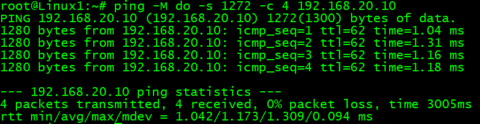

*Figure 17. The packet fits the lower 1300-byte limit and succeeds.*

### 3.2 Send a packet that exceeds R2's interface MTU

```bash
ping -M do -s 1372 -c 4 192.168.20.10
```

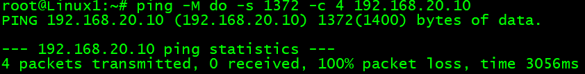

*Figure 18. The 1400-byte packet exceeds the lower interface MTU and all four requests time out.*

From Linux1 toward Linux2, R1 can transmit this packet because its side is configured for 1500 bytes. R2's lower receiving-interface MTU can cause the oversized Ethernet payload to be discarded before normal Layer 3 forwarding, which does not necessarily produce ICMP feedback. This resembles an MTU black hole.

The reachability result proves a size-dependent failure under mismatched interface configuration. To prove the precise drop point on a physical platform, also record R2 interface counters before and after the test:

```cisco
show interfaces GigabitEthernet0/1
```

Look for changes in input errors, giants, or oversized-frame counters. Some virtual Cisco images display the configuration but do not fully emulate hardware Ethernet MTU enforcement or counters.

### 3.3 Restore a consistent Ethernet MTU

```cisco
R2(config)# interface GigabitEthernet0/1
R2(config-if)# mtu 1500
```

Repeat the 1400-byte test:

```bash
ping -M do -s 1372 -c 4 192.168.20.10
```


*Figure 19. Restoring a consistent interface MTU removes the size-dependent failure.*

### Experiment 3 result

A 1300-byte packet succeeded, a 1400-byte packet failed while one link endpoint used MTU 1300, and the same 1400-byte packet succeeded after both endpoints used MTU 1500. This verifies the operational importance of consistent interface MTU. A future rerun should add before-and-after interface counters to prove whether the virtual image classifies the discarded packet as an Ethernet giant.

---

## Results Summary

| Test | Expected behavior | Recorded result | Status |
| --- | --- | --- | --- |
| 1500-byte IPv4 packet on baseline path | Success | Four replies; Wireshark shows Total Length 1500 and DF | Verified |
| 1500-byte DF packet across IP MTU 1400 | ICMP `Fragmentation Needed` | Next-hop MTU 1400 captured; Linux learns PMTU | Verified |
| 1400-byte DF packet across IP MTU 1400 | Success | Four replies | Verified |
| 1500-byte packet with fragmentation allowed | Two or more IPv4 fragments | Two fragments with matching Identification captured | Verified |
| TCP before MSS adjustment | MSS 1460 and PMTUD reaction | MSS 1460, ICMP Code 4, and retransmissions captured | Verified |
| PMTUD feedback filtered | TCP control plane works but large data stalls | Session connects; transfer nearly stops and retransmits | Verified behavior |
| TCP MSS adjusted to 1360 | A new handshake advertises no more than MSS 1360 and subsequent IP packets stay within 1400 bytes | SYN-ACK shows MSS 1360; data frames contain 1400-byte IP packets and 1348-byte TCP payloads | Verified |
| Ethernet interfaces at MTU 1500/1300 | Size-dependent loss | 1300-byte packet succeeds; 1400-byte packet fails | Verified reachability; drop counter not captured |
| Ethernet interfaces restored to MTU 1500/1500 | 1400-byte packet succeeds | Four replies | Verified |

## Key Takeaways

- `show interface` and `show ip interface` can legitimately display different MTUs because they report interface-level and IPv4-specific limits.
- PMTUD depends on useful ICMP `Fragmentation Needed` feedback. Filtering that feedback can leave small control packets working while large TCP data stalls.
- MSS is negotiated only in TCP SYN packets. Every MSS test must use a new TCP connection and must verify the modified SYN on the far side of the adjusting router.
- IPv4 fragment payloads, except the final fragment, must align to eight-byte boundaries. This explains the 1396-byte first fragment on a path with IP MTU 1400.
- A BGP neighbor can establish over small packets while larger UPDATE delivery is impaired, but routing policy and RIB conditions must be ruled out before diagnosing MTU.
- An interface MTU mismatch can produce silent, size-dependent packet loss. Consistent MTU configuration and packet/counter evidence are both important.

## Cleanup

```cisco
R1(config)# interface GigabitEthernet0/1
R1(config-if)# no ip mtu
R1(config-if)# mtu 1500
!
R1(config)# interface GigabitEthernet0/0
R1(config-if)# no ip tcp adjust-mss
!
R2(config)# interface GigabitEthernet0/1
R2(config-if)# mtu 1500
!
R2(config)# interface GigabitEthernet0/0
R2(config-if)# no ip tcp adjust-mss
```

```bash
sudo iptables -D INPUT -p icmp --icmp-type fragmentation-needed -j DROP
```

If the `iptables` rule has already been removed, the deletion command returns an error and no further action is required.

## References

- [Cisco IOS XE: Setting the MTU Packet Size](https://www.cisco.com/c/en/us/td/docs/routers/ios/config/17-x/ip-addressing/b-ip-addressing/m_iap-ipserv-xe.html)
- [Cisco IOS: `ip tcp adjust-mss` Command Reference](https://www.cisco.com/en/US/docs/ios-xml/ios/ipapp/command/ip_tcp_adjust-mss_through_ip_wccp_web-cache_accelerated.html)
- [Cisco: Resolve IPv4 Fragmentation, MTU, MSS, and PMTUD Issues with GRE and IPsec](https://www.cisco.com/c/en/us/support/docs/ip/generic-routing-encapsulation-gre/25885-pmtud-ipfrag.html)
- [RFC 791: Internet Protocol](https://www.rfc-editor.org/rfc/rfc791)
- [RFC 1191: Path MTU Discovery](https://www.rfc-editor.org/rfc/rfc1191)
- [RFC 6691: TCP Options and Maximum Segment Size](https://www.rfc-editor.org/rfc/rfc6691)
